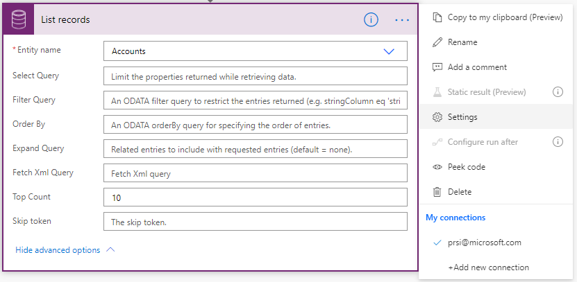
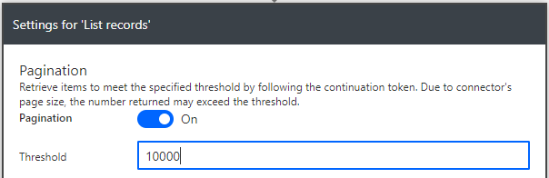
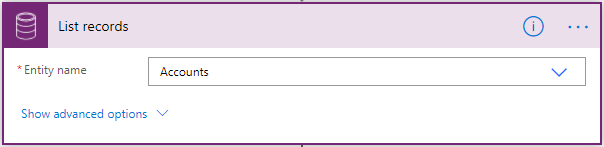
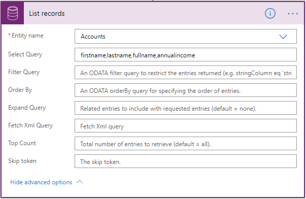
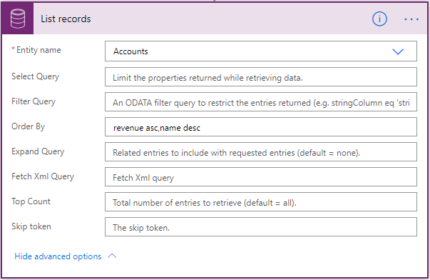
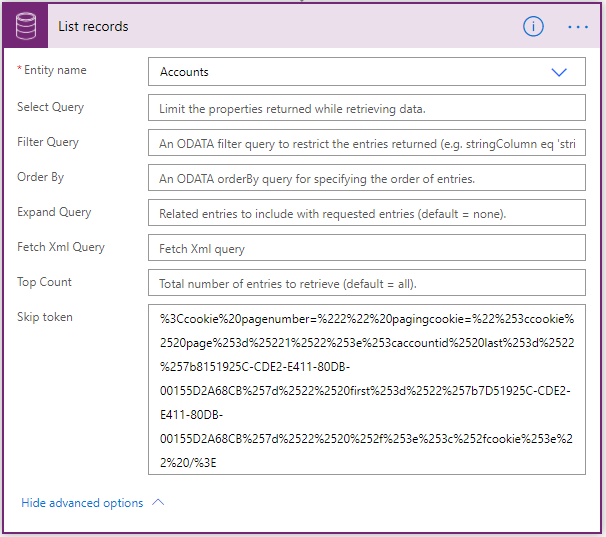

# Use lists of records in flows

<!--Todo update ALL images: tip1-->

Use the **List records** action to retrieve multiple records at once from Microsoft Dataverse with a structured query.


For example, you can select the **Entity name** to retrieve [up to 5000 accounts](https://docs.microsoft.com/powerapps/developer/common-data-service/webapi/query-data-web-api#limits-on-number-of-entities-returned). 


<!-- However, entities often contain thousands of records, so you can use filters to limit the number of results that Dataverse returns. When you filter the results, you improve efficiency and performance of your flows.  -->


To get more than 5000 records at a time, you can use the **Pagination** feature from **Settings** as the following image displays. However, [content throughput limits](https://docs.microsoft.com/power-automate/limits-and-config#content-throughput-limits) and [message size limits](https://docs.microsoft.com/power-automate/limits-and-config#message-size) are applied to ensure general service guarantees.






To learn more, see the [advanced options](#advanced-options) section within this article.

<!--todo-->



## Advanced options

Use these advanced options to provide additional properties that more finely define the records that Dataverse returns.

**Select Query** – Use **Select Query** to define a set of unique comma-separated attributes for the entity, as shown in the following image. When this step runs, only the attributes that you defined in **Select Query** are returned.



**Filter Query** – Use **Filter Query** to define an OData-style filter expression to narrow down the set of records that Dataverse returns. In the following example, the step returns only those records where the *firstname* starts with *John*.


>[!TIP]
>Learn how to use [standard filter operators](https://docs.microsoft.com/powerapps/developer/common-data-service/webapi/query-data-web-api#standard-filter-operators) and [query functions](https://docs.microsoft.com/powerapps/developer/common-data-service/webapi/query-data-web-api#standard-query-functions) 
to construct **Filter Query** expressions. 

>[!IMPORTANT]
>Filter expressions cannot contain this string: **\$filter=** because it only applies when you use the APIs directly.


**Order By** – Use **Order By** to define an OData-style expression that defines the order in which items are returned. Use the **asc** or **desc** suffix to indicate ascending or descending order, respectively. The default order is ascending. The following example shows how to retrieve a list of accounts in which the revenue is sorted in ascending order and the name is sorted in descending order.



**Expand Query** – Use **Expand Query** to define an OData-style expression that defines the data that Dataverse will return from related entities. 

<!--todo: I am not sure how talk about navigation properties is releated here-->
There are two types of navigation properties that you can use in **Expand Query**:

   1. *Single-valued* navigation properties correspond to lookup attributes that support many-to-one relationships and allow you to set a reference to another entity.

   1. *Collection-valued* navigation properties correspond to one-to-many or many-to-many relationships.

If you include only the name of the navigation property, you’ll receive all the properties for the related records. To learn more, see [Retrieve related entity records with a query](https://docs.microsoft.com/powerapps/developer/common-data-service/webapi/retrieve-related-entities-query).

To use it in a flow step, enter an Odata expression as shown in the following image. This example shows how to get the *contactid* and *fullname* fields for the *primarycontactid* of each *account*.


**Fetch XML Query** – Use **Fetch XML Query** to define a Dataverse-style XML snippet that indicates the following:
   1. The order in which attributes are returned
   1. The complex filter conditions that determine which records are returned.
   
This option is particularly useful when you work with related entities. 

The following example shows you how to set up a scenario like the **Filter Query** shown earlier. 


You can learn more about how to [use FetchXML to construct a query](https://docs.microsoft.com/powerapps/developer/common-data-service/use-fetchxml-construct-query).

**Top Count** – Use **Top Count** to indicate the specific number of records for Dataverse to return. Here's an example that shows how to request 10 records.


**Skip Token**

<!--todo This section doesn't feel totally relevant to skip token-->

Because Power Automate applies [Content throughput limits](https://docs.microsoft.com/power-automate/limits-and-config#content-throughput-limits) and [Message size limits](https://docs.microsoft.com/power-automate/limits-and-config#message-size) to ensure general service guarantees, it is often useful to use *pagination* to return a smaller number of records in a batch, rather than the [Limits on number of entities returned](https://docs.microsoft.com/powerapps/developer/common-data-service/webapi/query-data-web-api#limits-on-number-of-entities-returned).

The default page limits of 5000 records applies if you do not use pagination.

<!--todo: what is "it"?-->
To use it, implement a loop to parse the *\@odata.nextLink* value in the JSON response, extract the **skip token** and then send another request until you have listed the number of records that you need.

```json
HTTP/1.1 200 OK  
Content-Type: application/json; odata.metadata=minimal  
OData-Version: 4.0  
Content-Length: 402  
Preference-Applied: odata.maxpagesize=3  
  
{  
   "@odata.context":"[Organization URI]/api/data/v9.1/$metadata#accounts(name)",
   "value":[  
      {  
         "@odata.etag":"W/\"437194\"",
         "name":"Fourth Coffee (sample)",
         "accountid":"7d51925c-cde2-e411-80db-00155d2a68cb"
      },
      {  
         "@odata.etag":"W/\"437195\"",
         "name":"Litware, Inc. (sample)",
         "accountid":"7f51925c-cde2-e411-80db-00155d2a68cb"
      },
      {  
         "@odata.etag":"W/\"468026\"",
         "name":"Adventure Works (sample)",
         "accountid":"8151925c-cde2-e411-80db-00155d2a68cb"
      }
   ],
   "@odata.nextLink":"[Organization URI]/api/data/v9.1/accounts?$select=name&$skiptoken=%3Ccookie%20pagenumber=%222%22%20pagingcookie=%22%253ccookie%2520page%253d%25221%2522%253e%253caccountid%2520last%253d%2522%257b8151925C-CDE2-E411-80DB-00155D2A68CB%257d%2522%2520first%253d%2522%257b7D51925C-CDE2-E411-80DB-00155D2A68CB%257d%2522%2520%252f%253e%253c%252fcookie%253e%22%20/%3E"
}
```


