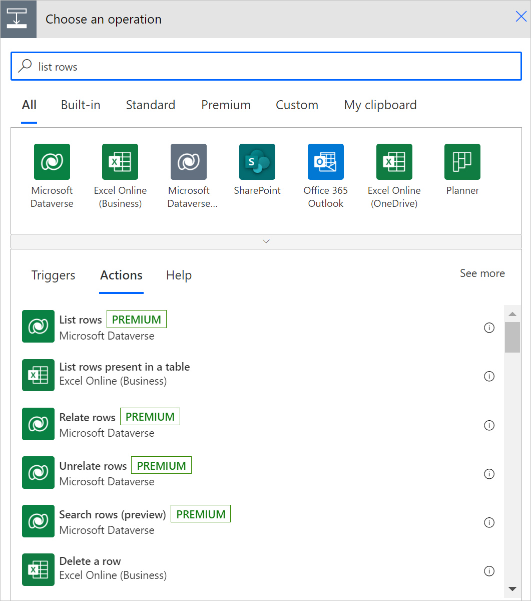
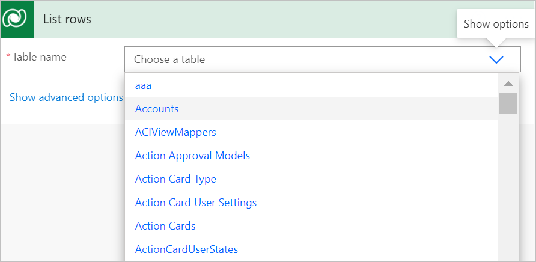
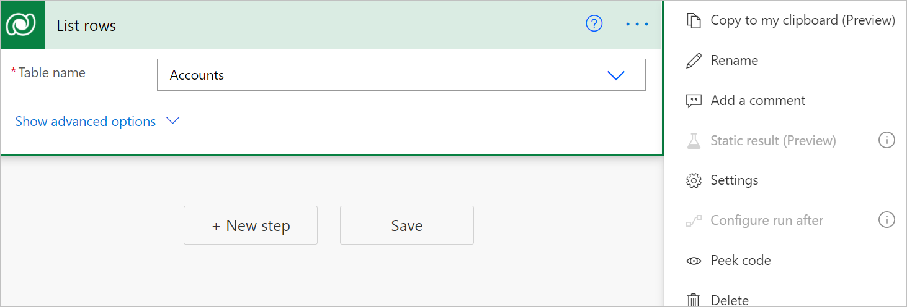
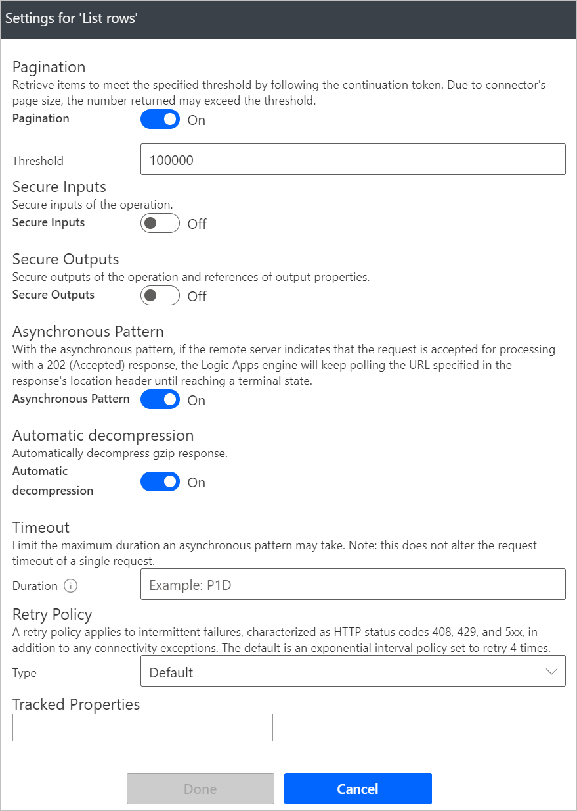
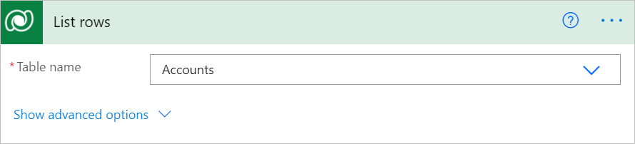
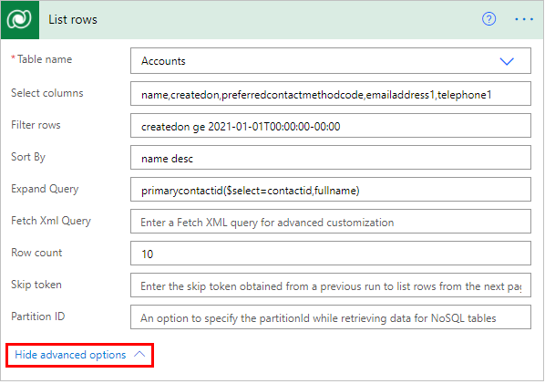

# Use lists of rows in flows

Use the **List rows** action to retrieve multiple rows at once from Microsoft Dataverse with a structured query.

## Get a list of rows

Follow these steps to add the **List rows** action to your flow to return [up to 5000 accounts](/powerapps/developer/common-data-service/webapi/query-data-web-api) from the **Accounts** table in Dataverse.

1. Select **New step** to add an action to your flow.

1. Enter **list row** into the **Search connectors and actions** search box on the **Choose an operation** card.

1. Select **Microsoft Dataverse** to filter the search results to display only actions and triggers for Microsoft Dataverse.

1. Select **List rows**.

   

1. Select the **Accounts** table from the **Table name** list.

   

1. Save and run your flow to confirm that no more than 5,000 rows are returned.

## Turn on pagination to request more than 5,000 rows

To get more than 5,000 rows from a query automatically, turn on the **Pagination** feature from **Settings** as the following steps indicate:

1. In the upper-right corner of the **List rows** card, select the menu (...).

1. Select **Settings**.

      

1. Move the **Pagination** slider to the **On** position if it's not already turned on.

1. In **Threshold**, enter the maximum<!--Edit note: Verify if min or max here. --> number of rows requested. Internally, this number is rounded off in increments of the default page size. For example, if that page size is 5,000, and you enter 7,000, the number of rows returned is 10,000.

   

>[!NOTE]
>[Content throughput limits](../limits-and-config.md#content-throughput-limits) and [message size limits](../limits-and-config.md#message-size) apply to ensure general service guarantees. When pagination is not set, the response includes an _@odata.nextLink_ parameter that can be used to request the next set of rows. See the **Skip token** section later in this article to learn how to use it.

## Advanced options

<!-- 1. Follow the steps in the [Get a list of rows](#get-a-list-of-rows) and the [Turn on pagination](#turn-on-pagination) sections earlier in this article.

1. Expand **Show advanced options**.
   
    -->

The advanced options for the **List Rows** action allow you to sort, filter, arrange, and extend the results of a query. Here's an example of how they can be can be put together:



**Select columns**: Enter a comma-separated list of columns to return, such as "name,createdon,preferredcontactmethodcode,emailaddress1,telephone1" for the Account table.

**Filter rows**: Use to define an OData-style filter expression to narrow down the set of rows that Dataverse returns, such as "createdon ge 2021-01-01T00:00:00-00:00" for rows with **createdon** greater than or equal to the year 2021. 

>[!TIP]
>Learn how to use [standard filter operators](/powerapps/developer/common-data-service/webapi/query-data-web-api.md#standard-filter-operators) and [query functions](/powerapps/developer/common-data-service/webapi/query-data-web-api.md#standard-query-functions)
to construct **Filter Query** expressions.

>[!IMPORTANT]
>Filter expressions cannot contain this string, **\$filter=**, because it only applies when you use the APIs directly.

**Sort By**: Use to define an OData-style expression that defines the order in which items are returned, such as "name desc". Use the **asc** or **desc** suffix to indicate ascending or descending order, respectively. The default order is ascending. 

**Expand Query**: Use to specify an OData-style expression that defines the data that Dataverse returns from the related tables, such as "primarycontactid($select=contactid,fullname)" to use the account's **primarycontactid** to retrieve the **fullname** column from the related contact with ID **contactid** in the response. 

There are two types of navigation properties that you can use in **Expand Query**:

   1. *Single-valued* navigation properties correspond to lookup columns that support many-to-one relationships and allow you to set a reference to another table.

   1. *Collection-valued* navigation properties correspond to one-to-many or many-to-many relationships.

If you include only the name of the navigation property, you’ll receive all the properties for the related rows. To learn more, see [Retrieve related table rows with a query](/powerapps/developer/data-platform/webapi/retrieve-related-entities-query).

To use it in a flow step, enter an Odata expression as shown in the following image. This example shows how to get the *contactid* and *fullname* columns for the *primarycontactid* of each *account*.

**Row count**: Use to indicate the specific number of rows for Dataverse to return. Here's an example that shows how to request 10 rows.

**Fetch Xml Query**: Use to specify a [Dataverse-style FetchXML snippet](/powerapps/developer/common-data-service/use-fetchxml-construct-query) which allows additional flexibility in building custom queries. These can be useful when you work with a table that has multiple related tables, or handling pagination. The following screenshot shows how to use FetchXML for the same filters and sort conditions as the previous example:


Example FetchXML query for the Account table: 

```xml
<fetch count="10">
	<entity name="account">
		<attribute name="name" />
		<attribute name="preferredcontactmethodcode" />
		<attribute name="emailaddress1" />
		<attribute name="telephone1" />
   		<link-entity name="contact" to="primarycontactid" from="contactid">
      			<attribute name="fullname" />
		</link-entity>
		<filter> 
			<condition attribute="createdon" operator="ge" value="2021-01-01T00:00:00-00:00" />
		</filter>
		<order attribute="name" descending="true" />
	</entity>
</fetch>
```

**Skip token**: Because Power Automate applies [content throughput limits](../limits-and-config.md#content-throughput-limits) and [message size limits](../limits-and-config.md#message-size) to ensure general service guarantees, it is often useful to use *pagination* to return a smaller number of rows in a batch, rather than the default [limits on number of tables returned](/powerapps/developer/common-data-service/webapi/query-data-web-api.md#limits-on-number-of-tables-returned).

The default page limit of 5,000 rows applies if you do not use pagination.

<!--todo: what is "it"?-->
To use it, implement a loop to parse the *\@odata.nextLink* value in the JSON response, extract the **skip token**, and then send another request until you have listed the number of rows that you need.

```json
HTTP/1.1 200 OK  
Content-Type: application/json; odata.metadata=minimal  
OData-Version: 4.0  
Content-Length: 402  
Preference-Applied: odata.maxpagesize=3  
  
{  
   "@odata.context":"[Organization URI]/api/data/v9.1/$metadata#accounts(name)",
   "value":[  
      {  
         "@odata.etag":"W/\"437194\"",
         "name":"Fourth Coffee (sample)",
         "accountid":"7d51925c-cde2-e411-80db-00155d2a68cb"
      },
      {  
         "@odata.etag":"W/\"437195\"",
         "name":"Litware, Inc. (sample)",
         "accountid":"7f51925c-cde2-e411-80db-00155d2a68cb"
      },
      {  
         "@odata.etag":"W/\"468026\"",
         "name":"Adventure Works (sample)",
         "accountid":"8151925c-cde2-e411-80db-00155d2a68cb"
      }
   ],
   "@odata.nextLink":"[Organization URI]/api/data/v9.1/accounts?$select=name&$skiptoken=%3Ccookie%20pagenumber=%222%22%20pagingcookie=%22%253ccookie%2520page%253d%25221%2522%253e%253caccountid%2520last%253d%2522%257b8151925C-CDE2-E411-80DB-00155D2A68CB%257d%2522%2520first%253d%2522%257b7D51925C-CDE2-E411-80DB-00155D2A68CB%257d%2522%2520%252f%253e%253c%252fcookie%253e%22%20/%3E"
}
```


**Partition ID**: An option to specify the partitionId while retrieving data for NoSQL tables. To learn more, see [Improve performance using storage partitions when accessing table data](/powerapps/developer/data-platform/org-service/azure-storage-partitioning-sdk).
