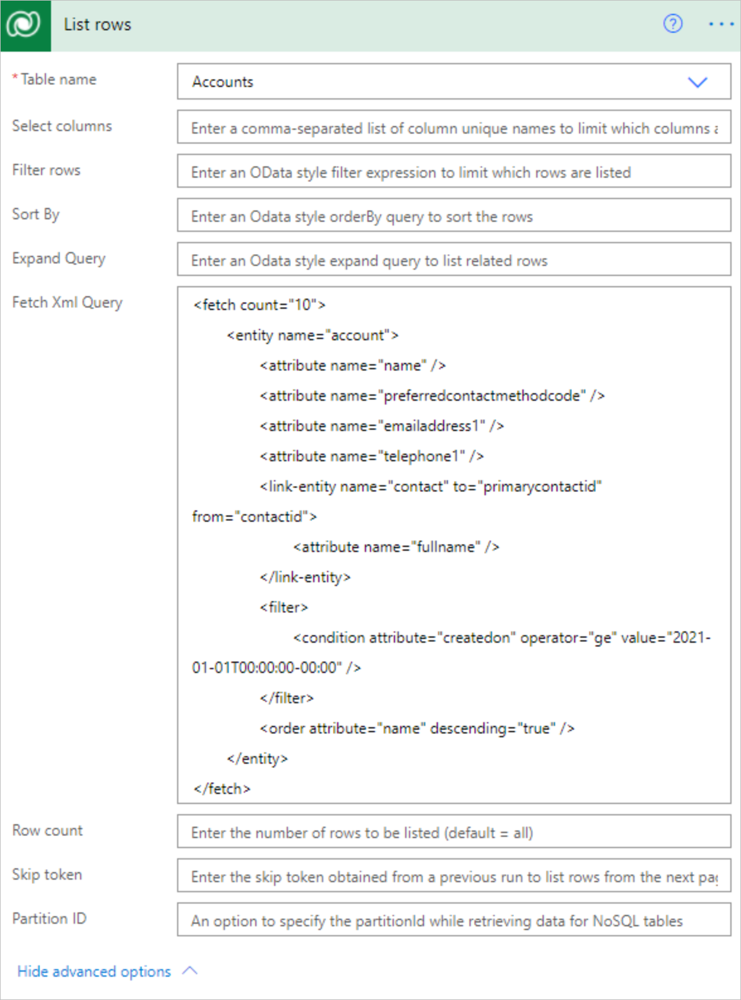

# Use lists of rows in flows

Use the **List rows** action to retrieve multiple rows at once from Microsoft Dataverse with a structured query.

## Get a list of rows

Follow these steps to add the **List rows** action to your flow to return [up to 5,000 accounts](/powerapps/developer/common-data-service/webapi/query-data-web-api) from the **Accounts** table in Dataverse.

[!INCLUDE[designer-tab-experience](../includes/designer-tab-experience.md)]

# [New designer](#tab/new-designer)

1. Select the plus sign (**+**) > **Add an action**.
1. On the **Add an action** sceen, enter **list rows** in the **Search** field.
1. Under **Microsoft Dataverse**, select **List rows (Preview)**.
1. On the **Parameters** tab to the left, select **Accounts** in the **Table Name** dropdown menu.
1. Close the screen by selecting (**<<**).

# [Classic designer](#tab/classic-designer)

1. Select **New step** to add an action to your flow.
1. Enter **list rows** into the **Search connectors and actions** search box on the **Choose an operation** card.
1. Select **Microsoft Dataverse** to filter the search results to display only actions and triggers for Microsoft Dataverse.
1. Select **List rows**.
1. Select the **Accounts** table from the **Table name** list.
1. Save and run your flow to confirm that no more than 5,000 rows are returned.

---

## Turn on pagination to request more than 5,000 rows

To get more than 5,000 rows from a query automatically, turn on the **Pagination** feature from **Settings**.

When pagination is set and the amount of rows exceeds that number of the threshold configured, the response won't include the **_@odata.nextLink_** parameter to request the next set of rows. Turn pagination off so that the response includes the **_@odata.nextLink_** parameter that can be used to request the next set of rows. Go to [Skip token](#skip-token) to learn how to use it.

[Content throughput limits](../limits-and-config.md#content-throughput-limits) and [message size limits](../limits-and-config.md#message-size) apply to ensure general service guarantees.

# [New designer](#tab/new-designer)

1. Select the **List rows** card.
1. On the pane to the left, select the **Settings** tab > **Networking**.
1. Move the **Pagination** slider to the **On** position if it's not already turned on.
1. In **Threshold**, enter the maximum number of rows requested. The maximum configurable threshold is 100,000.

    Internally, this number is rounded off in increments of the default page size. For example, if that page size is 5,000, and you enter 7,000, the number of rows returned is 10,000.

# [Classic designer](#tab/classic-designer)

1. In the upper-right corner of the **List rows** card, select the menu (...).
1. Select **Settings**.
1. Move the **Pagination** slider to the **On** position if it's not already turned on.
1. In **Threshold**, enter the maximum number of rows requested. The maximum configurable threshold is 100,000.

    Internally, this number is rounded off in increments of the default page size. For example, if that page size is 5,000, and you enter 7,000, the number of rows returned is 10,000.

---

## Advanced options

The advanced options for the **List Rows** action allow you to sort, filter, arrange, and extend the results of a query.

# [New designer](#tab/new-designer)

You can set options inthe action configuration pane.

1. To see the options, select the **List rows** card.
1. In the **Parameters** tab, select an advanced option in the **Add new parameters** dropdown menu.

    :::image type="content" source="../media/list-rows/ai-advanced-list-rows.png" alt-text="Screenshot of advanced options for the List rows action in the Configuration action pane.":::

# [Classic designer](#tab/classic-designer)

You can set advanced options directly on the **List rows** card. To see the options, select **Show advanced options**. When you select it, the name changes to **Hide advanced options**.

:::image type="content" source="../media/list-rows/advanced-list-rows.png" alt-text="Screenshot of advanced options in the List rows card.":::

---

### Select columns

Enter a comma-separated list of columns to return, such as "name,createdon,preferredcontactmethodcode,emailaddress1,telephone1" for the Account table.

### Filter rows

Use to define an OData-style filter expression to narrow down the set of rows that Dataverse returns, such as "createdon ge 2021-01-01T00:00:00-00:00" for rows with **createdon** greater than or equal to the year 2021.

Learn how to use [standard filter operators](/powerapps/developer/data-platform/webapi/query-data-web-api#standard-filter-operators) and [query functions](/powerapps/developer/data-platform/webapi/query-data-web-api#standard-query-functions)
to construct **Filter Query** expressions.

Certain characters, such as **&**, **#**, and **+** need to be replaced with their URL-encoded equivalent. More information: [URL encode special characters](/powerapps/developer/data-platform/webapi/query-data-web-api#url-encode-special-characters)

> [!IMPORTANT]
> Filter expressions can't contain this string, **\$filter=**, because it only applies when you use the APIs directly.

### Sort by

Use to define an OData-style expression that defines the order in which items are returned, such as "name desc". Use the **asc** or **desc** suffix to indicate ascending or descending order, respectively. The default order is ascending.

### Expand query

Use to specify an OData-style expression that defines the data that Dataverse returns from the related tables, such as `primarycontactid($select=contactid,fullname)` to use the account's **primarycontactid** to retrieve the **fullname** column from the related contact with ID **contactid** in the response.

There are two types of navigation properties that you can use in **Expand Query**:

   1. *Single-valued* navigation properties correspond to lookup columns that support many-to-one relationships and allow you to set a reference to another table.

   1. *Collection-valued* navigation properties correspond to one-to-many or many-to-many relationships.

If you include only the name of the navigation property, you’ll receive all the properties for the related rows. To learn more, see [Retrieve related table rows with a query](/powerapps/developer/data-platform/webapi/retrieve-related-entities-query).

To use it in a flow step, enter this Odata expression in the **Expand Query** field: `primarycontactid(contactid,fullname)`. This is how to get the *contactid* and *fullname* columns for the *primarycontactid* of each *account*.

### Row count

Use to indicate the specific number of rows for Dataverse to return. Here's an example that shows how to request 10 rows.

### Fetch Xml Query

[Aggregation queries](/powerapps/developer/data-platform/use-fetchxml-aggregation) aren't currently supported when using the **List rows** action with FetchXML queries. However, the distinct operator is supported.

# [New designer](#tab/new-designer)

Use a [Dataverse-style FetchXML query](/powerapps/developer/common-data-service/use-fetchxml-construct-query), which allows more flexibility in building custom queries. These queries can be useful when you work with a table that has multiple related tables, or handling pagination. The following screenshot shows how to use FetchXML.

Example FetchXML query for the Account table:

```xml
<fetch count="10">
	<entity name="account">
		<attribute name="name" />
		<attribute name="preferredcontactmethodcode" />
		<attribute name="emailaddress1" />
		<attribute name="telephone1" />
   		<link-entity name="contact" to="primarycontactid" from="contactid">
      			<attribute name="fullname" />
		</link-entity>
		<filter> 
			<condition attribute="createdon" operator="ge" value="2021-01-01T00:00:00-00:00" />
		</filter>
		<order attribute="name" descending="true" />
	</entity>
</fetch>
```

As the distinct operator isn't currently supported directly in FetchXML queries from the List rows action, the [union function](/azure/logic-apps/workflow-definition-language-functions-reference#union) can be used to remove duplicate rows. For example, you can use the [Select action](../data-operations.md#use-the-select-action) to transform the response of the List rows connection to the specific array format you need, then create a [variable](../create-variable-store-values.md#initialize-a-variable) with the expression *union(body(‘Select’),body(‘Select’))* to get an array with distinct rows.

# [Classic designer](#tab/classic-designer)

Use a [Dataverse-style FetchXML query](/powerapps/developer/common-data-service/use-fetchxml-construct-query), which allows more flexibility in building custom queries. These queries can be useful when you work with a table that has multiple related tables, or handling pagination. The following screenshot shows how to use FetchXML.

Type the following in the **Fetch Xml Query** field.



As the distinct operator isn't currently supported directly in FetchXML queries from the List rows action, the [union function](/azure/logic-apps/workflow-definition-language-functions-reference#union) can be used to remove duplicate rows. For example, you can use the [Select action](../data-operations.md#use-the-select-action) to transform the response of the List rows connection to the specific array format you need, then create a [variable](../create-variable-store-values.md#initialize-a-variable) with the expression *union(body(‘Select’),body(‘Select’))* to get an array with distinct rows.

---

### Skip token

Because Power Automate applies [content throughput limits](../limits-and-config.md#content-throughput-limits) and [message size limits](../limits-and-config.md#message-size) to ensure general service guarantees, it's often useful to use *pagination* to return a smaller number of rows in a batch, rather than the default [limits on number of table rows returned](/power-apps/developer/data-platform/webapi/query-data-web-api#limits-on-number-of-table-rows-entities-returned).

The default page limit of 5,000 rows applies if you don't use pagination.

To use it, implement a loop to parse the *\@odata.nextLink* value in the JSON response, extract the **skip token**, and then send another request until you've listed the number of rows that you need.

```json
HTTP/1.1 200 OK  
Content-Type: application/json; odata.metadata=minimal  
OData-Version: 4.0  
Content-Length: 402  
Preference-Applied: odata.maxpagesize=3  
  
{  
   "@odata.context":"[Organization URI]/api/data/v9.1/$metadata#accounts(name)",
   "value":[  
      {  
         "@odata.etag":"W/\"437194\"",
         "name":"Fourth Coffee (sample)",
         "accountid":"7d51925c-cde2-e411-80db-00155d2a68cb"
      },
      {  
         "@odata.etag":"W/\"437195\"",
         "name":"Litware, Inc. (sample)",
         "accountid":"7f51925c-cde2-e411-80db-00155d2a68cb"
      },
      {  
         "@odata.etag":"W/\"468026\"",
         "name":"Adventure Works (sample)",
         "accountid":"8151925c-cde2-e411-80db-00155d2a68cb"
      }
   ],
   "@odata.nextLink":"[Organization URI]/api/data/v9.1/accounts?$select=name&$skiptoken=%3Ccookie%20pagenumber=%222%22%20pagingcookie=%22%253ccookie%2520page%253d%25221%2522%253e%253caccountid%2520last%253d%2522%257b8151925C-CDE2-E411-80DB-00155D2A68CB%257d%2522%2520first%253d%2522%257b7D51925C-CDE2-E411-80DB-00155D2A68CB%257d%2522%2520%252f%253e%253c%252fcookie%253e%22%20/%3E"
}
```

### Partition ID

An option to specify the partitionId while retrieving data for NoSQL tables. To learn more, see [Improve performance using storage partitions when accessing table data](/powerapps/developer/data-platform/org-service/azure-storage-partitioning-sdk).

## Related information

- [Training: Use Dataverse triggers and actions in Power Automate (module)](/training/modules/use-dataverse-triggers-actions/)
- [Training: Integrate Power Automate flows and Dataverse (learning path)](/training/paths/integrate-dataverse-power-automate/)
