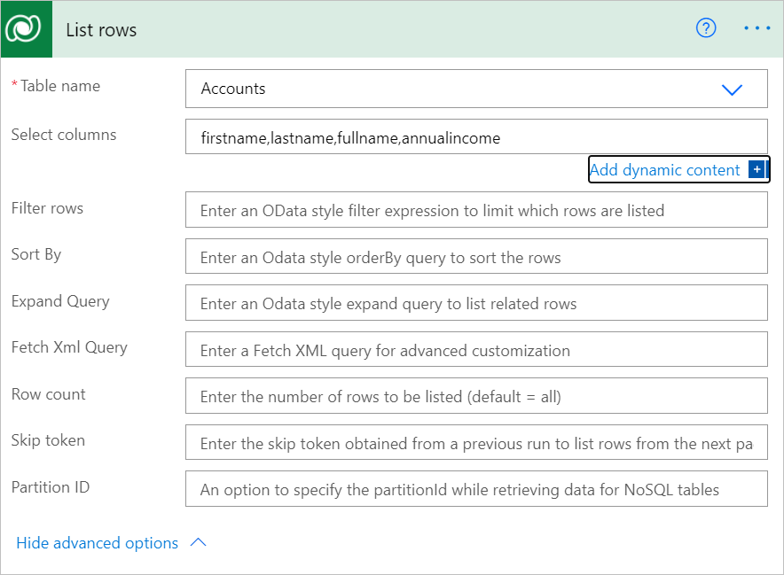
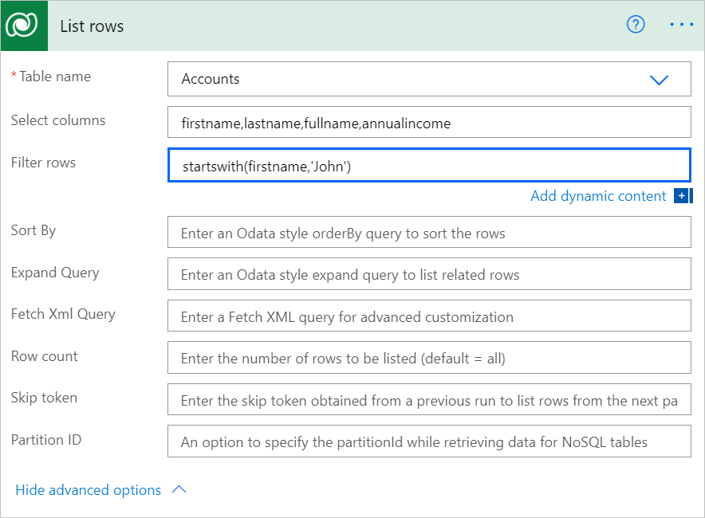
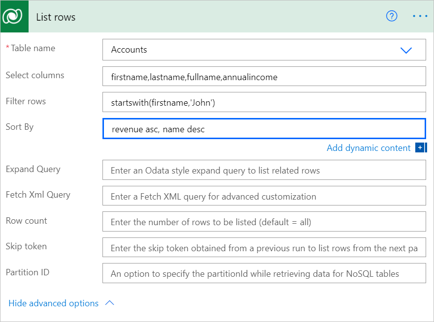
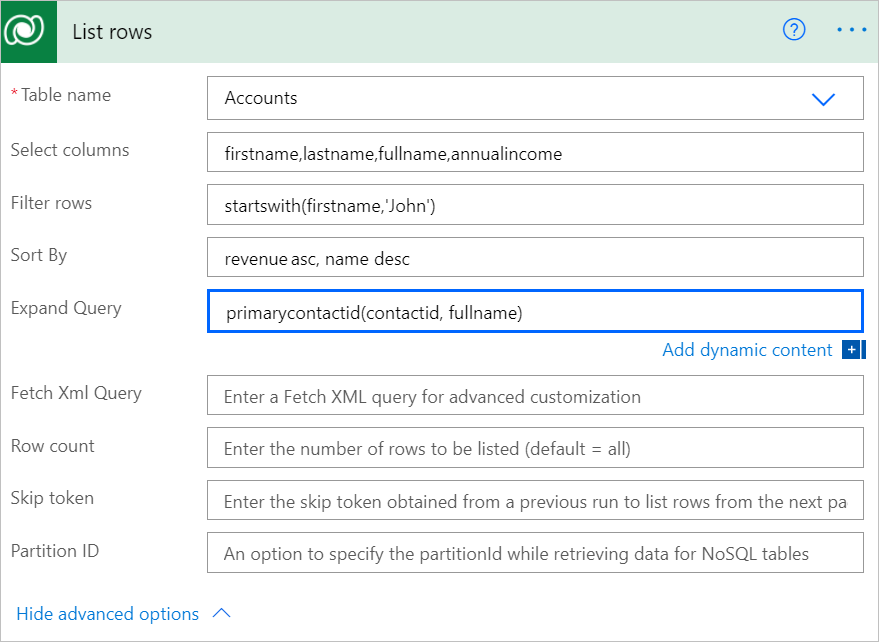
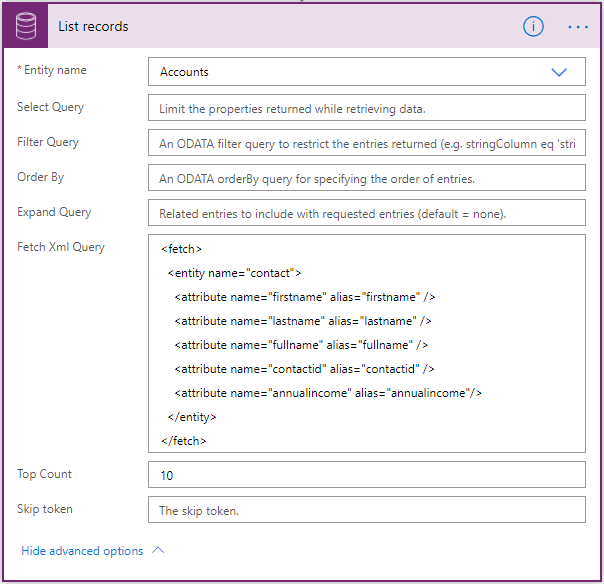
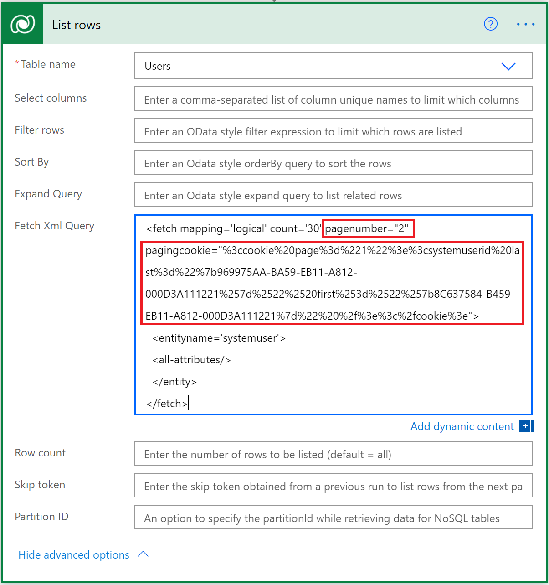
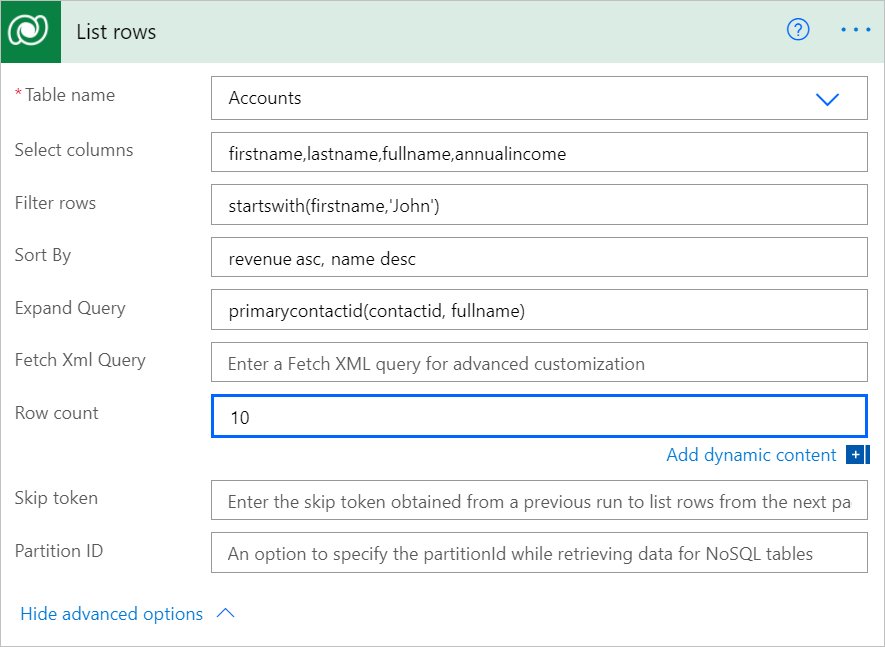
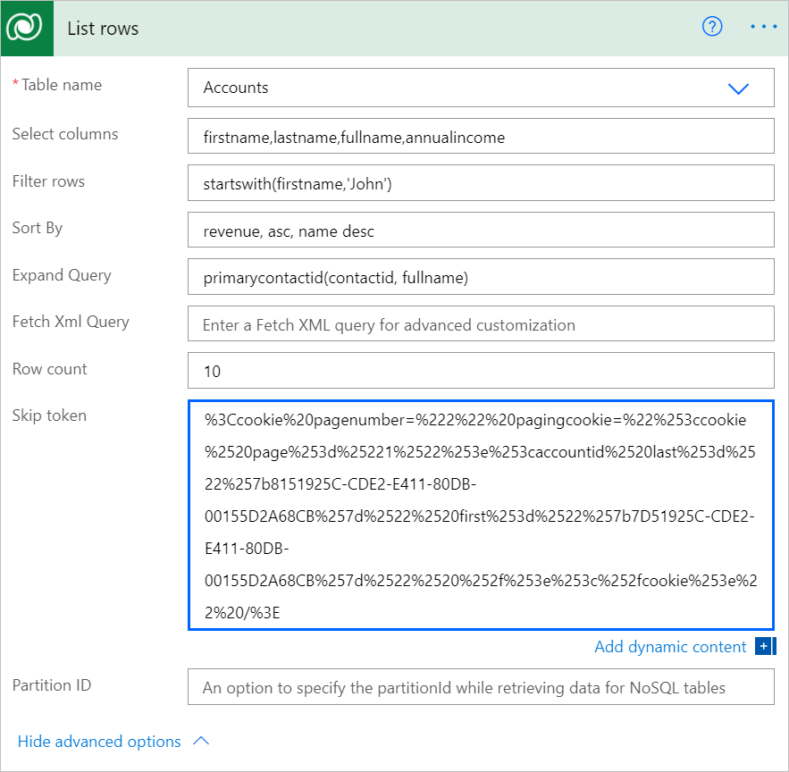

# Use lists of rows in flows

Use the **List rows** action to retrieve multiple rows at once from Microsoft Dataverse with a structured query.


## Get a list of rows

Follow these steps to add the **List rows** action to your flow to return [up to 5000 accounts](https://docs.microsoft.com/powerapps/developer/common-data-service/webapi/query-data-web-api#limits-on-number-of-entities-returned) accounts from the **Accounts** table in Dataverse.

1. Select **New step** to add an action to your flow.
1. Enter **list row** into the **Search connectors and actions** search box on the **Choose an operation** card.
1. Select **Microsoft Dataverse** to filter the search results to display only actions and triggers for Microsoft Dataverse.
1. Select **List rows**.

   

1. Select the **Accounts** table from the **Table name** list.

   

1. Save and run your flow to confirm that no more than 5000 thousand rows are returned.


## Turn on pagination to request more than 5000 rows

To get more than 5000 rows from a query automatically, turn on the **Pagination** feature from **Settings** as the following steps indicate.

1. Select **Menu for list rows** (the three dots in the top right corner of the **List rows** card).

1. Select **Settings**.

      

1. Move the **Pagination** slider to the **On** position if it's not already turned on.

1. Enter a **Threshold** to indicate the minimum number of rows requested. It is internally rounded off in increments of the default page size, i.e. 5000. If you enter 7000, the number of rows returned is 10000.

   

>[!NOTE]
>[Content throughput limits](https://docs.microsoft.com/power-automate/limits-and-config#content-throughput-limits) and [message size limits](https://docs.microsoft.com/power-automate/limits-and-config#message-size) apply to ensure general service guarantees. When pagination is not set, the response includes an _@odata.nextLink_ parameter which can be used to request the next set of rows. See the **Skip token** section later in this article to learn how to use it.


## Advanced options

<!-- 1. Follow the steps in the [Get a list of rows](#get-a-list-of-rows) and the [Turn on pagination](#turn-on-pagination) sections earlier in this article.

1. Expand **Show advanced options**.
   
    -->


Use these advanced options to provide additional properties that more finely define the rows that Dataverse returns.


**Select columns** – Use **Select columns** to define a A comma-separated list of columns to return, as shown in the following image. When this step runs, only the columns that you defined in **Filter rows*** are returned.




**Filter rows** – Use **Filter rows** to define an OData-style filter expression to narrow down the set of rows that Dataverse returns. In the following example, the step returns only those rows where the *firstname* starts with *John*.




>[!TIP]
>Learn how to use [standard filter operators](https://docs.microsoft.com/powerapps/developer/common-data-service/webapi/query-data-web-api#standard-filter-operators) and [query functions](https://docs.microsoft.com/powerapps/developer/common-data-service/webapi/query-data-web-api#standard-query-functions) 
to construct **Filter Query** expressions. 

>[!IMPORTANT]
>Filter expressions cannot contain this string: **\$filter=** because it only applies when you use the APIs directly.


**Sort By** – Use **Sort By** to define an OData-style expression that defines the order in which items are returned. Use the **asc** or **desc** suffix to indicate ascending or descending order, respectively. The default order is ascending. The following example shows how to retrieve a list of accounts in which the revenue is sorted in ascending order and the name is sorted in descending order.




**Expand Query** – Use **Expand Query** to define an OData-style expression that defines the data that Dataverse will return from related tables. 

<!--todo: I am not sure how talk about navigation properties is related here-->
There are two types of navigation properties that you can use in **Expand Query**:

   1. *Single-valued* navigation properties correspond to lookup columns that support many-to-one relationships and allow you to set a reference to another table.

   1. *Collection-valued* navigation properties correspond to one-to-many or many-to-many relationships.

If you include only the name of the navigation property, you’ll receive all the properties for the related rows. To learn more, see [Retrieve related table rows with a query](https://docs.microsoft.com/powerapps/developer/common-data-service/webapi/retrieve-related-tables-query).

To use it in a flow step, enter an Odata expression as shown in the following image. This example shows how to get the *contactid* and *fullname* columns for the *primarycontactid* of each *account*.




**Fetch Xml Query** – Use **Fetch Xml Query** to define a Dataverse-style XML snippet that indicates the following:
   1. The order in which columns are returned.
   1. The complex filter conditions that determine which rows are returned.
   
This option is particularly useful when you work with related tables. 

The following example shows you how to set up a scenario like the **Filter Query** shown earlier. 

<!--todo - image needs to be updated-->
<!--  -->

You can learn more about how to [use FetchXML to construct a query](https://docs.microsoft.com/powerapps/developer/common-data-service/use-fetchxml-construct-query).

>[!NOTE]
When pagination is used with Fetch Xml, the response includes a _@Microsoft.Dynamics.CRM.fetchxmlpagingcookie_ parameter instead of a _@odata.nextLink_ parameter, typically formatted as _<cookie pagenumber=\"2\" pagingcookie=\"%253ccookie%2520page%253d%25221%2522%253e%253csystemuserid%2520last%253d%2522%257b969975AA-BA59-EB11-A812-000D3A111221%257d%2522%2520first%253d%2522%257b8C637584-B459-EB11-A812-000D3A111221%257d%2522%2520%252f%253e%253c%252fcookie%253e\" istracking=\"False\" />_. Following image shows how to use it manually in a flow. However, it is advisable to use an expression to pass this parameter to the Fetch Xml Query input.




**Row count** – Use **Row count** to indicate the specific number of rows for Dataverse to return. Here's an example that shows how to request 10 rows.




**Skip token**

<!--todo This section doesn't feel totally relevant to skip token-->

Because Power Automate applies [Content throughput limits](https://docs.microsoft.com/power-automate/limits-and-config#content-throughput-limits) and [Message size limits](https://docs.microsoft.com/power-automate/limits-and-config#message-size) to ensure general service guarantees, it is often useful to use *pagination* to return a smaller number of rows in a batch, rather than the [Limits on number of tables returned](https://docs.microsoft.com/powerapps/developer/common-data-service/webapi/query-data-web-api#limits-on-number-of-entities-returned).

The default page limits of 5000 rows applies if you do not use pagination.

<!--todo: what is "it"?-->
To use it, implement a loop to parse the *\@odata.nextLink* value in the JSON response, extract the **skip token** and then send another request until you have listed the number of rows that you need.


```json
HTTP/1.1 200 OK  
Content-Type: application/json; odata.metadata=minimal  
OData-Version: 4.0  
Content-Length: 402  
Preference-Applied: odata.maxpagesize=3  
  
{  
   "@odata.context":"[Organization URI]/api/data/v9.1/$metadata#accounts(name)",
   "value":[  
      {  
         "@odata.etag":"W/\"437194\"",
         "name":"Fourth Coffee (sample)",
         "accountid":"7d51925c-cde2-e411-80db-00155d2a68cb"
      },
      {  
         "@odata.etag":"W/\"437195\"",
         "name":"Litware, Inc. (sample)",
         "accountid":"7f51925c-cde2-e411-80db-00155d2a68cb"
      },
      {  
         "@odata.etag":"W/\"468026\"",
         "name":"Adventure Works (sample)",
         "accountid":"8151925c-cde2-e411-80db-00155d2a68cb"
      }
   ],
   "@odata.nextLink":"[Organization URI]/api/data/v9.1/accounts?$select=name&$skiptoken=%3Ccookie%20pagenumber=%222%22%20pagingcookie=%22%253ccookie%2520page%253d%25221%2522%253e%253caccountid%2520last%253d%2522%257b8151925C-CDE2-E411-80DB-00155D2A68CB%257d%2522%2520first%253d%2522%257b7D51925C-CDE2-E411-80DB-00155D2A68CB%257d%2522%2520%252f%253e%253c%252fcookie%253e%22%20/%3E"
}
```




**Partition ID** - An option to specify the partitionId while retrieving data for NoSQL tables. To learn more, see [Improve performance using storage partitions when accessing table data](https://docs.microsoft.com/powerapps/developer/data-platform/org-service/azure-storage-partitioning-sdk).

