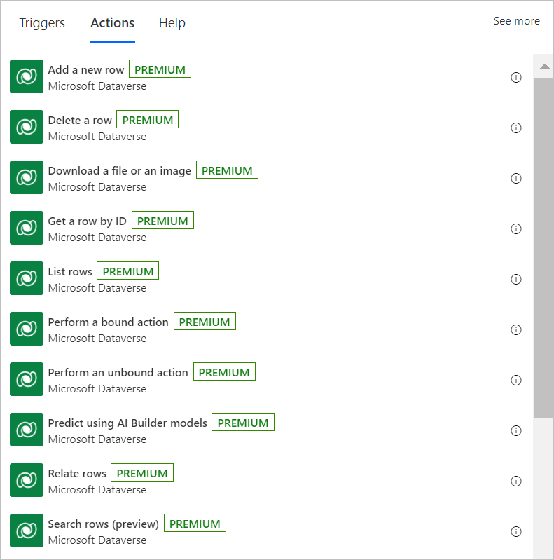

# Overview of how to integrate Power Automate flows with Dataverse

With [Microsoft Dataverse](https://powerplatform.microsoft.com/dataverse/?ef_id=4425b9cfc5191d82cc2ed9a8b6fe9233:G:s&OCID=AID2100430_SEM_4425b9cfc5191d82cc2ed9a8b6fe9233:G:s&msclkid=4425b9cfc5191d82cc2ed9a8b6fe9233), you can store and manage data for business applications and integrate natively with other Microsoft Power Platform services like Power BI, Power Apps, Microsoft Copilot Studio, and AI Builder from your [cloud flows](../overview-cloud.md).

The Microsoft Dataverse connector provides [several triggers](#overview-of-triggers) to start your flows and [many actions](#overview-of-actions) that you can use to create or update data in Dataverse while your flows run. You can use Dataverse actions even if your flows don't use a trigger from the Dataverse connector.

Use the Microsoft Dataverse connector to create cloud flows that start when data changes in Dataverse tables and custom messages. <!--todo, how is custom messages-->For example, you can send an email whenever a row gets updated in Dataverse.

## Overview of triggers

The Microsoft Dataverse connector provides the following triggers to help you define when your flows start:

- When a row is created, updated, or deleted

- When an action is performed
  
- When a flow step is run from a business process flow

## Overview of actions

The Microsoft Dataverse connector provides the following actions to help you manage data in your flows:<!-- Edit note: How about a See also link to more details about triggers or actions, like a page describing them. -->

- Create a new row
- Update a row
- Search rows with relevance search
- Get a row
- List rows
- Delete a row
- Relate rows
- Unrelate rows
- Execute a changeset request
- Get file or image content
- Upload file or image content
- Perform a bound action
- Perform an unbound action
   
