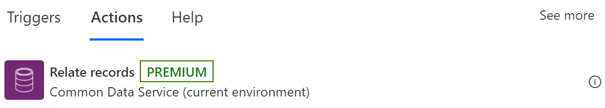
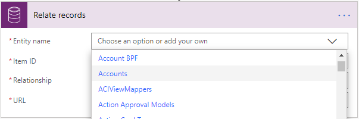
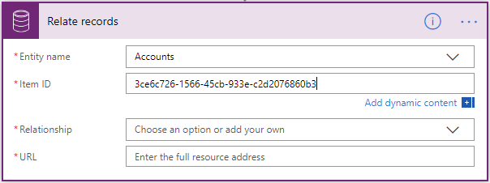
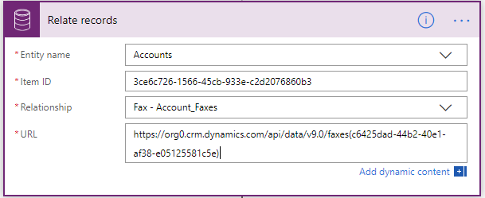
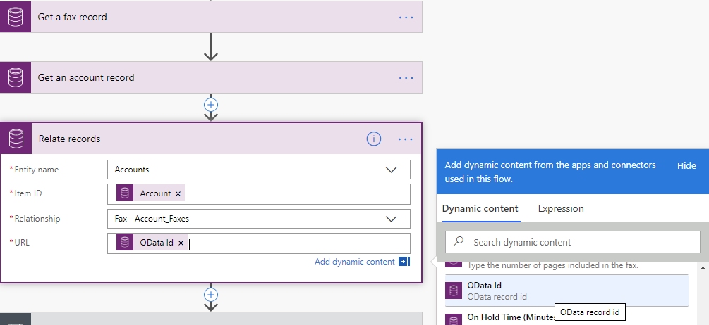
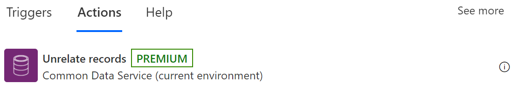
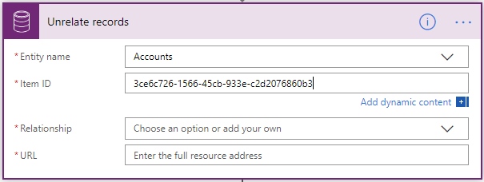

# Relate or unrelate rows in Dataverse

>[!IMPORTANT]
>You can associate two Dataverse rows only if they have a one-to-many or many-to-many relationship.

## Relate rows

Follow these steps to associate two rows.

1. Add the **Relate rows** action to your flow. 

   

   Like other actions in this connector, a list of supported tables is available.
   
1. Select the type of table that you want to which you want to relate, or enter a custom value for the table set name.  

   

1. You will need to enter the identifier of the row you want to relate.  

   

   The list of supported one-to-many and many-to-many relationships based on the table type selected is populated in the format \<Related Entity Type\> – \<Relationship Schema Name\>. You can select the relationship to which you want to relate your row.  

   

1. Enter the full resource URL of the row to which you want to add the relationship. This URL is the full OData identifier of the resource, as shown in the following image.  

   

   >[!TIP]
   >You can get the row identifier from a previous step from the available Dynamic content.  

   

## Unrelate rows

1. Add the **Unrelate rows** action to your flow. 

   Your flow uses this action to disassociate two Dataverse rows if they are linked via a one-to-many or many-to-many relationship.

   

1. Select the type of table you want to unrelate from or enter a custom value for the table set name.  

   

1. Enter the identifier of the row you want to unrelate from.  

   

   The list of supported one-to-many and many-to-many relationships based on the table type selected above will be populated in the format \<Related Entity Type\> – \<Relationship Schema Name\>. Select the relationship you want to unrelate the related table from or enter your custom value of the relationship schema name.  

   

1. Enter the full resource URL of the related table you want to unrelate. This
will be the full OData identifier of the resource.  

   

   >[!TIP]
   >You can usually grab the row identifier from a previous step by using dynamic content.  

   
