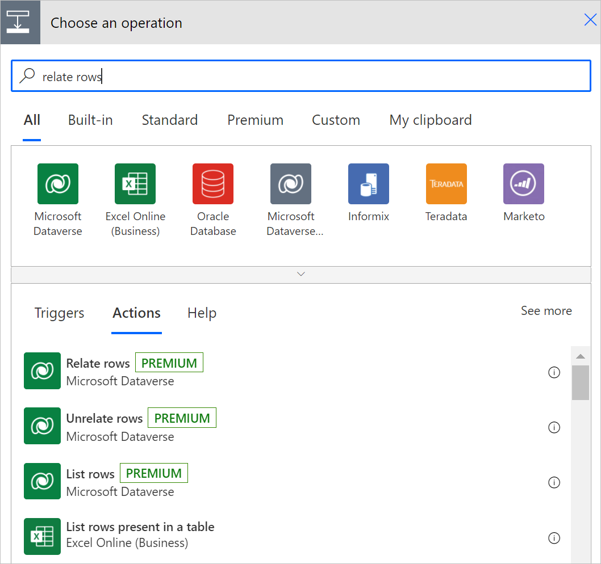
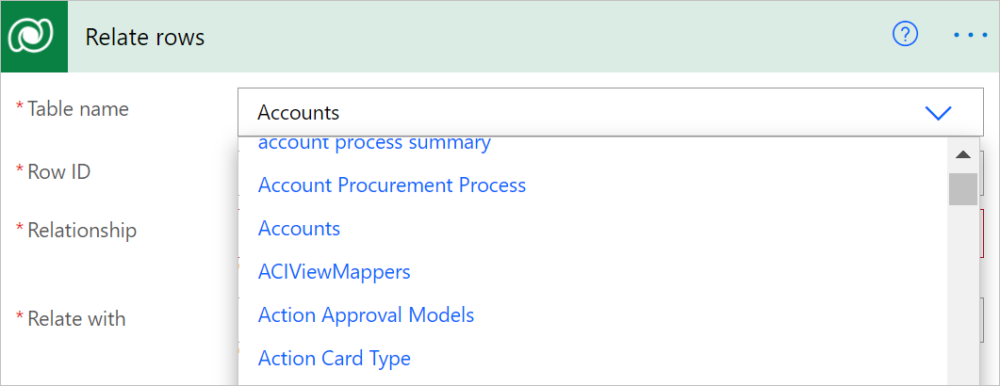
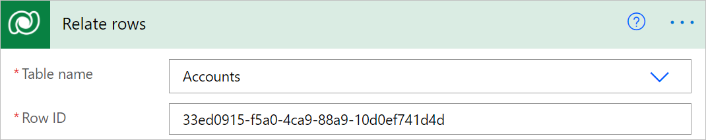
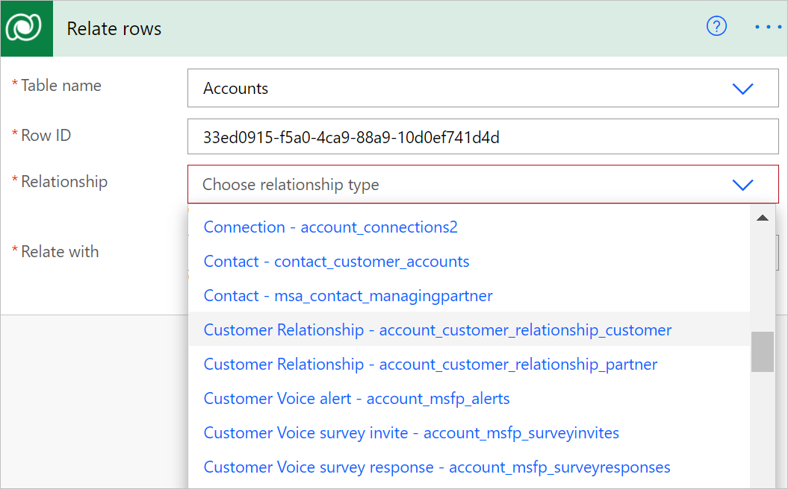
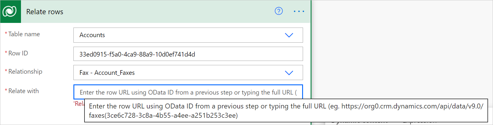
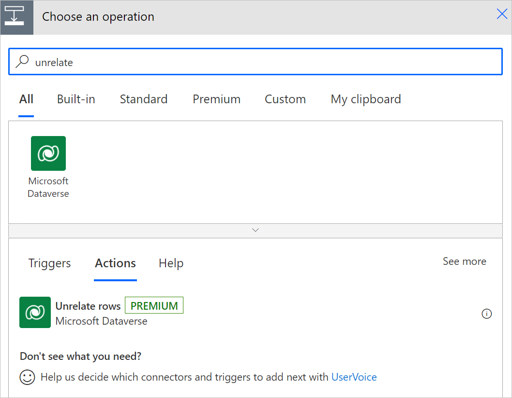
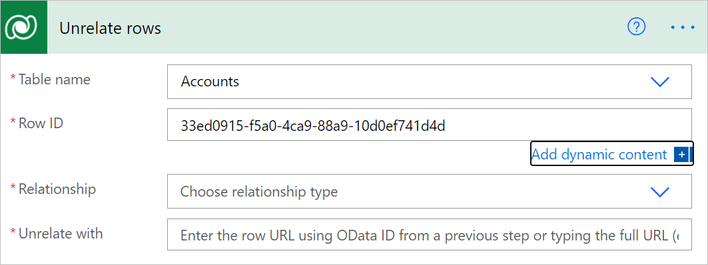
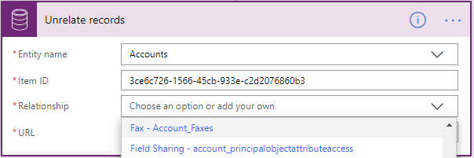
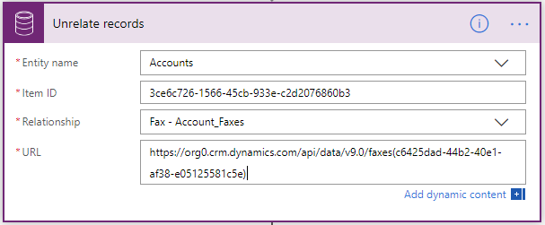
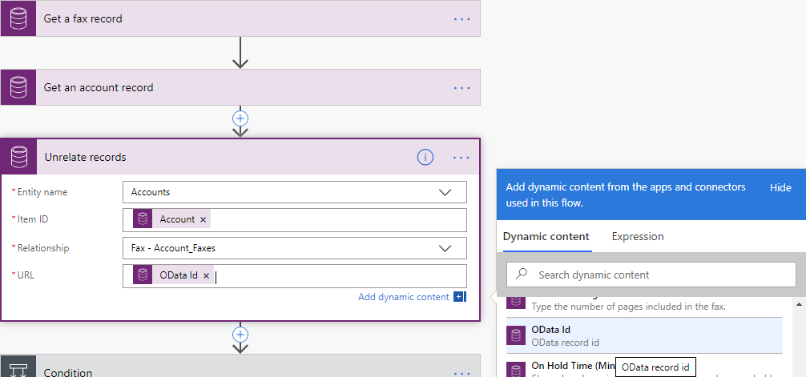

# Relate or unrelate rows in Dataverse

>[!IMPORTANT]
>You can associate two Microsoft Dataverse rows only if they have a one-to-many or many-to-many relationship.<!-- Edit note: I don't think this topic is in the TOC. -->

## Relate rows

Follow these steps to associate two rows while editing your flow:

1. Select **New step** to add an action to your flow.

1. Enter **relate rows** into the **Search connectors and actions** search box on the **Choose an operation** card.

1. Select **Microsoft Dataverse**.

1. Select the **Relate rows** action.

   

   Like other actions in this connector, a list of supported tables is available.

1. Select the table to which you want to relate or enter a custom value for the table name.  

   

1. You will need to enter the identifier of the row you want to relate.  

   

   The list of supported one-to-many and many-to-many relationships based on the table type selected is populated in the format \<Related Table Type\> – \<Relationship Schema Name\>. You can select the relationship to which you want to relate your row.  

   

1. Enter the full resource URL of the row to which you want to add the relationship.

   This URL is the full OData identifier of the resource, as shown in the following image:  

   

   >[!TIP]
   >You can get the row identifier URL from a previous step from the available dynamic content.  

## Unrelate rows

1. Select **New step** to add an action to your flow.

1. Enter **unrelate rows** into the **Search connectors and actions** search box on the **Choose an operation** card.

1. Select **Microsoft Dataverse**.

1. Select **unrelate rows** action.

   Your flow uses this action to disassociate two Dataverse rows if they are linked by a one-to-many or many-to-many relationship.

   

1. Select the type of table you want to unrelate from or enter a custom value for the table name.

1. Enter the identifier of the row that you want to unrelate from.  

   

   The list of supported one-to-many and many-to-many relationships based on the table type you selected will be populated in the format \<Related Table Type\> – \<Relationship Schema Name\>. Select the relationship you want to unrelate the related table from or enter your custom value for the relationship schema name.<!-- Edit note: From here the screenshots look different including name change from row to records. Maybe should be re-taken. -->

   

1. Enter the full resource URL of the related table you want to unrelate. This URL will be the full OData identifier of the resource.  

   

   >[!TIP]
   >You can usually copy the row identifier from a previous step by using dynamic content.<!-- Edit note: Do you mean URL not row ID. -->

   
