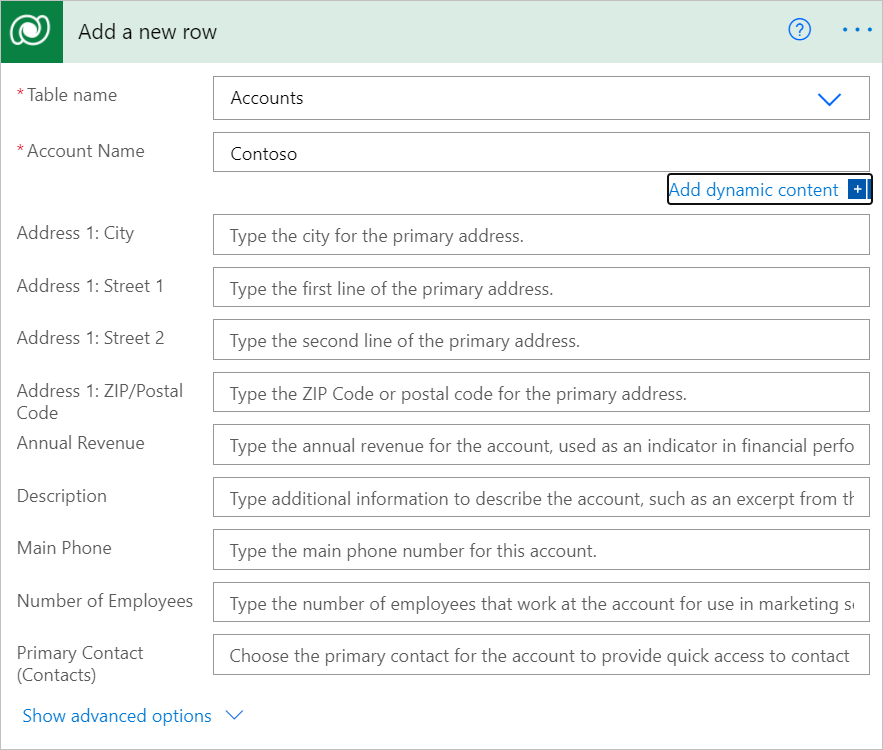
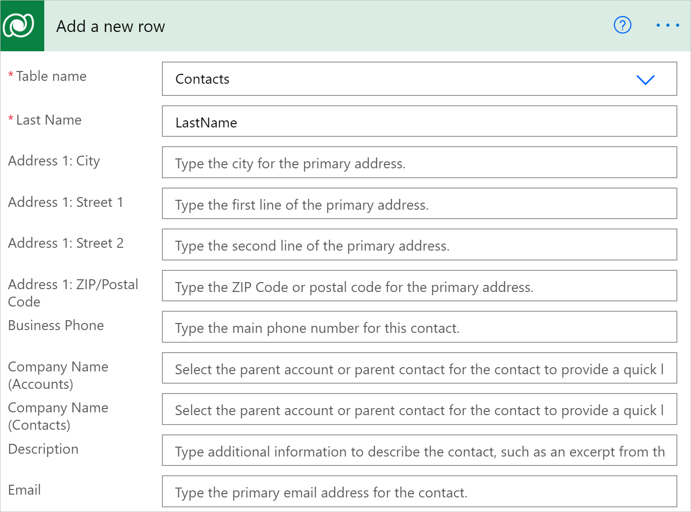
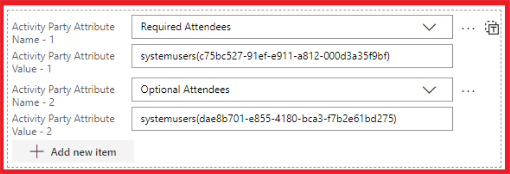
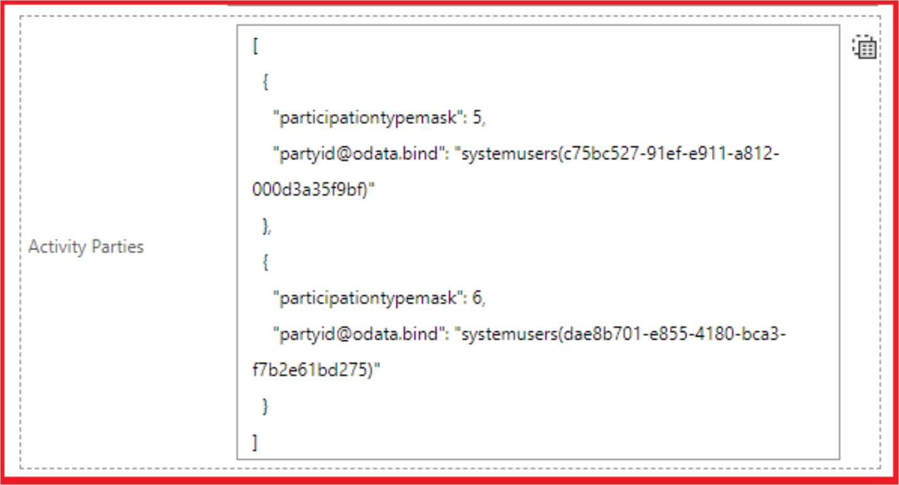

# Use relationships to modify rows

Relationships are an important concept in the Microsoft Dataverse. Power Automate allows you to work with these relationships in a few ways.<!-- Edit notes: Would be nice to define relationships or at least link to more info here. -->

## Modify or add rows directly with relationships

When you create or modify rows, there are columns that hold relationships. For example, when you create an account, there is a **Primary Contact** column.

When you want to create or modify a relationship, use standard OData notation. For example, while creating an account row, you should set the **Primary contact** column to the OData ID of a contact row like this: `contacts(c96be312-4ac1-4358-99b6-1e14e2957b15)`.

>[!IMPORTANT]
>If you try to pass only the GUID from previous step, you’ll get an error like this: *Resource not found for the segment \<segmentname\>*. The Microsoft Dataverse connector expects the full OData ID of the target row, including the type of the row.

If the lookup column is *polymorphic* (meaning it can have more than one possible target type), then the target row OData ID must be provided in the correct column. For example, the **Company name** column for **Contacts** is polymorphic and can take either an account or contact, but not both.

## Activity party relationships

*[Activity parties](/dynamics365/customer-engagement/web-api/activityparty)* are
a special type of relationship in Dataverse. For example, when you create an appointment, the values for **Required Attendees** and **Optional Attendees** are related to the System users table.

Select **Add new item**, and then enter the required data to add multiple values for an activity party. As shown earlier in the article, you must use the OData ID syntax for `systemusers(<ID of the user>)`.

You can also pass in a list of different activity parties by toggling from item mode to array mode by using the “T” button in the upper-right corner. When you do that, you can use expressions to pass in data from a previous action, as shown in the following array:<!-- Edit note: Is it still called item mode. -->

