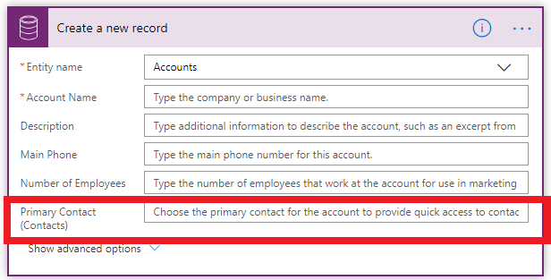
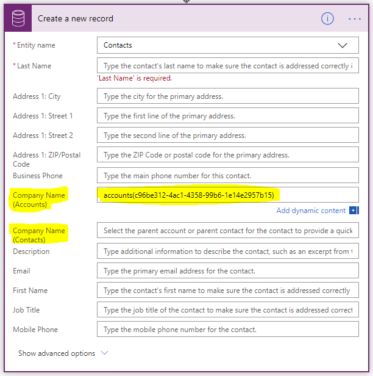
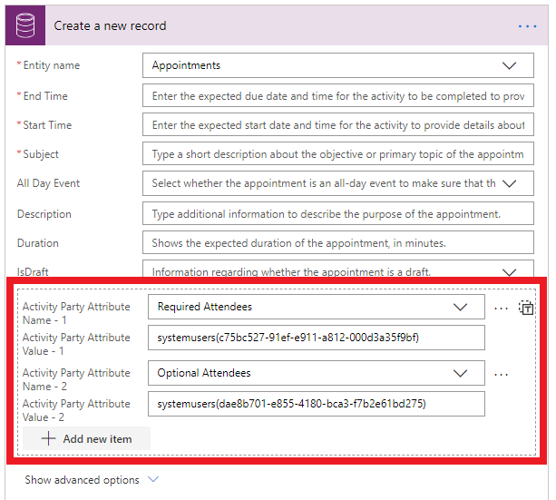
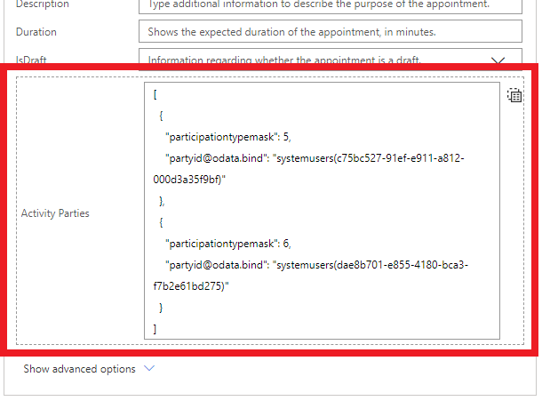

# Use relationships to update records

Relationships are an important concept in the Microsoft Dataverse and Power Automate allows you to work with these relationships in a few ways.

## Update or create records directly with relationships**

When you create or update records, there are fields that hold relationships. For example, when you create an **Account** there is a **Primary Contact** field.

<!--Todo update image tip1-->

When you want to create or update a relationship, use standard OData notation. For example, while creating an account record, you should set the primary contact field to the OData id of a contact record like this: contacts(c96be312-4ac1-4358-99b6-1e14e2957b15).

>[!IMPORTANT]
>If you try to pass only the GUID from previous step, you’ll get an error like this: *Resource not found for the segment \<segmentname\>*. The Microsoft Dataverse (current environment) connector expects the full OData ID of the target record, including the type of the record.

If the lookup field is polymorphic (meaning it can have more than one possible target types), then the target record OData ID must be provided in the correct field. For example, the **Company name** field for **Contacts** is polymorphic and can take either an **Account** or **Contact,** but not both.

<!--Todo update image tip1-->

## Activity party relationships

[Activity parties](https://docs.microsoft.com/dynamics365/customer-engagement/web-api/activityparty) are
a special type of relationship in Dataverse. For example, when you create
an **Appointment,** the Required Attendees and Optional Attendees are related to
the System Users entity.

<!--Todo update image tip1-->

Select **Add new items** and then enter the required data to add multiple values
for an activity party. As shown earlier in the article, you must use the OData
ID syntax for systemusers(\<ID of the user\>).

You can also pass in a list of different activity parties by toggling from the
item mode to the array mode by using the “T” button at the top-right. When you
do that, you can use expressions to pass in data from a previous action, as
shown in the following array.

