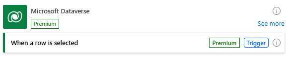

# Trigger flows for selected rows

With the **When a row is selected** trigger in the Dataverse connector, you can enable users to run flows for one or more selected rows in a [model-driven app view](/power-apps/maker/model-driven-apps/create-edit-views). This trigger can also be used to [run flows as steps](/power-automate/create-instant-flows) in business process flows.

To use it, follow these steps: 
1. Create a cloud flow with the **When a row is selected** trigger, either from Power Automate or from the Flow menu in a model-driven app. 
2. In the trigger, select the table that users will trigger the flow from, and optionally add any additional inputs that should be provided provide when running the flow. 
3. Add at least one action and save the flow. The outputs of the trigger are available to other actions as dynamic content, including each columns of the selected row in Dataverse, and the details of the user who triggered the flow.
4. Navigate to the flow's detail page by clicking the back button in the flow designer or locating the flow through My flows. 
5. Click **Edit** in the **Run only users** tile and share the flow with the users or groups of users that should have acess to run the flow. All co-owners and run-only users will be able to see the flow in the Flow menu in model-driven app views for the related table.

## Migration from the Microsoft Dataverse (legacy) connector
* The migration assistant, which currently supports other Dataverse connector actions, does not yet support the **When a row is selected** trigger.
* Flows using the **When a row is selected** trigger from the Microsoft Dataverse (legacy) connector can be manually updated by deleting the trigger and replacing it with the current **When a row is selected** trigger. 

## Limitations
* When running flows from the flow menu, users will see a confirmation if the flow has been successfully started, but not the progress or results of the flow run. To notify a user of completion or failures, use an email, Teams, or other notification action within in the flow.
* Run-only users cannot view the run history of the flow. 
* Selecting more than 40 rows may result in an error when running the flow.
* The **When a row is selected** trigger can only be used with **Split on** enabled, which is on by default in the trigger's settings. With this setting, each selected row will result in an individual flow run. 