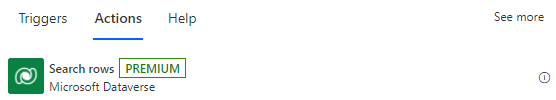
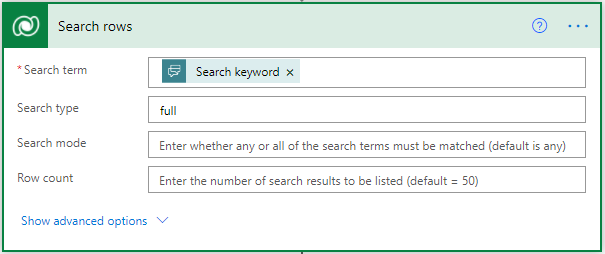
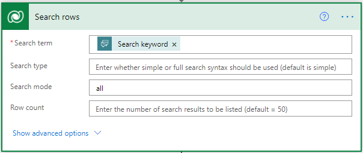
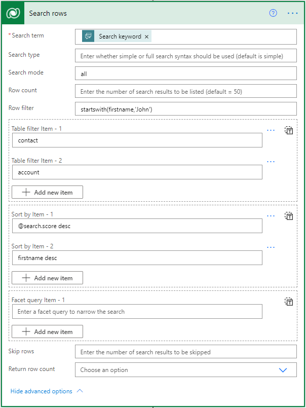
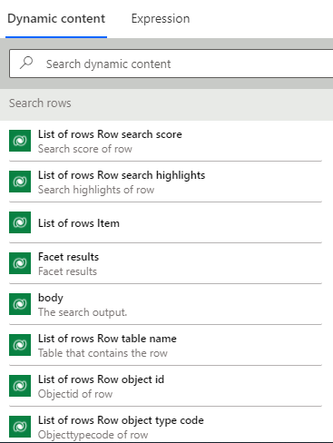
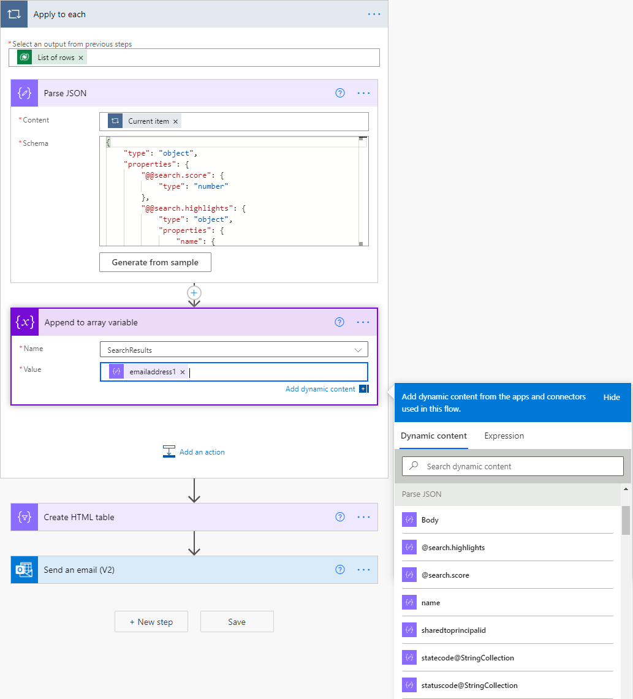

# Use Dataverse search to retrieve rows

Use the **Search rows** action in flows to retrieve data from Microsoft Dataverse by using keywords and [Dataverse search](/power-platform/admin/configure-relevance-search-organization#what-is-relevance-search), which delivers fast, intelligent, and comprehensive results across tables in Dataverse.

## Prerequisites

Your admin must configure [Dataverse search](/power-platform/admin/configure-relevance-search-organization) on your environment before you can use the search action on Microsoft Dataverse.

You can add the **Search rows** action to your flows, and then provide a keyword in **Search term** to search for that keyword across all the indexed rows in Dataverse.

You can use dynamic content from a previous step in the flow to parameterize the **Search term** box. For example, you can use a keyword that's entered in a Microsoft Copilot Studio bot and set the following options to initiate an automated search.

> [!NOTE]
> It can take a few hours for newly added rows to be included in the search results.

## Search type

Use the **Search type** option to provide the syntax for the search query. Use **simple** to indicate that you want to use the simple query syntax. Or, use **full** if you prefer to use the Lucene query syntax. The default query syntax is **simple**.

Take a look at the following examples or review the full list of features at [Search across table data using Dataverse search](/powerapps/developer/data-platform/webapi/relevance-search).

<!--Todo  -->

The simple query syntax supports the following functionality:

|Operator|Description|
|---------|-----------|
|Boolean operators| AND operator; denoted by +  OR operator; denoted by \| NOT operator; denoted by -
| Precedence operators | A search term "hotel+(wifi \| luxury)" will search for results containing the term "hotel" and either "wifi" or "luxury" (or both). |
| Wildcards            | Trailing wildcards are supported; for example, "Alp\*" searches for "alpine".                                                        |
| Exact matches        | A query enclosed in quotation marks " ".                                                                                            |

The Lucene query syntax supports the following functionality:

|Operator|Description|
|---------|-----------|
|Boolean operators| Provides an expanded set compared to simple query syntax.   AND operator; denoted by AND, &&, +  OR operator; denoted by OR, \|\| NOT operator; denoted by NOT, !, – |
| Precedence operators              | The same functionality as simple query syntax.                       |
| Wildcards                         | In addition to a trailing wildcard, also supports a leading wildcard. Trailing wildcard – "alp*" Leading wildcard - “/.*pine/”                                 |
| Fuzzy search                      | Supports queries misspelled by up to two characters.  "Uniersty~" will return "University" "Blue~1" will return "glue", "blues"                                            |
| Term boosting                     | Weighs specific terms in a query differently.  "Rock\^2 electronic" will return results where the matches to "rock" are more important than matches to "electronic".                                            |
| Proximity search                  | Returns results where terms are within *x* words of each other, for more contextual results.  For example, "airport hotel"\~5" returns results where "airport" and "hotel" are within five words of each other, thus boosting the chances of finding a hotel located close to an airport.      |
| Regular expression (regex) search | For example, /[mh]otel/ matches "motel" or "hotel".   |

To use any of the search operators as part of the search text, escape the character by prefixing it with a single backslash (\\). Special characters that
be escaped include the following characters: + - & \| ! ( ) { } [ ] \^ " \~ \* ? : \\
/

## Search mode

You can specify whether any or all the search terms must be matched to count the document as a match. The default is **any**. It controls whether a term with the NOT operator is AND'ed or OR'ed with other terms in the query (assuming there is no + or \| operator on the other terms).

- Using **any** for **Search mode** increases the recall of queries by including more results. By default, it is interpreted as "OR NOT". For example, "wifi -luxury" will match documents that either contain the term "wifi" or those that don't contain the term "luxury".

- Using **all** for **Search mode** increases the precision of queries by including fewer results. By default, it is interpreted as "AND NOT". For example, "wifi -luxury" will match documents that contain the term "wifi" and don't contain the term "luxury".

Go to [Search across table data using Dataverse search](/powerapps/developer/data-platform/webapi/relevance-search#searchtype-simple--full-optional) for more details.

### Advanced Options

You can optimize your search by using other advanced options as described is this section.
See [Search across table data using Dataverse search](/powerapps/developer/data-platform/webapi/relevance-search) for more examples.

- **Row filter**: You can narrow your search by specifying filters as shown in the following image.

- **Table filter**: You can restrict your search to specified tables as shown in the following image.

- **Sort by**: Use this option to sort by specifying a column name and adding *asc* or *desc* as the suffix, as shown in the following image.

    

### Using dynamic content and Dataverse rows

You can use the outputs of the action directly from **Dynamic content**. Here's the meaning of each of the parameters.

|Parameter name|Description|
|--------------|-----------|
Body|The object that represents the entire response. It contains the list of rows, total row count, and facet results.
List of rows|An object that represents all the rows returned.
List of rows item|An individual row in the list of rows, when used inside a loop.
Row search score|The Dataverse score of a row. This score indicates how closely it matched the search keywords and conditions.
Row search highlights|Highlights the specific keywords that matched the search keywords in the row.
Row table name|The name of the table for a single row. This action aggregates rows from all searchable tables in the environment.
Row object id|This is an identifier for each row. Use this identifier in conjunction with the table name in the **Get rows** action to read all the columns in a row.
Row object type code|The table name identifier for the row.

When you are building your flow, the dynamic content might appear like this image:

The **Search rows** action returns many other columns for the matched rows in a variable schema, depending on [your Dataverse search configuration](/power-platform/admin/configure-relevance-search-organization).
To use these columns, parse the JSON response, and then use the dynamic outputs generated from it as shown in the following image.

