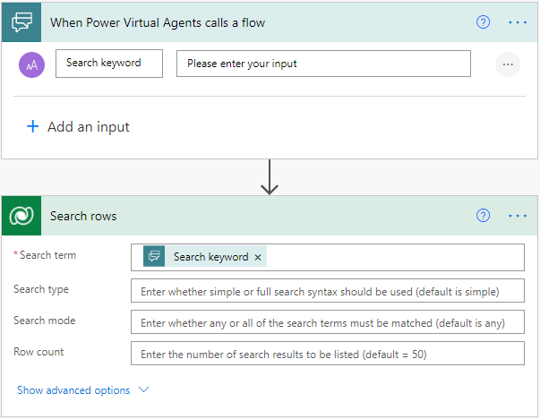

Search rows
-----------

**Pre-requisite:** Relevance Search must be configured on your environment. See
[Configure Relevance Search to improve search results and
performance](https://docs.microsoft.com/en-us/power-platform/admin/configure-relevance-search-organization)

**Tip:** It can take a few hours for newly added rows to be included in the
search results.

Of the several ways to retrieve data from Common Data Service, this action helps
you use keywords to search for a record using Relevance Search, which is built
on the Azure Machine Learning service. To learn more, see [What is Relevance
Search?](https://docs.microsoft.com/en-us/power-platform/admin/configure-relevance-search-organization#what-is-relevance-search).

You can search for a keyword across all the indexed rows in Dataverse by setting
the *Search term*. You can parameterize it by using dynamic content from a
previous step in the flow. For example, you can initiate an automated search
based on a keyword entered in a Power Virtual Agent bot, by using dynamic
content and setting the following options.

**Search type**

You can specify the syntax of a search query using this option. Using 'simple'
selects simple query syntax and 'full' selects Lucene query syntax. The default
is 'simple'. See examples below, or the full list of features at [Search across
entity data using relevance search (Microsoft Dataverse) - Power Apps \|
Microsoft
Docs](https://docs.microsoft.com/en-us/powerapps/developer/data-platform/webapi/relevance-search#searchmode-any--all-optional).

The simple query syntax supports the following functionality:

| Boolean operators    | AND operator; denoted by +                                                                                                          |
|                      | OR operator; denoted by \|                                                                                                          |
|                      | NOT operator; denoted by -                                                                                                          |
|----------------------|-------------------------------------------------------------------------------------------------------------------------------------|
| Precedence operators | A search term "hotel+(wifi \| luxury)" will search for results containing the term "hotel" and either "wifi" or "luxury" (or both). |
| Wildcards            | Trailing wildcard are supported. For example, "Alp\*" searches for "alpine".                                                        |
| Exact matches        | A query enclosed in quotation marks " ".                                                                                            |

The Lucene query syntax supports the following functionality:

| Boolean operators                 | Provides an expanded set compared to simple query syntax.                                                                                                                                                                                                                              |
|                                   | AND operator; denoted by AND, &&, +                                                                                                                                                                                                                                                    |
|                                   | OR operator; denoted by OR, \|\|                                                                                                                                                                                                                                                       |
|                                   | NOT operator; denoted by NOT, !, –                                                                                                                                                                                                                                                     |
|-----------------------------------|----------------------------------------------------------------------------------------------------------------------------------------------------------------------------------------------------------------------------------------------------------------------------------------|
| Precedence operators              | The same functionality as simple query syntax.                                                                                                                                                                                                                                         |
| Wildcards                         | In addition to a trailing wildcard, also supports a leading wildcard.                                                                                                                                                                                                                  |
|                                   | Trailing wildcard – "alp\*"                                                                                                                                                                                                                                                            |
|                                   | Leading wildcard - “/.\*pine/”                                                                                                                                                                                                                                                         |
| Fuzzy search                      | Supports queries misspelled by up to two characters.                                                                                                                                                                                                                                   |
|                                   | "Uniersty\~" will return "University"                                                                                                                                                                                                                                                  |
|                                   | "Blue\~1" will return "glue", "blues"                                                                                                                                                                                                                                                  |
| Term boosting                     | Weighs specific terms in a query differently.                                                                                                                                                                                                                                          |
|                                   | "Rock\^2 electronic" will return results where the matches to "rock" are more important than matches to "electronic".                                                                                                                                                                  |
| Proximity search                  | Returns results where terms are within *x* words of each other, for more contextual results.                                                                                                                                                                                           |
|                                   | For example, "airport hotel"\~5 returns results where "airport" and "hotel" are within five words of each other, thus boosting the chances of finding a hotel located close to an airport.                                                                                             |
| Regular expression (regex) search | For example, /[mh]otel/ matches "motel" or "hotel".                                                                                                                                                                                                                                    |

To use any of the search operators as part of the search text, escape the
character by prefixing it with a single backslash (\\). Special characters that
require escaping include the following: + - & \| ! ( ) { } [ ] \^ " \~ \* ? : \\
/

**Search mode**

You can specify whether any or all the search terms must be matched to count the
document as a match. The default is 'any'. It controls whether a term with the
NOT operator is AND'ed or OR'ed with other terms in the query (assuming there is
no + or \| operator on the other terms).

-   Using search mode=any increases the recall of queries by including more
    results, and by default will be interpreted as "OR NOT". For example, "wifi
    -luxury" will match documents that either contain the term "wifi" or those
    that don't contain the term "luxury".

-   Using search mode=all increases the precision of queries by including fewer
    results, and by default will be interpreted as "AND NOT". For example, "wifi
    -luxury" will match documents that contain the term "wifi" and don't contain
    the term "luxury".

See [Search across entity data using relevance search (Microsoft Dataverse) -
Power Apps \| Microsoft
Docs](https://docs.microsoft.com/en-us/powerapps/developer/data-platform/webapi/relevance-search#searchtype-simple--full-optional).

### Advanced Options

You can optimize your search by using other advanced options as described below.
See [Search across entity data using relevance search (Microsoft Dataverse) -
Power Apps \| Microsoft
Docs](https://docs.microsoft.com/en-us/powerapps/developer/data-platform/webapi/relevance-search#query-parameters)
for more examples.

-   **Row filter –** You can narrow your search by specifying filters as shown
    below.

-   **Table filter –** You can restrict your search to specified tables as shown
    below.

-   **Sort by –** You can use this option to sort, by specifying a column name
    and adding *asc* or *desc* as suffix, as shown below.

### Using dynamic content and Dataverse row fields

You can use the outputs of the action directly from **Dynamic content**. Here is
the significance of each of the parameters –

-   Body – the object representing the entire response, containing the list of
    rows, total row count and facet results

-   List of rows – an object representing all the rows returned

-   List of rows item – individual row in the list of all rows, when used inside
    a loop

-   Row search score – relevance score of a row, indicating how closely it
    matched the search keywords and conditions

-   Row search highlights – specific keywords of the row that matched the search
    keywords

-   Row table name – table name of an individual row, as this action aggregates
    rows from all searchable tables in the environment

-   Row object id – row identifier, that can be used in conjunction with the
    table name in the Get rows action to read all the fields of the row

-   Row object type code – table name identifier of the row

This action returns many other fields of the matched rows in a variable schema,
depending upon [your relevance search
configuration](https://docs.microsoft.com/en-us/power-platform/admin/configure-relevance-search-organization).
To use them, you can parse the JSON response, and use the dynamic outputs
generated from it as shown below

