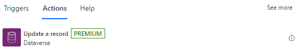
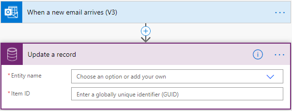
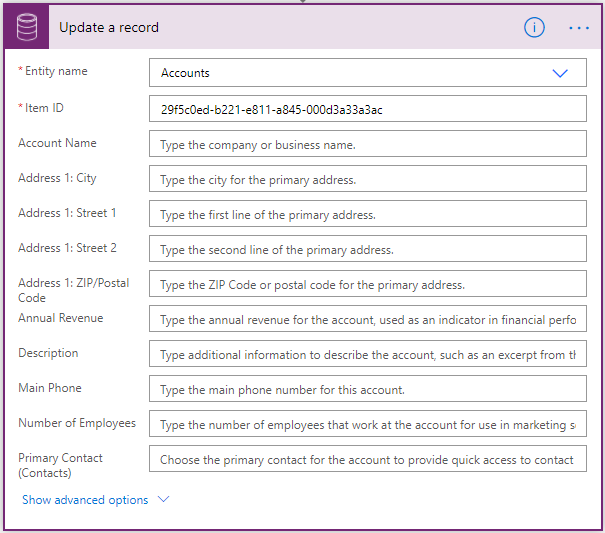

# Use a flow to update a row

Use the **Update a row** action to make changes record in Microsoft Dataverse.

For example, you can create a flow that updates an **Account** in Dataverse when you receive an email, as shown in the following image.

After you select an table, new fields appear. Use these fields to set values for other fields. All mandatory fields display an asterisk (\*). It's not necessary to enter a value for optional fields. Fields that are left blank are skipped in the update unless you provide a null value explicitly.

The **Item ID** field is the unique ID of the record that you are updating, as shown in the following image. If you do not see an attribute, you can select **Show advanced options** at the bottom of the card.

