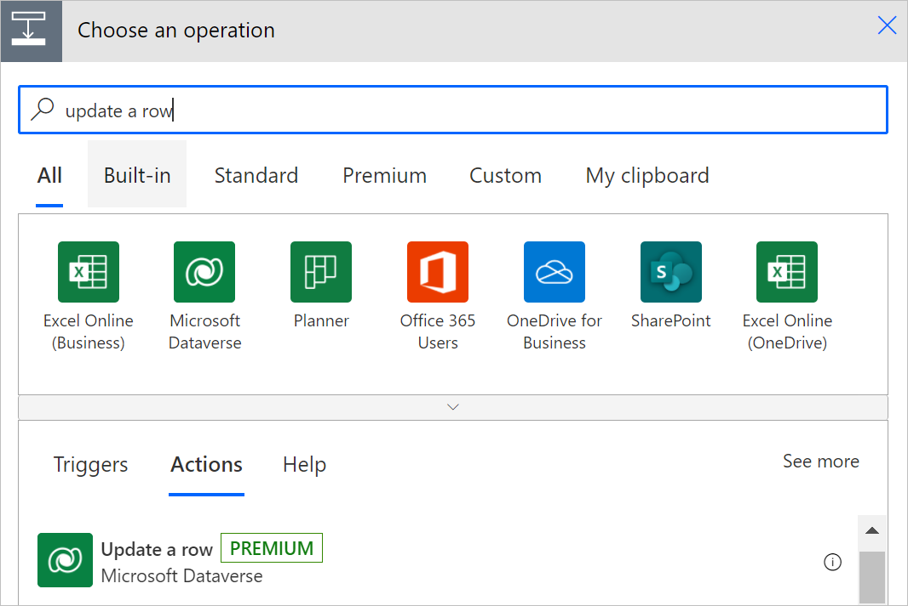
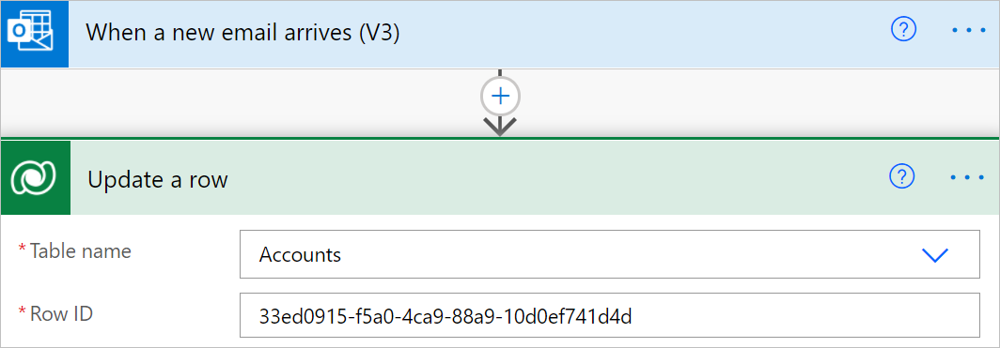

# Use a flow to update a row

Use the **Update a row** action to make changes to a row in Microsoft Dataverse.

For example, you can create a flow that updates an **Account** in Dataverse when you receive an email, as shown in the following image.

## Update a row 

After you select a table, the action card displays a list of inputs for the row Id that's related to the columns in the table to update. An asterisk (\*) indicates the mandatory columns. The **Row Id** column is the unique Id for the row that's being updated. If you provide a row Id that doesn't exist or generated with the **guid()** expression, the action performs an update or insert (upsert) operation, creating a new row with the Id you provide. 

If you don't see a column, select **Show advanced options** at the bottom of the card. The update doesn't include columns left blank, unless a null value is provided explicitly.
