# Upload or download image and file content

In late 2019, two new column datatypes were added to Dataverse.

- **File** – With **File**, you can have a [column that stores arbitrary file data for your table](https://docs.microsoft.com/powerapps/developer/common-data-service/file-columns).

- **Image** – In addition to a column for storing the full size of an image as
    a file, the **Image** datatype can also include [thumbnail information](https://docs.microsoft.com/powerapps/developer/common-data-service/image-columns).

You can use the Microsoft Dataverse connector to work with these datatypes in Power Automate.

## Download image or file contents

1. Add the **Get file or image content** action to your flow to download content from a corresponding file or image column from Dataverse so that you can use the file content elsewhere in your flow.

   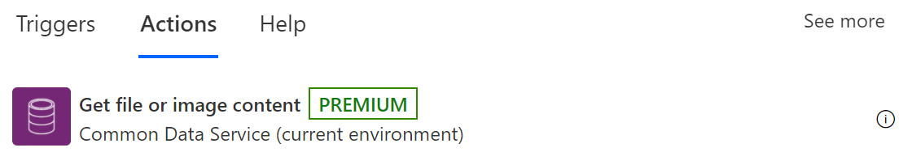

   As with any action in this connector, a list of supported tables is available. 
1. Select the table from which you want to download file/image content or enter your own custom value for the table name.  

   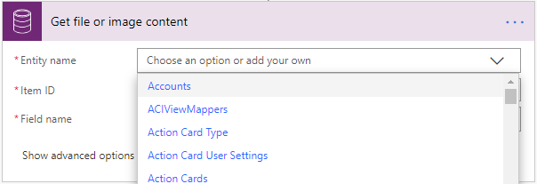

1. Enter the identifier of the row you want to get the file or image content from in **Item ID**.  

   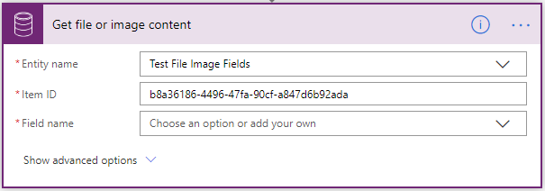

   >[!TIP]
   >You can normally grab the row identifier from a previous request via the dynamic content.

   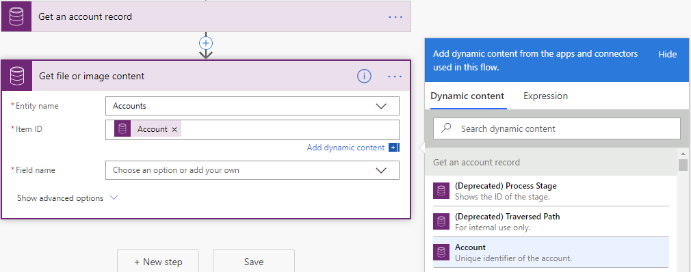

   The list of supported file and image columns based on the table type selected earlier will be populated for your selected table. 
   
1. Select the column from which you want to download content or enter a custom value.  

   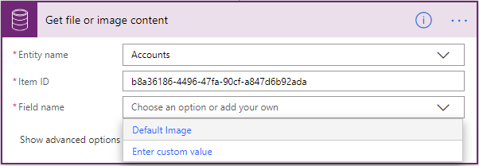

1. With the content output of the action you can pass it to any action as you want. In this image, it's being passed to the **Create file** action.

   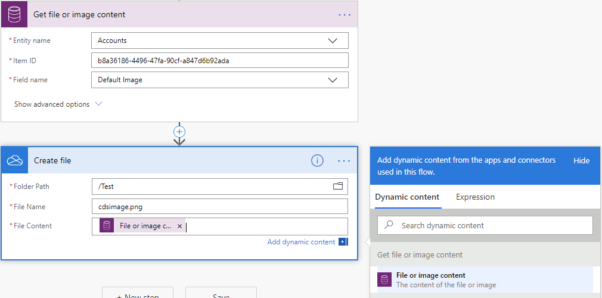

## Upload file or image content

1. Add the **Upload file or image content** action to your flow so that you can upload content to a corresponding file or image column in Dataverse.

   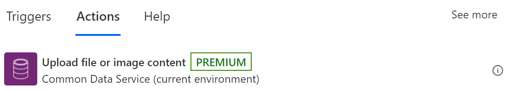

1. Select the table to which you want to upload the file/image content or enter a custom value for the **Table name**.  

   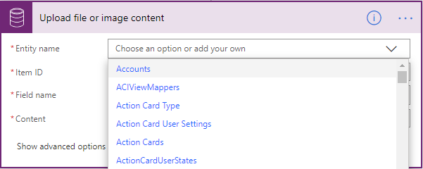

1. Enter the identifier for the row to which you want to upload the file or image content.  

   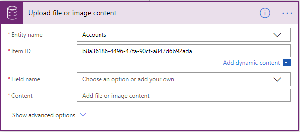

   >[!TIP]
   >You can normally grab the row identifier from a previous request by using the dynamic content.  

   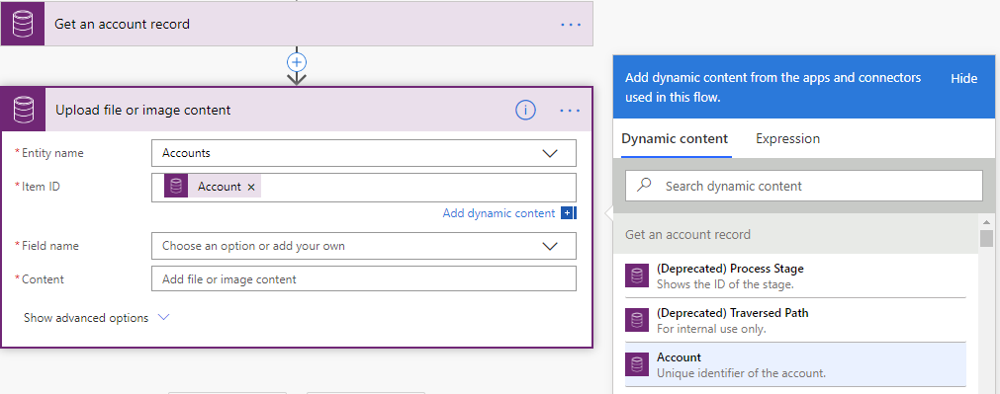

   The list of supported file and image columns based on the table you selected is populated. 
   
1. Select the column to which you want to upload the content or enter custom value.  

   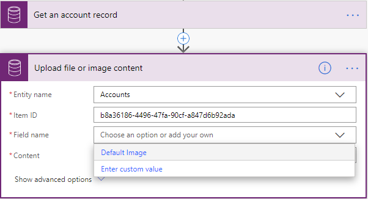

1. Enter the content you want to upload to the column.  

   