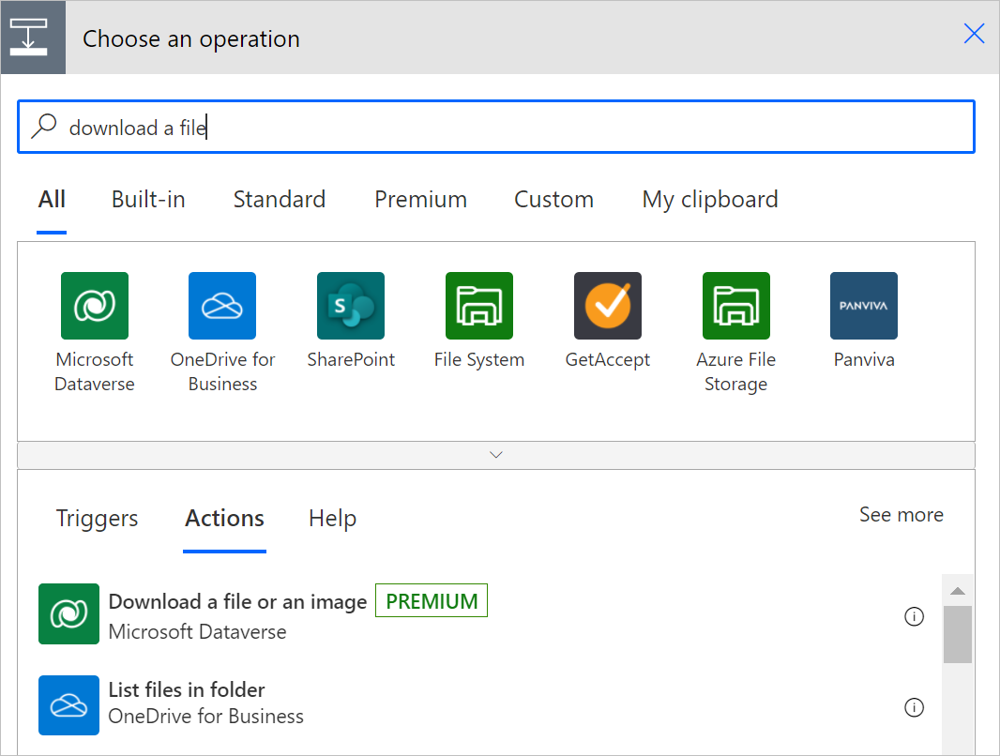
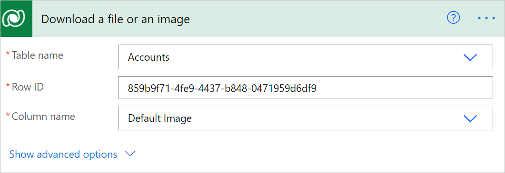
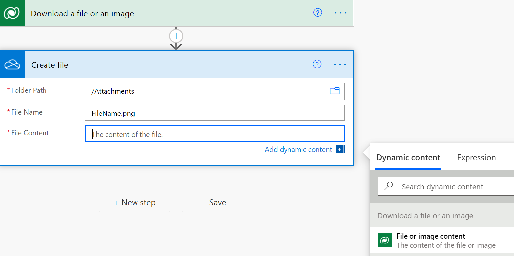
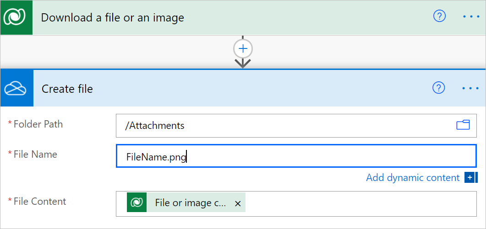
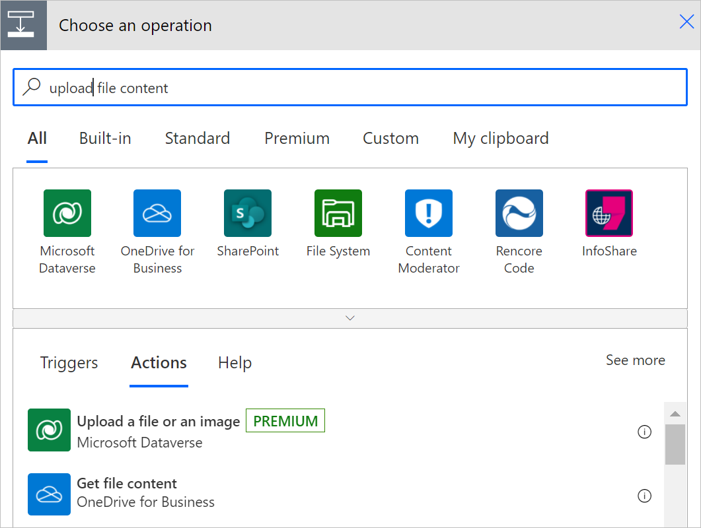
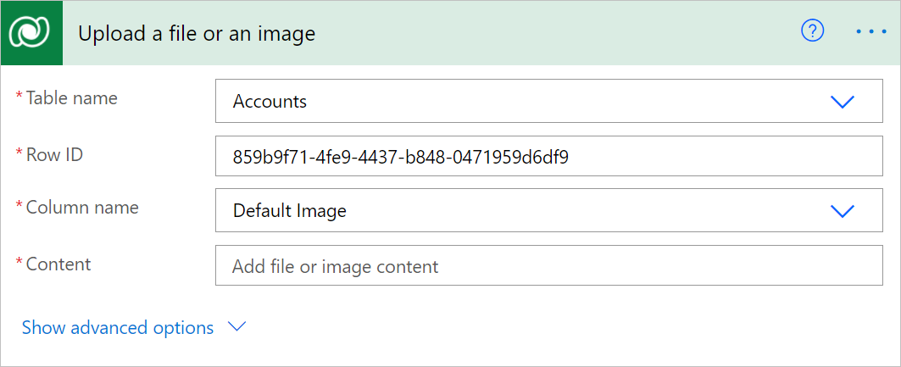
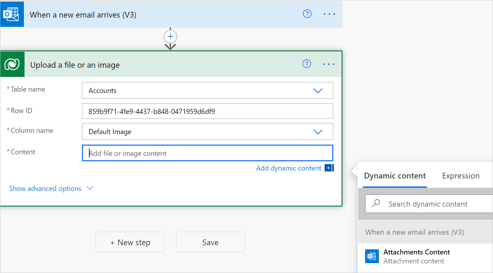

# Upload or download image and file content

You can use flows to upload or download images and files in Microsoft Dataverse. There are two column data types for handling images and file content in Dataverse.

- **File**: You can have a [column that stores arbitrary file data for your table](/powerapps/developer/data-platform/file-attributes).

- **Image**: In addition to a column that stores the full size of an image as a file, the **Image** datatype can also include [thumbnail information](/powerapps/developer/data-platform/image-attributes).

You can use the Microsoft Dataverse connector to work with these data types in Power Automate.

## Download file or image content

Follow these steps to add the **Download a file or an image** action to your flow. You can use the downloaded file contents in suitable actions later in the flow.

1. Select **New step** to add an action to your flow.

1. Enter **download a file** into the **Search connectors and actions** search box on the **Choose an operation** card.

1. Select **Microsoft Dataverse**.

1. Select the **Download a file or an image** *action*.

   

1. Select the table from which you want to download the file or image content or enter your own custom value for the table name.

1. In **Row ID**, enter the row ID of the row in the table that you just selected.

   >[!TIP]
   >You can normally copy the row identifier from a previous request by using dynamic content.

   The list of supported file and image columns for the table you selected earlier will be populated in the **Column name** list.

1. From **Column name**, select the column that holds the file or image content that you want to download.

   

   You now can access the file or image content by using the **File or image content** variable in the **Dynamic content** list.

      

   With the content output of the action, you can pass it to any action later in the flow. In the following example, the file contents are being passed to the **Create file** action.

      

## Upload file or image content

Follow these steps to add the **Upload a file or an image** action to your flow. This way, you can upload content to a corresponding file or image column in Microsoft Dataverse.

   

1. In **Table name**, select the table to which you want to upload the file or image content or enter a custom value.  

1. Enter the identifier in **Row ID** for the row to which you want to upload the file or image content.  

   >[!TIP]
   >You can normally copy the row identifier from a previous request by using dynamic content.  

   The list of available file and image columns in the table that you selected is populated.

1. From **Column name**, select the column to which you want to upload the image or enter a custom value.

   Your **Upload a file or an image** action card might look like this now.

   

1. Enter the content you want to upload.

   In this example, the files to upload are the attachments content from an email captured earlier in the flow. You can select **Attachments Content** in the list of dynamic content that's displayed when you select **Add dynamic content** on the **Upload a file or an image** card.

   
