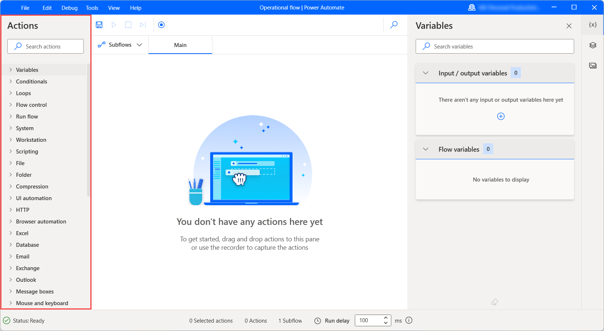
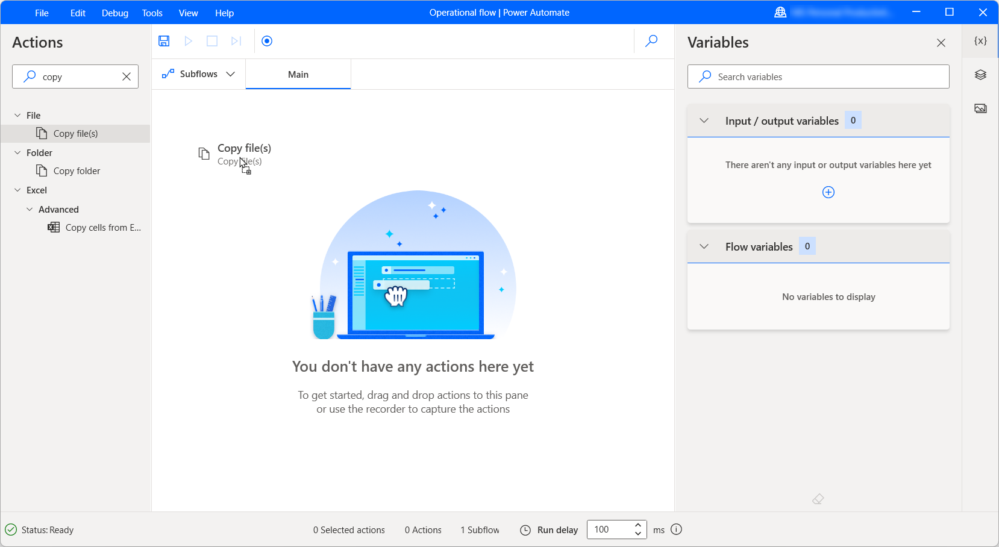
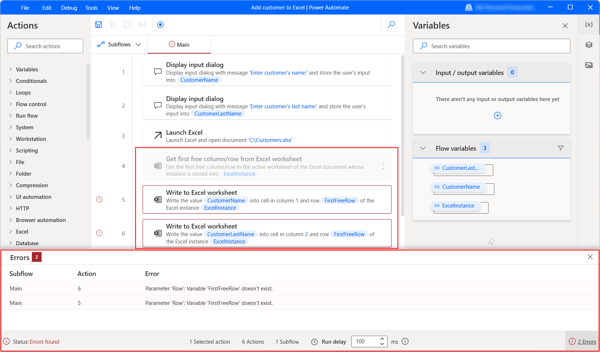

# Configure actions and the actions pane

The actions pane occupies the left side of the flow designer and displays all the available desktop flow actions.

To find a specific action, populate its name in the search bar at the top of the pane. Searching also returns partial matches but requires at least two provided characters. When the search term matches a module name, the results display the module expanded with all its actions available.

## Add actions to the workspace

To develop a desktop flow, find the action you want to deploy, and double-click on it or drag it into the workspace.

After the deployment, the modal of the action opens and displays the available parameters of the action. Some actions may have default values for some parameters, while others require user input. When the configuration is ready, select **Save**.

## Configure actions

Power Automate actions contain three main elements:

- **Input parameters**  have the form of text fields, drop-down menus, and checkboxes and determine the way the action functions and the data it gets as input. The data can be hardcoded values or variables.

    To use a variable as a parameter, select the appropriate icon on the right side of the field and pick the desired variable.

    Each field can accept specific data types, such as numeric values, text, or lists. If you use values or variables of wrong data types as inputs, the action will throw an error.

   

- **Produced variables** are automatically generated variables that hold the outcomes of the actions for later use. All the produced variables of an action are available on the bottom part of its modal.

    Like any other variable, produced variables have data types defined by their content. To see the data type of a specific variable, use the [variables pane](manage-variables.md). To find more information about data types, refer to [Variable datatypes](variable-data-types.md).

    If a produced variable isn't useful for later use, unselect the checkbox next to its name to disable it.

    The name of a produced variable can't contain special characters, white spaces, and non-Latin characters. Additionally, it can't start with arithmetic characters.

    

- **Error-handling configuration** allows you to set a custom functionality for the cases when an action fails. To configure error-handling for an action, select **On error** in its modal. To find more information regarding error-handling, refer to [Handle errors in desktop flows](errors.md).

## Enable and disable actions

To disable or enable an action, right-click on it and select **Disable action** or **Enable action**, respectively.

Disabling an action allows you to remove it from the flow without erasing it. This feature is commonly applied for testing, as it enables you to try different versions of your desktop flow efficiently.

When an action is disabled, all variables initialized in its modal get hidden from the variables pane. The flow may throw an error if you use the hidden variables in other actions.

In the example below, two actions throw an error because they contain variables defined in a disabled action.

[!INCLUDE[footer-include](../includes/footer-banner.md)]
