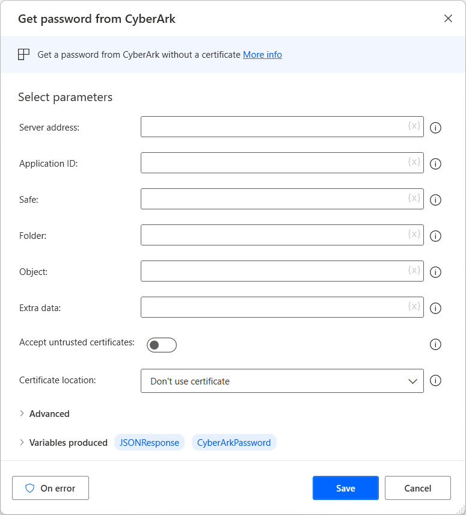

# CyberArk

Connect to CyberArk and retrieve passwords

|<!-- --> |
|-----|
|[Get password from CyberArk](#getpasswordbase)|

## Getting started with CyberArk actions

CyberArk offers an identity security platform that secures human and machine identities from end-to-end.

Power Automate Desktop enables you to retrieve credentials from CyberArk through the **Get password from CyberArk** action.

To deploy the action, configure the following fields:

- **Server address**: Populate the address of the server where CyberArk Central Credential Provider is installed. 

- **Application ID**: To find the application ID, open CyberArk Password Vault on a web browser and navigate to the **Applications** tab.

- **Safe**: Populate the name of the safe displayed in the PrivateArk Client. 

- **Folder** and **Object**: Select a Safe in the PrivateArk Client and populate the folder name displayed on the left pane and the object name displayed in the main list.

- **Extra data**:  If you've configured your credentials in a way that requires the use of extra data, populate this field accordingly.

- If a certificate is required to retrieve your credentials, specify it in the **Certificate location** field. If you want to use untrusted certificates, enable **Accept untrusted certificates**. 

# CyberArk actions

###  Get password from CyberArk
Retrieves a password for a specific application from CyberArk

##### Input Parameters
|Argument|Optional|Accepts|Default Value|Description|
|-----|-----|-----|-----|-----|
|Server address|No|Text value||The base URI for the web request|
|Application ID|No|Text value||The application ID to use for the web request|
|Safe|No|Text value||The safe on CyberArk in which the application belongs|
|Folder|No|Text value||The folder necessary for the web request query|
|Object|No|Text value||The object necessary for the web request query|
|Extra data|Yes|Text value||The extra data (if any) for the web request's query|
|Accept untrusted certificates|N/A|Boolean value|False|Specifies whether to accept untrusted certificates|
|Certificate location|N/A|Don't use certificate, Load certificate from Windows Store, Load certificate from file|Don't use certificate|Specifies how to load (if needed) the certificate for the request|
|Use only valid certificates|N/A|Boolean value|False|Specifies whether to load only valid certificates from the store|
|Store certificate path|No|Text value||The path of the certificate in the certificate store|
|Certificates path|No|File||The path of the certificate selected from the store|
|Certificate password|No|Encrypted value||The password for the certificate file|
|Timeout|Yes|Numeric value|30|The waiting time (in seconds) to get results from CyberArk|

##### Variables Produced
|Argument|Type|Description|
|-----|-----|-----|
|JSONResponse|Custom object|The API response result|
|CyberArkPassword|Encrypted value|The password retrieved from CyberArk|

#####  Exceptions
|Exception|Description|
|-----|-----|
|Failed to send web request|Indicates a problem sending the web request|
|Timeout expired|Indicates that the request timed out|
|Error response from web request|Indicates that the web request returned an error response|

[!INCLUDE[footer-include](../../includes/footer-banner.md)]