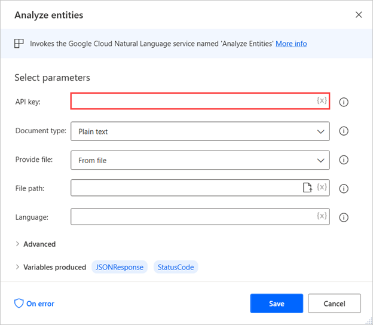

# Google cognitive

Google's cognitive actions

|<!-- --> |
|-----|
|[Analyze sentiment](#analyzesentimentgoogle)|
|[Analyze entities](#analyzeentitiesgoogle)|
|[Analyze syntax](#analyzesyntaxgoogle)|
|[Label detection](#labeldetectiongoogle)|
|[Landmark detection](#landmarkdetectiongoogle)|
|[Text Detection](#textdetectiongoogle)|
|[Logo detection](#logodetectiongoogle)|
|[Image properties detection](#imagepropertiesdetectiongoogle)|
|[Safe search detection](#safesearchdetectiongoogle)|

## Getting started with Google cognitive actions

Google cognitive services allow users to process unstructured data through machine learning and simplify complicated tasks like text analyzing and computer vision.

This functionality can be implemented in your desktop flows through the Google cognitive group of action. 

All Google cognitive actions require an API key that authorizes you to use the respective services. You can manage your API keys in the **APIs & services** section of the Cloud Console.

## Cognitive actions

## Natural language
Reveal the structure and meaning of text
###  Analyze sentiment
Invokes the Google Cloud Natural Language service named 'Analyze Sentiment'

##### Input Parameters
|Argument|Optional|Accepts|Default Value|Description|
|-----|-----|-----|-----|-----|
|API key|No|Text value||The Google Cloud API key to be used for this API call|
|Document type|N/A|Plain text, HTML|Plain text|The type of document to transmit|
|Provide document|N/A|From file, From GCS|From file|Specify whether the document will be provided by a full path or a Google Cloud Storage URI|
|File path|No|File||The full path (folder plus filename) of the document to transmit|
|GCS Content URI|No|Text value||The URI of the image residing on Google Cloud Storage|
|Language|Yes|Text value||The language of the text|
|Timeout|Yes|Numeric value|30|The time (in seconds) that the agent should wait for a connection to be established with the server, before it fails|

##### Variables Produced
|Argument|Type|Description|
|-----|-----|-----|
|JSONResponse|Custom object|The API response results|
|StatusCode|Numeric value|The status code returned|

#####  Exceptions
|Exception|Description|
|-----|-----|
|Failed to Invoke cognitive services|Indicates a problem while trying to invoke Cognitive Services|
|Request timeout expired|Indicates that the timeout expired while performing the request|

###  Analyze entities
Invokes the Google Cloud Natural Language service named 'Analyze Entities'

##### Input Parameters
|Argument|Optional|Accepts|Default Value|Description|
|-----|-----|-----|-----|-----|
|API key|No|Text value||The Google Cloud API key to be used for this API call|
|Document type|N/A|Plain text, HTML|Plain text|The type of the document to transmit|
|Provide file|N/A|From file, From GCS|From file|Specify whether the document will be provided by a full path or a Google Cloud Storage URI|
|File path|No|File||The full path (folder plus filename) of the document to transmit|
|GCS URL|No|Text value||The URI of the document residing on Google Cloud Storage|
|Language|Yes|Text value||The language of the text|
|Timeout|Yes|Numeric value|30|The time (in seconds) that the agent should wait for a connection to be established with the server, before it fails|

##### Variables Produced
|Argument|Type|Description|
|-----|-----|-----|
|JSONResponse|Custom object|The API response results|
|StatusCode|Numeric value|The status code returned|

#####  Exceptions
|Exception|Description|
|-----|-----|
|Failed to Invoke cognitive services|Indicates a problem while trying to invoke Cognitive Services|
|Request timeout expired|Indicates that the timeout expired while performing the request|

###  Analyze syntax
Invokes the Google Cloud Natural Language service named 'Analyze Syntax'

##### Input Parameters
|Argument|Optional|Accepts|Default Value|Description|
|-----|-----|-----|-----|-----|
|API key|No|Text value||The Google Cloud API key to be used for this API call|
|Document type|N/A|Plain text, HTML|Plain text|The type of document to transmit|
|Provide document|N/A|From file, From GCS|From file|Specify whether the document will be provided by a full path or a Google Cloud Storage URI|
|File path|No|File||The full path (folder plus filename) of the document to transmit|
|GCS Content URI|No|Text value||The URI of the image residing on Google Cloud Storage|
|Language|Yes|Text value||The language of the text|
|Timeout|Yes|Numeric value|30|The time (in seconds) that the agent should wait for a connection to be established with the server, before it fails|

##### Variables Produced
|Argument|Type|Description|
|-----|-----|-----|
|JSONResponse|Custom object|The API response results|
|StatusCode|Numeric value|The status code returned|

#####  Exceptions
|Exception|Description|
|-----|-----|
|Failed to Invoke cognitive services|Indicates a problem while trying to invoke Cognitive Services|
|Request timeout expired|Indicates that the timeout expired while performing the request|

## Vision
Assign labels to images and classify them into predefined categories. Detect objects, faces, and read printed and handwritten text
###  Label detection
Invokes the Google Cloud Vision service named 'Label Detection'

##### Input Parameters
|Argument|Optional|Accepts|Default Value|Description|
|-----|-----|-----|-----|-----|
|API key|No|Text value||The Google Cloud API key to be used for this API call|
|Provide image|N/A|From file, From GCS|From file|Specify whether the image will be provided by a full path or a Google Cloud Storage URI|
|Image file|No|File||The full path (folder plus filename) of the image file to transmit|
|GCS Image URI|No|Text value||The URI of the image residing on Google Cloud Storage|
|Timeout|Yes|Numeric value|30|The time (in seconds) that the agent should wait for a connection to be established with the server, before it fails|

##### Variables Produced
|Argument|Type|Description|
|-----|-----|-----|
|JSONResponse|Custom object|The API response results|
|StatusCode|Numeric value|The status code returned|

#####  Exceptions
|Exception|Description|
|-----|-----|
|Failed to Invoke cognitive services|Indicates a problem while trying to invoke Cognitive Services|
|Request timeout expired|Indicates that the timeout expired while performing the request|

###  Landmark detection
Invokes the Google Cloud Vision service named 'Landmark Detection'

##### Input Parameters
|Argument|Optional|Accepts|Default Value|Description|
|-----|-----|-----|-----|-----|
|API key|No|Text value||The Google Cloud API key to be used for this API call|
|Provide image|N/A|From file, From GCS|From file|Specify whether the image will be provided by a full path or a Google Cloud Storage URI|
|Image file path|No|File||The full path (folder plus filename) of the image file to transmit|
|GCS Image URI|No|Text value||The URI of the image residing on Google Cloud Storage|
|Timeout|Yes|Numeric value|30|The time (in seconds) that the agent should wait for a connection to be established with the server, before it fails|

##### Variables Produced
|Argument|Type|Description|
|-----|-----|-----|
|JSONResponse|Custom object|The API response results|
|StatusCode|Numeric value|The status code returned|

#####  Exceptions
|Exception|Description|
|-----|-----|
|Failed to Invoke cognitive services|Indicates a problem while trying to invoke Cognitive Services|
|Request timeout expired|Indicates that the timeout expired while performing the request|

###  Text Detection
Invokes the Google Cloud Vision service named 'Text Detection'

##### Input Parameters
|Argument|Optional|Accepts|Default Value|Description|
|-----|-----|-----|-----|-----|
|API key|No|Text value||The Google Cloud API key to be used for this API call|
|Provide image|N/A|From file, From GCS|From file|Specify whether the image will be provided by a full path or a Google Cloud Storage URI|
|Image file|No|File||The full path (folder plus filename) of the image file to transmit|
|GCS Image URI|No|Text value||The URI of the image residing on Google Cloud Storage|
|Timeout|Yes|Numeric value|30|The time (in seconds) that the agent should wait for a connection to be established with the server, before it fails|

##### Variables Produced
|Argument|Type|Description|
|-----|-----|-----|
|JSONResponse|Custom object|The API response results|
|StatusCode|Numeric value|The status code returned|

#####  Exceptions
|Exception|Description|
|-----|-----|
|Failed to Invoke cognitive services|Indicates a problem while trying to invoke Cognitive Services|
|Request timeout expired|Indicates that the timeout expired while performing the request|

###  Logo detection
Invokes the Google Cloud Vision service named 'Logo Detection'

##### Input Parameters
|Argument|Optional|Accepts|Default Value|Description|
|-----|-----|-----|-----|-----|
|API key|No|Text value||The Google Cloud API key to be used for this API call|
|Provide image|N/A|From file, From GCS|From file|Specify whether the image will be provided by a full path or a Google Cloud Storage URI|
|Image file|No|File||The full path (folder plus filename) of the image file to transmit|
|GCS Image URI|No|Text value||The URI of the image residing on Google Cloud Storage|
|Timeout|Yes|Numeric value|30|The time (in seconds) that the agent should wait for a connection to be established with the server, before it fails|

##### Variables Produced
|Argument|Type|Description|
|-----|-----|-----|
|JSONResponse|Custom object|The API response results|
|StatusCode|Numeric value|The status code returned|

#####  Exceptions
|Exception|Description|
|-----|-----|
|Failed to Invoke cognitive services|Indicates a problem while trying to invoke Cognitive Services|
|Request timeout expired|Indicates that the timeout expired while performing the request|

###  Image properties detection
Invokes the Google Cloud Vision service named 'Image Properties Detection'

##### Input Parameters
|Argument|Optional|Accepts|Default Value|Description|
|-----|-----|-----|-----|-----|
|API key|No|Text value||The Google Cloud API key to be used for this API call|
|Provide image|N/A|From file, From GCS|From file|Specify whether the image will be provided by a full path or a Google Cloud Storage URI|
|Image file|No|File||The full path (folder plus filename) of the image file to transmit|
|GCS Image URI|No|Text value||The URI of the image residing on Google Cloud Storage|
|Timeout|Yes|Numeric value|30|The time (in seconds) that the agent should wait for a connection to be established with the server, before it fails|

##### Variables Produced
|Argument|Type|Description|
|-----|-----|-----|
|JSONResponse|Custom object|The API response results|
|StatusCode|Numeric value|The status code returned|

#####  Exceptions
|Exception|Description|
|-----|-----|
|Failed to Invoke cognitive services|Indicates a problem while trying to invoke Cognitive Services|
|Request timeout expired|Indicates that the timeout expired while performing the request|

###  Safe search detection
Invokes the Google Cloud Vision service named 'Safe Search Detection'

##### Input Parameters
|Argument|Optional|Accepts|Default Value|Description|
|-----|-----|-----|-----|-----|
|API key|No|Text value||The Google Cloud API key to be used for this API call|
|Provide image|N/A|From file, From GCS|From file|Specify whether the image will be provided by a full path or a Google Cloud Storage URI|
|Image file|No|File||The full path (folder plus filename) of the image file to transmit|
|GCS Image URI|No|Text value||The URI of the image residing on Google Cloud Storage|
|Timeout|Yes|Numeric value|30|The time (in seconds) that the agent should wait for a connection to be established with the server, before it fails|

##### Variables Produced
|Argument|Type|Description|
|-----|-----|-----|
|JSONResponse|Custom object|The API response results|
|StatusCode|Numeric value|The status code returned|

#####  Exceptions
|Exception|Description|
|-----|-----|
|Failed to Invoke cognitive services|Indicates a problem while trying to invoke Cognitive Services|
|Request timeout expired|Indicates that the timeout expired while performing the request|

[!INCLUDE[footer-include](../../includes/footer-banner.md)]