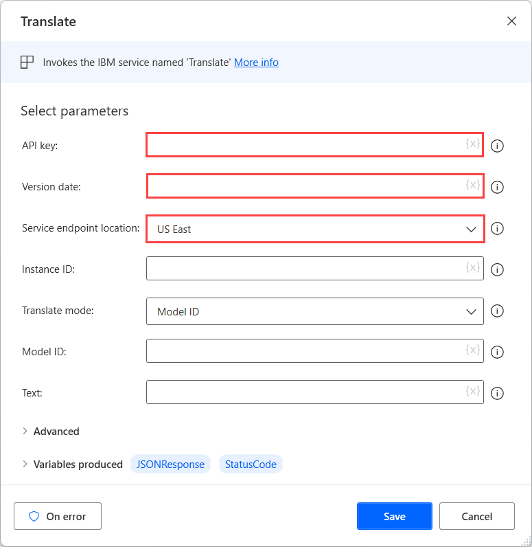

## Getting started with IBM cognitive actions

IBM cognitive services are machine learning algorithms that use artificial intelligence to perform complex operations, such as language tone analyzing and visual recognition.

Power Automate for desktop enables you to use these services in your flows through the IBM cognitive actions.

All IBM cognitive actions require an API key that can be created and managed through the IBM Cloud console. Additionally, they require the release date of the used API and the service endpoint location.

