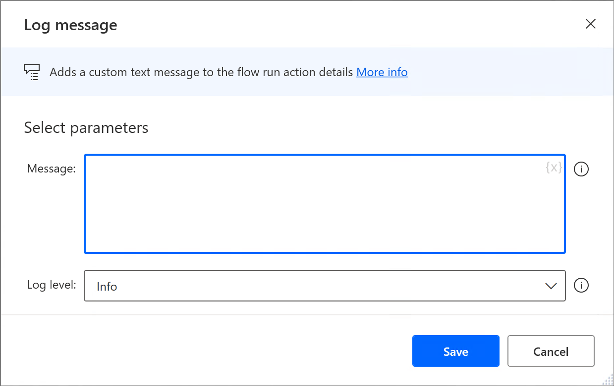

# Log message action

The **Log message** action enables you to log a custom text message with a severity level of Info, Warning or Error in the flow run action details.  

> [!IMPORTANT]
>
> The Log message action in Power Automate for desktop is a premium feature, which requires a [Power Automate subscription](https://powerautomate.microsoft.com/pricing/).

At runtime, all action logs are uploaded to the Power Automate service, and are visible in the [flow run action details](../monitor-run-details.md#actions-details) view of the Power Automate portal.

>[!NOTE]
>
> - The text message should contain a maximum of 128 characters.
> - Action logs are not uploaded to the Power Automate service when the flow is executed through the Power Automate for desktop designer. 

##  Log message

Adds a custom text message to the flow run action details.

### Input parameters

|Argument|Optional|Accepts|Default Value|Description|
|-----|-----|-----|-----|-----|
|Message|No|[Text value](../variable-data-types.md#text-value)||The message to log|
|Log level|N/A|Info, Warning, Error|Info|The severity level of the message|

### Variables produced

This action doesn't produce any variables.

###  Exceptions

This action doesn't include any exceptions.

[!INCLUDE[footer-include](../../includes/footer-banner.md)]
