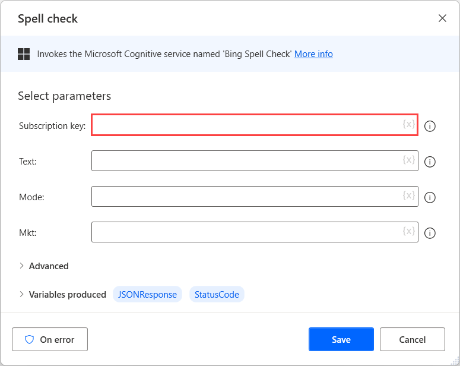

# Microsoft cognitive

Microsoft's cognitive actions

[Spell check](#spellcheck)  
[Analyze image](#analyzeimagemicrosoft)  
[Describe image](#describeimagemicrosoft)  
[OCR](#ocrmicrosoft)  
[Tag image](#tagimagemicrosoft)  
[Detect language](#detectlanguage)  
[Key phrases](#keyphrases)  
[Sentiment](#sentiment)  

## Getting started with Microsoft cognitive actions

Microsoft cognitive services enable users to accelerate decision-making using artificial intelligence without requiring machine learning expertise. 

Power Automate desktop flows provide a wide variety of Microsoft cognitive actions that allow you to integrate this functionality into your flows. Text analysis, computer vision, and spell checking are all tasks that Microsoft cognitive actions can perform.

All Microsoft cognitive actions require a subscription key that validates your subscription for a service or group of services. The keys are available in the Azure portal for each resource that you've created.

## Microsoft cognitive actions

## Bing spell check
Correct spelling errors, recognize the difference among names, brand names, and slang, as well as understand homophones

###  Spell check
Invokes the Microsoft Cognitive service named 'Bing Spell Check'

##### Input Parameters
|Argument|Optional|Accepts|Default Value|Description|
|-----|-----|-----|-----|-----|
|Subscription key|No|Text value||The subscription key to use for this API call|
|Text|No|List of Text values||The text or the list of texts to send|
|Mode|Yes|Text value||Specify the spell-check mode|
|Mkt|Yes|Text value||For proof mode, the only supported language codes are: en-us, es-es, pt-br. For spell mode, all language codes are supported|
|Timeout|Yes|Numeric value|30|The time (in seconds) that the agent should wait for a connection to be established with the server, before it fails|

##### Variables Produced
|Argument|Type|Description|
|-----|-----|-----|
|JSONResponse|Custom object|The API response results|
|StatusCode|Numeric value|The status code returned|

#####  Exceptions
|Exception|Description|
|-----|-----|
|Request timeout expired|Indicates that the timeout expired while performing the request|
|Failed to Invoke cognitive services|Indicates a problem while trying to invoke Cognitive Services|

## Computer vision
Analyze images and extract data 
###  Analyze image
Invokes the Microsoft Cognitive service named 'Analyze Image'

##### Input Parameters
|Argument|Optional|Accepts|Default Value|Description|
|-----|-----|-----|-----|-----|
|Server location|N/A|West US, West US 2, East US, East US 2, West Central US, South Central US, West Europe, North Europe, Southeast Asia, East Asia, Australia East, Brazil South, Canada Central, Central India, UK South, Japan East|West US|The server location to be use for this API call|
|Subscription key|No|Text value||The subscription key to use for this API call|
|Provide image|N/A|From file, From GCS|From file|Specify whether the image will be provided by a full path or a URL address|
|Image file|No|File||The full path (folder plus filename) of the image file to transmit|
|Image URL|No|Text value||The URL address of an image|
|Visual features|Yes|Text value||A text value indicating what visual feature types to return. Multiple values should be comma-separated. For example: categories, tags, description|
|Details|Yes|Text value||A text value indicating which domain-specific details to return. Multiple values should be comma-separated|
|Language|Yes|Text value||A text value indicating which language to return. The service will return recognition results in the specified language|
|Timeout|Yes|Numeric value|30|The time (in seconds) that the agent should wait for a connection to be established with the server, before it fails|

##### Variables Produced
|Argument|Type|Description|
|-----|-----|-----|
|JSONResponse|Custom object|The API response results|
|StatusCode|Numeric value|Τhe status code returned|

#####  Exceptions
|Exception|Description|
|-----|-----|
|Request timeout expired|Indicates that the timeout expired while performing the request|
|Failed to Invoke cognitive services|Indicates a problem while trying to invoke Cognitive Services|

###  Describe image
Invokes the Microsoft Cognitive service named 'Describe Image'

##### Input Parameters
|Argument|Optional|Accepts|Default Value|Description|
|-----|-----|-----|-----|-----|
|Server location|N/A|West US, West US 2, East US, East US 2, West Central US, South Central US, West Europe, North Europe, Southeast Asia, East Asia, Australia East, Brazil South, Canada Central, Central India, UK South, Japan East|West US|The server location to be use for this API call|
|Subscription key|No|Text value||The subscription key to use for this API call|
|Provide image|N/A|From file, From GCS|From file|Specify whether the image will be provided by a full path or a URL address|
|Image file|No|File||The full path (folder plus filename) of the image file to transmit|
|Image URL|No|Text value||The URL address of an image|
|Max candidates|Yes|Text value||The maximum number of candidate descriptions to be returned. The default is 1|
|Timeout|Yes|Numeric value|30|The time (in seconds) that the agent should wait for a connection to be established with the server, before it fails|

##### Variables Produced
|Argument|Type|Description|
|-----|-----|-----|
|JSONResponse|Custom object|The API response results|
|StatusCode|Numeric value|The status code returned|

#####  Exceptions
|Exception|Description|
|-----|-----|
|Request timeout expired|Indicates that the timeout expired while performing the request|
|Failed to Invoke cognitive services|Indicates a problem while trying to invoke Cognitive Services|

###  OCR
Invokes the Microsoft Cognitive service named 'OCR'

##### Input Parameters
|Argument|Optional|Accepts|Default Value|Description|
|-----|-----|-----|-----|-----|
|Server location|N/A|West US, West US 2, East US, East US 2, West Central US, South Central US, West Europe, North Europe, Southeast Asia, East Asia, Australia East, Brazil South, Canada Central, Central India, UK South, Japan East|West US|The server location to be use for this API call|
|Subscription key|No|Text value||The subscription key to use for this API call|
|Provide image|N/A|From file, From GCS|From file|Specify whether the image will be provided by a full path or a URL address|
|Image file|No|File||The full path (folder plus filename) of the image file to transmit|
|Image URL|No|Text value||The URL address of an image|
|Language|Yes|Text value||The BCP-47 language code of the text to detect in the image|
|Detect orientation|Yes|Text value||Specify whether to detect the text orientation in the image|
|Timeout|Yes|Numeric value|30|The time (in seconds) that the agent should wait for a connection to be established with the server, before it fails|

##### Variables Produced
|Argument|Type|Description|
|-----|-----|-----|
|JSONResponse|Custom object|The API response results|
|StatusCode|Numeric value|The status code returned|

#####  Exceptions
|Exception|Description|
|-----|-----|
|Request timeout expired|Indicates that the timeout expired while performing the request|
|Failed to Invoke cognitive services|Indicates a problem while trying to invoke Cognitive Services|

###  Tag image
Invokes the Microsoft Cognitive service named 'Tag Image'

##### Input Parameters
|Argument|Optional|Accepts|Default Value|Description|
|-----|-----|-----|-----|-----|
|Server location|N/A|West US, West US 2, East US, East US 2, West Central US, South Central US, West Europe, North Europe, Southeast Asia, East Asia, Australia East, Brazil South, Canada Central, Central India, UK South, Japan East|West US|The server location to be use for this API call|
|Subscription key|No|Text value||The subscription key to use for this API call|
|Provide image|N/A|From file, From GCS|From file|Specify whether the image will be provided by a full path or a URL address|
|Image file|No|File||The full path (folder plus filename) of the image file to transmit|
|Image URL|No|Text value||The URL address of an image|
|Timeout|Yes|Numeric value|30|The time (in seconds) that the agent should wait for a connection to be established with the server, before it fails|

##### Variables Produced
|Argument|Type|Description|
|-----|-----|-----|
|JSONResponse|Custom object|The API response results|
|StatusCode|Numeric value|The status code returned|

#####  Exceptions
|Exception|Description|
|-----|-----|
|Request timeout expired|Indicates that the timeout expired while performing the request|
|Failed to Invoke cognitive services|Indicates a problem while trying to invoke Cognitive Services|

## Text Analytics
Detect sentiment, key phrases, named entities and language from text
###  Detect language
Invokes the Microsoft Cognitive service named 'Text Analytics - Detect Language'

##### Input Parameters
|Argument|Optional|Accepts|Default Value|Description|
|-----|-----|-----|-----|-----|
|Server location|N/A|West US, West US 2, East US, East US 2, West Central US, South Central US, West Europe, North Europe, Southeast Asia, East Asia, Australia East, Brazil South, Canada Central, Central India, UK South, Japan East|West US|The server location to be use for this API call|
|Subscription key|No|Text value||The subscription key to use for this API call|
|Text|No|Text value||The text to analyze|
|Timeout|Yes|Numeric value|30|The time (in seconds) that the agent should wait for a connection to be established with the server, before it fails|

##### Variables Produced
|Argument|Type|Description|
|-----|-----|-----|
|JSONResponse|Custom object|The API response results|
|StatusCode|Numeric value|The status code returned|

#####  Exceptions
|Exception|Description|
|-----|-----|
|Request timeout expired|Indicates that the timeout expired while performing the request|
|Failed to Invoke cognitive services|Indicates a problem while trying to invoke Cognitive Services|

###  Key phrases
Invokes the Microsoft Cognitive service named 'Text Analytics - Key Phrases'

##### Input Parameters
|Argument|Optional|Accepts|Default Value|Description|
|-----|-----|-----|-----|-----|
|Server location|N/A|West US, West US 2, East US, East US 2, West Central US, South Central US, West Europe, North Europe, Southeast Asia, East Asia, Australia East, Brazil South, Canada Central, Central India, UK South, Japan East|West US|The server location to be use for this API call|
|Subscription key|No|Text value||The subscription key to use for this API call|
|Text|No|List of Text values||The text or the list of texts to analyze|
|Language|Yes|Text value||The language of the text(s)|
|Timeout|Yes|Numeric value|30|The time (in seconds) that the agent should wait for a connection to be established with the server, before it fails|

##### Variables Produced
|Argument|Type|Description|
|-----|-----|-----|
|JSONResponse|Custom object|The API response results|
|StatusCode|Numeric value|The status code returned|

#####  Exceptions
|Exception|Description|
|-----|-----|
|Request timeout expired|Indicates that the timeout expired while performing the request|
|Failed to Invoke cognitive services|Indicates a problem while trying to invoke Cognitive Services|

###  Sentiment
Invokes the Microsoft Cognitive service named 'Text Analytics - Sentiment'

##### Input Parameters
|Argument|Optional|Accepts|Default Value|Description|
|-----|-----|-----|-----|-----|
|Server location|N/A|West US, West US 2, East US, East US 2, West Central US, South Central US, West Europe, North Europe, Southeast Asia, East Asia, Australia East, Brazil South, Canada Central, Central India, UK South, Japan East|West US|The server location to be use for this API call|
|Subscription key|No|Text value||The subscription key to use for this API call|
|Text|No|List of Text values||Text|
|Language|Yes|Text value||The 2 letter ISO 639-1 representation of the language of the text(s)|
|Timeout|Yes|Numeric value|30|The time (in seconds) that the agent should wait for a connection to be established with the server, before it fails|

##### Variables Produced
|Argument|Type|Description|
|-----|-----|-----|
|JSONResponse|Custom object|The API response results|
|StatusCode|Numeric value|The status code returned|

#####  Exceptions
|Exception|Description|
|-----|-----|
|Request timeout expired|Indicates that the timeout expired while performing the request|
|Failed to Invoke cognitive services|Indicates a problem while trying to invoke Cognitive Services|

[!INCLUDE[footer-include](../../includes/footer-banner.md)]