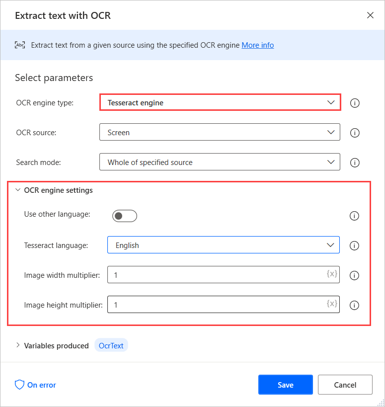

# OCR

Initiate OCR engines to perform OCR related activities

|<!-- --> |
|-----|
|[Create Tesseract OCR engine](#createtesseractocrenginebase)|
|[Create MODI OCR engine](#createmodiengine)|
|[Extract text with OCR](#extracttextwithocr)|

## Getting started with OCR actions

Power Automate Desktop enables users to read, extract, and manage data within an assortment of files through optical character recognition (OCR).

To create an OCR engine and extract text from images and documents with OCR, use the **Extract text with OCR** action. In the figure below, the engine is created for the purpose of this action alone, and the OCR source is a locally stored image. The action is set to extract text from the entire image. 

The action wherein the OCR engine is created contains the engine settings. These include the language and the image width and height multipliers. The OCR engine variable can be used in any action containing OCR capabilities.

> [!WARNING]
> Image multipliers increase the size of the image to make searching and text extraction more effective. Please note that setting values greater than 3 may lead to erroneous results.

## OCR actions

###  Create Tesseract OCR engine
Create a Tesseract OCR engine

> [!NOTE]
> The **MODI OCR engine** and the **Create Tesseract OCR engine** action are planned for deprecation. You can find more information about the deprecation in the [respective blog post](https://powerusers.microsoft.com/t5/Power-Automate-Community-Blog/Announcing-deprecation-of-MODI-OCR-engine-and-Create-Tesseract/ba-p/941316#M1186).

##### Input Parameters
|Argument|Optional|Accepts|Default Value|Description|
|-----|-----|-----|-----|-----|
|Use other language|N/A|Boolean value|False|Specifies whether to use a language not given in the choices|
|Tesseract language|N/A|English, German, Spanish, French, Italian|English|The language of the image's text that the Tesseract engine detects|
|Language abbreviation|No|Text value||The Tesseract abbreviation of the language to use. For example, if the data is 'eng.traineddata', enter 'eng' in the field|
|Language data path: |No|Folder||The path of the folder that holds the specified language Tesseract's data|
|Image width multiplier|Yes|Numeric value|1|The image's width multiplier|
|Image height multiplier|Yes|Numeric value|1|The image's height multiplier|

##### Variables Produced
|Argument|Type|Description|
|-----|-----|-----|
|OCREngine|OCREngineObject|The OCR engine for use with later OCR actions|

#####  Exceptions
|Exception|Description|
|-----|-----|
|Failed to create the OCR engine|Indicates an error occurred while trying to create the OCR engine|
|Data path folder doesn't exist|Indicates that the folder specified for the language data doesn't exist|

#####  Prepare flows for upcoming deprecation

The **Create Tesseract OCR engine** action is planned for deprecation. To prevent flows from failing after the depreciation, initialize the required Tesseract OCR engines directly through the actions that use them.

This OCR engine initialization method provides the same configuration options as before and eliminates the need for a produced **OCREngine** variable.

###  Create MODI OCR engine
Create a MODI OCR engine

> [!NOTE]
> The **MODI OCR engine** and the **Create Tesseract OCR engine** action are planned for deprecation. You can find more information about the deprecation in the [respective blog post](https://powerusers.microsoft.com/t5/Power-Automate-Community-Blog/Announcing-deprecation-of-MODI-OCR-engine-and-Create-Tesseract/ba-p/941316#M1186).

##### Input Parameters
|Argument|Optional|Accepts|Default Value|Description|
|-----|-----|-----|-----|-----|
|MODI language|N/A|Chinese simplified, Chinese traditional, Czech, Danish, Dutch, English, Finnish, French, German, Greek, Hungarian, Italian, Japanese, Korean, Norwegian, Polish, Portuguese, Russian, Spanish, Swedish, Turkish|English|The language of the image's text that the MODI engine detects|
|Image width multiplier|Yes|Numeric value|1|The image's width multiplier|
|Image height multiplier|Yes|Numeric value|1|The image's height multiplier|

##### Variables Produced
|Argument|Type|Description|
|-----|-----|-----|
|OCREngine|OCREngineObject|The OCR engine to use with later OCR actions|

#####  Exceptions
|Exception|Description|
|-----|-----|
|Failed to create the OCR engine|Indicates an error occurred while trying to create the OCR engine|

#####  Prepare flows for upcoming deprecation

The MODI OCR engine is planned for deprecation. To prevent flows from failing after the depreciation, replace the initialized MODI engines with Tesseract engines.

You can perform the initialization directly through the actions that require the engines without using the **Create Tesseract OCR engine** action.

###  Extract text with OCR
Extract text from a given source using the given OCR engine

##### Input Parameters
|Argument|Optional|Accepts|Default Value|Description|
|-----|-----|-----|-----|-----|
|OCR engine|No|OCR engine variable, Tesseract engine|OCR engine variable|The OCR engine type to use. Select a preconfigured OCR engine or set up a new one.|
|OCR engine variable|No|OCREngineObject||The engine to use for the OCR operation|
|OCR source|N/A|Screen, Foreground window, Image on disk|Screen|The source of the image to perform the OCR operation on|
|Image file path|No|File||The path of the image to perform the OCR operation on|
|Search mode|N/A|Whole of specified source, Specific subregion only, Subregion relative to image|Whole of specified source|The selected mode for the OCR operation|
|Image|No|List of Image||The image to use for narrowing down the scan to a subregion that is relative to the specified image|
|Tolerance|Yes|Numeric value|10|Specifies how much the image can differ from the originally chosen image|
|X1|Yes|Numeric value||The start X coordinate of the subregion to narrow down the scan|
|X2|Yes|Numeric value||The end X coordinate of the subregion to narrow down the scan|
|Y1|Yes|Numeric value||The start Y coordinate of the subregion to narrow down the scan|
|Y2|Yes|Numeric value||The end Y coordinate of the subregion to narrow down the scan|
|Wait for image to appear|N/A|Boolean value|False|Whether to wait for the image to appear on the screen or foreground window|
|Timeout|Yes|Numeric value|0|Specifies the time to wait for the operation to complete before the action fails|

##### Variables Produced
|Argument|Type|Description|
|-----|-----|-----|
|OcrText|Text value|The result after the text extraction|

#####  Exceptions
|Exception|Description|
|-----|-----|
|Failed to extract text with OCR|Indicates an error occurred while trying to extract text with OCR from the given source|
|Image file not found|Indicates that the file doesn't exist on the given path|
|Landmark image not found |Indicates that the landmark image doesn't exist|
|OCR engine not alive|Indicates that the OCR engine isn't alive|
|Can't get text from screen in non-interactive mode|Indicates that it isn't possible to get text from screen when in non-interactive mode|

[!INCLUDE[footer-include](../../includes/footer-banner.md)]