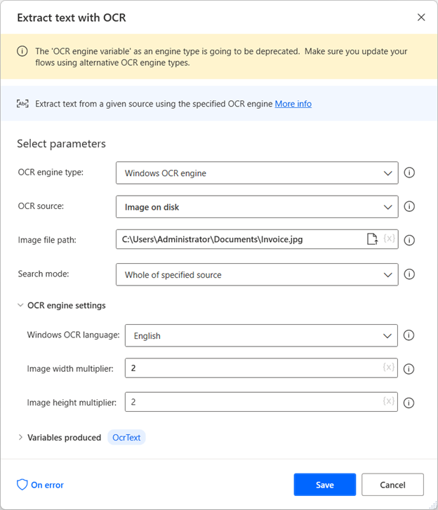

# OCR actions

Power Automate enables users to read, extract, and manage data within files through optical character recognition (OCR).

To create an OCR engine and extract text from images and documents, use the **Extract text with OCR** action. The following example extracts text from the entire specified image.  

All OCR actions can create a new OCR engine variable or use an existing one. You can use existing OCR engine variables in any action that offers OCR capabilities.

Power Automate supports the Windows OCR and Tesseract engines. To configure the selected OCR engine, navigate to the **OCR engine settings** of the appropriate action. The available options include the language and the image width and height multipliers.

> [!NOTE]
>
> - All the available OCR engines are pre-installed in Power Automate and work locally without connecting to the cloud. However, you may need to download language packs or data files to extract texts in specific languages.  
> - Image multipliers increase the image size to make searching and text extraction more effective. Setting values greater than three may lead to erroneous results.

## Use the Windows OCR engine

The default OCR engine in Power Automate is the Windows OCR engine. To extract texts using the Windows OCR engine, you must install the appropriate language pack for the language you want to extract.

If the appropriate language pack isn't installed, Power Automate throws an error, prompting you to install it. To find more information regarding downloading and installing language packs, go to [Language packs for Windows](https://support.microsoft.com/windows/language-packs-for-windows-a5094319-a92d-18de-5b53-1cfc697cfca8).

After installing the appropriate language pack, extend the **OCR engine settings** of the OCR action and select the language you want. The Windows OCR engine supports 25 languages, including Chinese (Simplified and Traditional), Czech, Danish, Dutch, English, Finnish, French, German, Greek, Hungarian, Italian, Japanese, Korean, Norwegian, Polish, Portuguese, Romanian, Russian, Serbian (Cyrillic and Latin), Slovak, Spanish, Swedish, and Turkish.

## Use the Tesseract OCR engine

> [!NOTE]
> To make use of the Tesseract OCR engine, make sure the machine's CPU supports AVX2 instruction set.

Apart from the Windows OCR engine, Power Automate supports the Tesseract engine. This engine can extract text in five languages without further configuration: English, German, Spanish, French, and Italian.

To extract text in a language outside the mentioned list, enable the **Use other languages** option in the **OCR engine settings** of the OCR action. When this option is enabled, the action displays two more parameters: **Language abbreviation** and **Language data path**.

The **Language abbreviation** field indicates to the engine which language to look for during OCR. The **Language data path** field contains the language data files (.traineddata) used to train the OCR engine. You can find the language data files for all the available languages in [this GitHub repository](https://github.com/tesseract-ocr/tessdata).

You can also use the Tesseract engine to extract text from multilingual documents. To find more information regarding extracting text from multilingual documents, go to [Perform OCR on multilingual documents](../how-to/ocr-multilingual-documents.md).

###  If text on screen (OCR)

Marks the beginning of a conditional block of actions depending on whether a given text appears on the screen or not, using OCR.

### Input parameters

|Argument|Optional|Accepts|Default Value|Description|
|-----|-----|-----|-----|-----|
|If text|N/A|Exists, Doesn't exist|Exists|Specifies whether to check if the text exists or not on the given source to analyze|
|OCR engine type|No|Windows OCR engine, Tesseract engine, OCR engine variable|OCR engine variable|The OCR engine type to use. Select a preconfigured OCR engine or set up a new one.|
|OCR engine variable|No|[OCREngineObject](../variable-data-types.md#ocr)||The engine to use for the OCR operation|
|Text to find|No|[Text value](../variable-data-types.md#text-value)||The text to search for in the specified source|
|Is regular expression|N/A|[Boolean value](../variable-data-types.md#boolean-value)|False|Specifies whether to use a regular expression to find the specified text|
|Search for text on|N/A|Entire screen, Foreground window|Entire screen|Specifies whether to search for the specified text on the entire visible screen or just the foreground window|
|Search mode|N/A|Whole of specified source, Specific subregion only, Subregion relative to image|Whole of specified source|Specifies whether to scan the entire screen (or window) or a narrowed down subregion of it|
|Image(s)|No|[List](../variable-data-types.md#list) of [Images](../images.md)||The image(s) specifying the subregion (relative to the top left corner of the image) to scan for the supplied text|
|X1|Yes|[Numeric value](../variable-data-types.md#numeric-value)||The start X coordinate of the subregion to scan for the supplied text|
|Tolerance|Yes|[Numeric value](../variable-data-types.md#numeric-value)|10|Specifies how much the image(s) searched for can differ from the originally chosen image|
|Y1|Yes|[Numeric value](../variable-data-types.md#numeric-value)||The start Y coordinate of the subregion to scan for the supplied text|
|X1|Yes|[Numeric value](../variable-data-types.md#numeric-value)||The start X coordinate of the subregion relative to the specified image to scan for the supplied text|
|X2|Yes|[Numeric value](../variable-data-types.md#numeric-value)||The end X coordinate of the subregion to scan for the supplied text|
|Y1|Yes|[Numeric value](../variable-data-types.md#numeric-value)||The start Y coordinate of the subregion relative to the specified image to scan for the supplied text|
|Y2|Yes|[Numeric value](../variable-data-types.md#numeric-value)||The end Y coordinate of the subregion to scan for the supplied text|
|X2|Yes|[Numeric value](../variable-data-types.md#numeric-value)||The end X coordinate of the subregion relative to the specified image to scan for the supplied text|
|Y2|Yes|[Numeric value](../variable-data-types.md#numeric-value)||The end Y coordinate of the subregion relative to the specified image to scan for the supplied text|
|Windows OCR language|N/A|Chinese (Simplified), Chinese (Traditional), Czech, Danish, Dutch, English, Finnish, French, German, Greek, Hungarian, Italian, Japanese, Korean, Norwegian, Polish, Portuguese, Romanian, Russian, Serbian (Cyrillic), Serbian (Latin), Slovak, Spanish, Swedish, Turkish|English|The language of the text that the Windows OCR engine detects|
|Use other language|N/A|[Boolean value](../variable-data-types.md#boolean-value)|False|Specifies whether to use a language not given in the 'Tesseract language' field|
|Tesseract language|N/A|English, German, Spanish, French, Italian|English|The language of the text that the Tesseract engine detects|
|Language abbreviation|No|[Text value](../variable-data-types.md#text-value)||The Tesseract abbreviation of the language to use. For example, if the data is 'eng.traineddata', set this parameter to 'eng'|
|Language data path|No|[Text value](../variable-data-types.md#text-value)||The path of the folder that holds the specified language's Tesseract data|
|Image width multiplier|No|[Numeric value](../variable-data-types.md#numeric-value)|1|The width multiplier of the image|
|Image height multiplier|No|[Numeric value](../variable-data-types.md#numeric-value)|1|The height multiplier of the image|
|Image matching algorithm|N/A|Basic, Advanced|Basic|Which image algorithm to use when searching for image|

> [!NOTE]
>
> - Power Automate's regular expression engine is .NET. To find more information about regular expressions, go to [Regular Expression Language - Quick Reference](/dotnet/standard/base-types/regular-expression-language-quick-reference).
> - The **OCR engine variable** option is planned for deprecation.

### Variables produced

|Argument|Type|Description|
|-----|-----|-----|
|LocationOfTextFoundX|[Numeric value](../variable-data-types.md#numeric-value)|The X coordinate of the point where the text appears on the screen. If the search is performed in the foreground window, the coordinate returned is relative to the top left corner of the window|
|LocationOfTextFoundY|[Numeric value](../variable-data-types.md#numeric-value)|The X coordinate of the point where the text appears on the screen. If the search is performed in the foreground window, the coordinate returned is relative to the top left corner of the window|

###  Exceptions

|Exception|Description|
|-----|-----|
|Can't check if text exists in non-interactive mode|Indicates that it isn't possible to check for the text on the screen when in non-interactive mode|
|Invalid subregion coordinates|Indicates that the specified subregion coordinates are invalid|
|Failed to analyze text with OCR|Indicates an error occurred while trying to analyze the text using OCR|
|Failed to create the OCR engine|Indicates an error occurred while trying to create the OCR engine|
|Data path folder doesn't exist|Indicates that the folder specified for the language data doesn't exist|
|The selected Windows language pack isn't installed on the machine|Indicates that the selected Windows language pack hasn't been installed on the machine|
|OCR engine not alive|Indicates that the OCR engine isn't alive|

##  Wait for text on screen (OCR)

Wait until a specific text appears/disappears on the screen, on the foreground window, or relative to an image on the screen or foreground window using OCR.

### Input parameters

|Argument|Optional|Accepts|Default Value|Description|
|-----|-----|-----|-----|-----|
|Wait for text to|N/A|Appear, Disappear|Appear|Specifies whether to wait for the text to appear or disappear|
|OCR engine type|No|Windows OCR engine, Tesseract engine, OCR engine variable|OCR engine variable|The OCR engine type to use. Select a preconfigured OCR engine or set up a new one.|
|OCR engine variable|No|[OCREngineObject](../variable-data-types.md#ocr)||The engine to use for the OCR operation|
|Text to find|No|[Text value](../variable-data-types.md#text-value)||The text to search for in the specified source|
|Is regular expression|N/A|[Boolean value](../variable-data-types.md#boolean-value)|False|Specifies whether to use a regular expression to find the specified text|
|Search for text on|N/A|Entire screen, Foreground window|Entire screen|Specifies whether to search for the specified text on the entire visible screen or just the foreground window|
|Search mode|N/A|Whole of specified source, Specific subregion only, Subregion relative to image|Whole of specified source|Specifies whether to scan the entire screen (or window) or a narrowed down subregion of it|
|Image(s)|No|[List](../variable-data-types.md#list) of [Images](../images.md)||The image(s) specifying the subregion (relative to the top left corner of the image) to scan for the supplied text|
|X1|Yes|[Numeric value](../variable-data-types.md#numeric-value)||The start X coordinate of the subregion to scan for the supplied text|
|Tolerance|Yes|[Numeric value](../variable-data-types.md#numeric-value)|10|Specifies how much the image(s) searched for can differ from the originally chosen image|
|Y1|Yes|[Numeric value](../variable-data-types.md#numeric-value)||The start Y coordinate of the subregion to scan for the supplied text|
|X1|Yes|[Numeric value](../variable-data-types.md#numeric-value)||The start X coordinate of the subregion relative to the specified image to scan for the supplied text|
|X2|Yes|[Numeric value](../variable-data-types.md#numeric-value)||The end X coordinate of the subregion to scan for the supplied text|
|Y1|Yes|[Numeric value](../variable-data-types.md#numeric-value)||The start Y coordinate of the subregion relative to the specified image to scan for the supplied text|
|Y2|Yes|[Numeric value](../variable-data-types.md#numeric-value)||The end Y coordinate of the subregion to scan for the supplied text|
|X2|Yes|[Numeric value](../variable-data-types.md#numeric-value)||The end X coordinate of the subregion relative to the specified image to scan for the supplied text|
|Y2|Yes|[Numeric value](../variable-data-types.md#numeric-value)||The end Y coordinate of the subregion relative to the specified image to scan for the supplied text|
|Windows OCR language|N/A|Chinese (Simplified), Chinese (Traditional), Czech, Danish, Dutch, English, Finnish, French, German, Greek, Hungarian, Italian, Japanese, Korean, Norwegian, Polish, Portuguese, Romanian, Russian, Serbian (Cyrillic), Serbian (Latin), Slovak, Spanish, Swedish, Turkish|English|The language of the text that the Windows OCR engine detects|
|Use other language|N/A|[Boolean value](../variable-data-types.md#boolean-value)|False|Specifies whether to use a language not given in the 'Tesseract language' field|
|Tesseract language|N/A|English, German, Spanish, French, Italian|English|The language of the text that the Tesseract engine detects|
|Language abbreviation|No|[Text value](../variable-data-types.md#text-value)||The Tesseract abbreviation of the language to use. For example, if the data is 'eng.traineddata', set this parameter to 'eng'|
|Language data path|No|[Text value](../variable-data-types.md#text-value)||The path of the folder that holds the specified language's Tesseract data|
|Image width multiplier|No|[Numeric value](../variable-data-types.md#numeric-value)|1|The width multiplier of the image|
|Image height multiplier|No|[Numeric value](../variable-data-types.md#numeric-value)|1|The height multiplier of the image|
|Image matching algorithm|N/A|Basic, Advanced|Basic|Which image algorithm to use when searching for image|
|Fail with timeout error|N/A|[Boolean value](../variable-data-types.md#boolean-value)|False|Specify whether you want the action to wait indefinitely or fail after a set time period|

> [!NOTE]
>
> - Power Automate's regular expression engine is .NET. To find more information about regular expressions, go to [Regular Expression Language - Quick Reference](/dotnet/standard/base-types/regular-expression-language-quick-reference).
> - The **OCR engine variable** option is planned for deprecation.

### Variables produced

|Argument|Type|Description|
|-----|-----|-----|
|LocationOfTextFoundX|[Numeric value](../variable-data-types.md#numeric-value)|The X coordinate of the point where the text appears on the screen. If the search is performed in the foreground window, the coordinate returned is relative to the top left corner of the window|
|LocationOfTextFoundY|[Numeric value](../variable-data-types.md#numeric-value)|The X coordinate of the point where the text appears on the screen. If the search is performed in the foreground window, the coordinate returned is relative to the top left corner of the window|

###  Exceptions

|Exception|Description|
|-----|-----|
|Can't check if text exists in non-interactive mode|Indicates that it isn't possible to check for the text on the screen when in non-interactive mode|
|Invalid subregion coordinates|Indicates that the specified subregion coordinates are invalid|
|Failed to analyze text with OCR|Indicates an error occurred while trying to analyze the text using OCR|
|Failed to create the OCR engine|Indicates an error occurred while trying to create the OCR engine|
|Data path folder doesn't exist|Indicates that the folder specified for the language data doesn't exist|
|The selected Windows language pack isn't installed on the machine|Indicates that the selected Windows language pack hasn't been installed on the machine|
|OCR engine not alive|Indicates that the OCR engine isn't alive|
|Timeout error|Indicates that the action failed after a set time period|

##  Extract text with OCR

Extract text from a given source using the given OCR engine.

### Input parameters

|Argument|Optional|Accepts|Default Value|Description|
|-----|-----|-----|-----|-----|
|OCR engine|No|Windows OCR engine, Tesseract engine, OCR engine variable|OCR engine variable|The OCR engine type to use. Select a preconfigured OCR engine or set up a new one|
|OCR engine variable|No|[OCREngineObject](../variable-data-types.md#ocr)||The engine to use for the OCR operation|
|OCR source|N/A|Screen, Foreground window, Image on disk|Screen|The source of the image to perform the OCR operation on|
|Image file path|No|[File](../variable-data-types.md#files-and-folders)||The path of the image to perform the OCR operation on|
|Search mode|N/A|Whole of specified source, Specific subregion only, Subregion relative to image|Whole of specified source|The selected mode for the OCR operation|
|Image|No|[List](../variable-data-types.md#list) of [Images](../images.md)||The image to use for narrowing down the scan to a subregion that is relative to the specified image|
|Tolerance|Yes|[Numeric value](../variable-data-types.md#numeric-value)|10|Specifies how much the image can differ from the originally chosen image|
|X1|Yes|[Numeric value](../variable-data-types.md#numeric-value)||The start X coordinate of the subregion to narrow down the scan|
|X2|Yes|[Numeric value](../variable-data-types.md#numeric-value)||The end X coordinate of the subregion to narrow down the scan|
|Y1|Yes|[Numeric value](../variable-data-types.md#numeric-value)||The start Y coordinate of the subregion to narrow down the scan|
|Y2|Yes|[Numeric value](../variable-data-types.md#numeric-value)||The end Y coordinate of the subregion to narrow down the scan|
|Windows OCR language|N/A|Chinese (Simplified), Chinese (Traditional), Czech, Danish, Dutch, English, Finnish, French, German, Greek, Hungarian, Italian, Japanese, Korean, Norwegian, Polish, Portuguese, Romanian, Russian, Serbian (Cyrillic), Serbian (Latin), Slovak, Spanish, Swedish, Turkish|English|The language of the text that the Windows OCR engine detects|
|Use other language|N/A|[Boolean value](../variable-data-types.md#boolean-value)|False|Specifies whether to use a language not given in the 'Tesseract language' field|
|Tesseract language|N/A|English, German, Spanish, French, Italian|English|The language of the text that the Tesseract engine detects|
|Language abbreviation|No|[Text value](../variable-data-types.md#text-value)||The Tesseract abbreviation of the language to use. For example, if the data is 'eng.traineddata', set this parameter to 'eng'|
|Language data path|No|[Text value](../variable-data-types.md#text-value)||The path of the folder that holds the specified language's Tesseract data|
|Image width multiplier|No|[Numeric value](../variable-data-types.md#numeric-value)|1|The width multiplier of the image|
|Image height multiplier|No|[Numeric value](../variable-data-types.md#numeric-value)|1|The height multiplier of the image|
|Wait for image to appear|N/A|[Boolean value](../variable-data-types.md#boolean-value)|True|Specifies whether to wait or not for the image to appear on the screen or foreground window|
|Timeout|No|[Numeric value](../variable-data-types.md#numeric-value)|5|Specifies the time to wait for the operation to complete before the action fails|
|Image matching algorithm|N/A|Basic, Advanced|Basic|Which image algorithm to use when searching for image|

> [!NOTE]
> The **OCR engine variable** option is planned for deprecation.

### Variables produced

|Argument|Type|Description|
|-----|-----|-----|
|OcrText|[Text value](../variable-data-types.md#text-value)|The result after the text extraction|

###  Exceptions

|Exception|Description|
|-----|-----|
|Failed to extract text with OCR|Indicates an error occurred while trying to extract text with OCR from the given source|
|Image file not found|Indicates that the file doesn't exist on the given path|
|Landmark image not found |Indicates that the landmark image doesn't exist|
|Can't get text from screen in non-interactive mode|Indicates that it isn't possible to get text from screen when in non-interactive mode|
|Failed to create the OCR engine|Indicates an error occurred while trying to create the OCR engine|
|Data path folder doesn't exist|Indicates that the folder specified for the language data doesn't exist|
|The selected Windows language pack isn't installed on the machine|Indicates that the selected Windows language pack hasn't been installed on the machine|
|OCR engine not alive|Indicates that the OCR engine isn't alive|

[!INCLUDE[footer-include](../../includes/footer-banner.md)]
