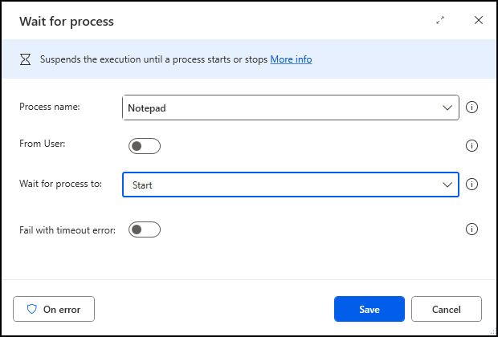

# System actions

>[!NOTE]
>The System group of actions has been segregated into some new categories. To find more information about these categories, go to [Workstation](workstation.md) and [Scripting](scripting.md) actions references.

Use the system actions to automate tasks fundamental to the Windows operating system. 

Launch any of your installed applications with the **Run application** action. You must enclose any command line arguments in double quotes and separate them by space. The following example opens a specific Word document in quiet mode.

>[!NOTE]
>The Application path field has to point to the executable of the application. You can open certain default Windows applications by entering their name, such as **notepad** for Notepad.

Additionally, desktop flows enable you to terminate processes by name or ID through the **Terminate process** action, and wait for processes to start or stop through the **Wait for process** action. You can also use user context if a process runs under a specific user.

To handle Windows environment variables, use the **Set Windows environment variable**, **Get Windows environment variable**, and **Delete Windows environment variable** actions for the respective tasks.

##  If process

Marks the beginning of a conditional block of actions depending on whether a process is running or not.

### Input parameters

|Argument|Optional|Accepts|Default Value|Description|
|-----|-----|-----|-----|-----|
|If process|N/A|Is running, Isn't running|Is running|State of the process to check|
|Process name|No|[Text value](../variable-data-types.md#text-value)||The name of the process to check|
|From User|N/A|[Boolean value](../variable-data-types.md#boolean-value)|False|Determine whether the process runs under a specific user or not|
|User name|No|[Text value](../variable-data-types.md#text-value)||Specify the name of the user running the process. The format is either domain\username or username.|

### Variables produced

This action doesn't produce any variables.

###  Exceptions

|Exception|Description|
|-----|-----|
|Can't retrieve list of processes|Indicates a problem retrieving the list of processes|

##  Wait for process

Suspends the execution until a process starts or stops.

### Input parameters

|Argument|Optional|Accepts|Default Value|Description|
|-----|-----|-----|-----|-----|
|Process name|No|[Text value](../variable-data-types.md#text-value)||The name of the process to check|
|From User|N/A|[Boolean value](../variable-data-types.md#boolean-value)|False|Determine whether the process runs under a specific user or not|
|User name|No|[Text value](../variable-data-types.md#text-value)||Specify the name of the user running the process. The format is either domain\username or username.|
|Wait for process to|N/A|Start, Stop|Start|Whether to wait until a certain process starts or stops|
|Fail with timeout error|N/A|[Boolean value](../variable-data-types.md#boolean-value)|False|Specify whether you want the action to wait indefinitely or fail after a set time period|

### Variables produced

This action doesn't produce any variables.

###  Exceptions

|Exception|Description|
|-----|-----|
|Can't retrieve list of processes|Indicates a problem retrieving the list of processes|
|Timeout error|A timeout occurred while waiting for the process|

##  Run application

Executes an application or opens a document by executing the associated application.

> [!IMPORTANT]
> Many applications with advanced functionality require elevated rights to prevent unauthorized access to system resources. To launch these applications using the **Run application** action, run Power Automate with administrator rights. To find more information regarding running Power Automate as an administrator, go to[Run Power Automate with elevated rights](../setup.md#run-power-automate-with-elevated-rights).

### Input parameters

|Argument|Optional|Accepts|Default Value|Description|
|-----|-----|-----|-----|-----|
|Application path|No|[File](../variable-data-types.md#files-and-folders)||The executable file as a complete file path|
|Command line arguments|Yes|[Text value](../variable-data-types.md#text-value)||Add extra arguments that would go after the executable file name. For example, enter notepad.exe in the application path and a specific text file in the command line arguments|
|Working folder|Yes|[Folder](../variable-data-types.md#files-and-folders)||The full path of the folder to work out of, if applicable.|
|Window style|N/A|Normal, Hidden, Minimized, Maximized|Normal|Choose the appearance and size of the application window when it opens|
|After application launch|N/A|Continue immediately, Wait for application to load, Wait for application to complete|Continue immediately|Whether the next action executes immediately, or waits until the program loads or completes|
|Timeout|Yes|[Numeric value](../variable-data-types.md#numeric-value)|0|The maximum wait time, and how long before forcing a continue|

### Variables produced

|Argument|Type|Description|
|-----|-----|-----|
|AppProcessId|[Numeric value](../variable-data-types.md#numeric-value)|The process ID output|
|AppExitCode|[Numeric value](../variable-data-types.md#numeric-value)|The application exit code|
|WindowHandle|[Numeric value](../variable-data-types.md#numeric-value)|The window handle. When opening a new window, this variable will catch the value of the window handle, and store it in this variable. A window handle is useful to specifically identify a window in a later action|

###  Exceptions

|Exception|Description|
|-----|-----|
|File or application not found|Indicates that the specified file or application wasn't found|
|Access denied for application or File|Indicates that access was denied for the specified application or file|
|Can't retrieve application's main window handle|Indicates a problem retrieving the application's main window handle|
|Can't execute application or open file|Indicates a problem executing the specified application or opening the specified file|

##  Terminate process

Immediately stops a running process.

### Input parameters

|Argument|Optional|Accepts|Default Value|Description|
|-----|-----|-----|-----|-----|
|Specify process by|N/A|Process ID, Process name|Process name|Specify whether the process to terminate is specified by its name, or by its ID|
|Process ID|No|[Numeric value](../variable-data-types.md#numeric-value)||The ID of the process to terminate|
|Process name|No|[Text value](../variable-data-types.md#text-value)||The name of the process to terminate. If more than one process with the same name is running, all of them are terminated|
|From User|N/A|[Boolean value](../variable-data-types.md#boolean-value)|False|Determine whether the process runs under a specific user or not|
|User name|No|[Text value](../variable-data-types.md#text-value)||Specify the name of the user running the process. The format is either domain\username or username.|

### Variables produced

This action doesn't produce any variables.

###  Exceptions

|Exception|Description|
|-----|-----|
|Process with specified ID not running|Indicates that a process with the specified ID isn't running|
|Failed to terminate process|Indicates a problem terminating the process|

##  Ping

Sends a message to determine whether a remote computer is accessible over the network.

### Input parameters

|Argument|Optional|Accepts|Default Value|Description|
|-----|-----|-----|-----|-----|
|Host name|No|[Text value](../variable-data-types.md#text-value)||The name of the remote computer or an IP address|
|Timeout|Yes|[Numeric value](../variable-data-types.md#numeric-value)|5000|The maximum number of milliseconds to wait for the Ping reply message|

### Variables produced

|Argument|Type|Description|
|-----|-----|-----|
|PingResult|[Text value](../variable-data-types.md#text-value)|The status of the ping message (success or failure)|
|RoundTripTime|[Numeric value](../variable-data-types.md#numeric-value)|The number of milliseconds taken for the Ping to complete|

###  Exceptions

|Exception|Description|
|-----|-----|
|Can't complete ping action|Indicates a problem completing the ping action|

##  Set Windows environment variable

Sets an environment variable to a given value.

### Input parameters

|Argument|Optional|Accepts|Default Value|Description|
|-----|-----|-----|-----|-----|
|Environment variable name|No|[Text value](../variable-data-types.md#text-value)||The name of the environment variable|
|New environment variable value|No|[Text value](../variable-data-types.md#text-value)||The value that is set to the environment variable|
|Type|N/A|User, System|User|The type of the environment variable|

### Variables produced

This action doesn't produce any variables.

###  Exceptions

|Exception|Description|
|-----|-----|
|Indicates a problem setting the environment variable's value|Indicates a problem setting the environment variable's value|
|Insufficient permissions|Indicates that the user has insufficient permissions to perform this action|

##  Get Windows environment variable

Retrieves the value of an environment variable.

### Input parameters

|Argument|Optional|Accepts|Default Value|Description|
|-----|-----|-----|-----|-----|
|Environment variable name|No|[Text value](../variable-data-types.md#text-value)||The name of the environment variable whose value will be retrieved|
|Search for variable only in scope|N/A|[Boolean value](../variable-data-types.md#boolean-value)|False|Specify whether to search for the variable only in a specific scope|
|Scope|N/A|User, System|User|The scope from which the environment variable should be retrieved|

### Variables produced

|Argument|Type|Description|
|-----|-----|-----|
|EnvironmentVariableValue|[Text value](../variable-data-types.md#text-value)|The environment variable's value|

###  Exceptions

|Exception|Description|
|-----|-----|
|Environment variable doesn't exist|Indicates that the specified environment variable doesn't exist|
|Insufficient permissions|Indicates that the user has insufficient permissions to perform this action|

##  Delete Windows environment variable

Deletes an environment variable from a given scope.

### Input parameters

|Argument|Optional|Accepts|Default Value|Description|
|-----|-----|-----|-----|-----|
|Environment variable name|No|[Text value](../variable-data-types.md#text-value)||The name of the environment variable to delete|
|Type|N/A|User, System|User|The type of the environment variable to delete|

### Variables produced

This action doesn't produce any variables.

###  Exceptions

|Exception|Description|
|-----|-----|
|Failed to delete environment variable|Indicates a problem deleting an environment variable|
|Insufficient permissions|Indicates that the user has insufficient permissions to perform this action|

[!INCLUDE[footer-include](../../includes/footer-banner.md)]
