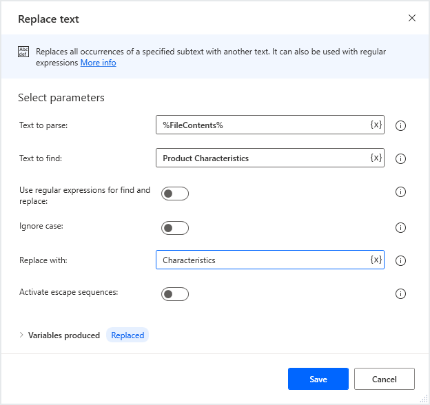
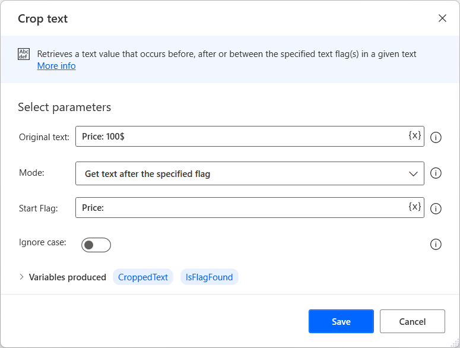
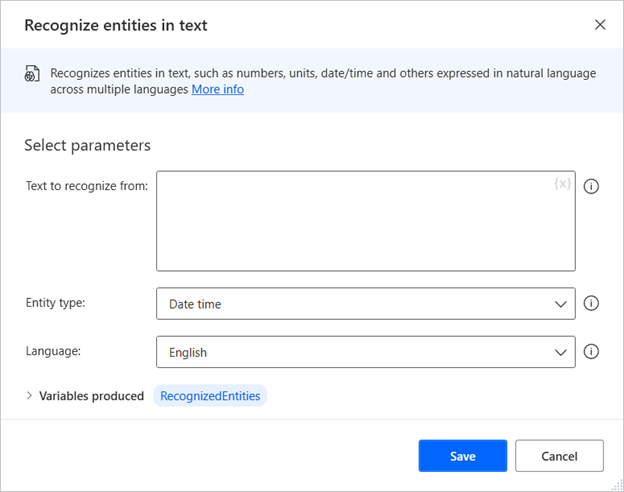
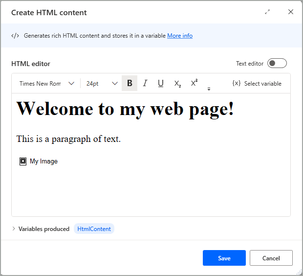
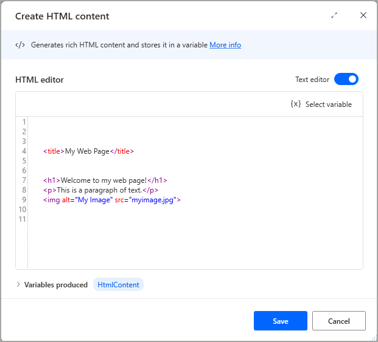

# Text actions

Text actions enable you to handle, manipulate, and convert text values in your desktop flows.

To merge a list of text values and create a single value, use the **Join text** action. The action requires you to specify the list and a delimiter.

To split a single text value into a list, deploy the **Split text** action, and specify the text value and the delimiters to separate the list items.

To replace a subtext in a text, use the **Replace text** action. The following example replaces the text **Product Characteristics** with **Characteristics**.

Search a text value inside another text with the **Parse text** action.

Some text actions allow you to use regular expressions. For example, you can enable **Is regular expression** in the **Parse text** action to search for a text specified by a regular expression. To find more information about regular expressions, go to [Regular Expression Language - Quick Reference](/dotnet/standard/base-types/regular-expression-language-quick-reference).

Additionally, you can disable **First occurrence only** to make the action return a list with the positions of all the matched texts.

The following example searches all the words in **Items detected in Stock** starting with a capital letter. The produced list named **Matches** stores the values **Items** and **Stock**. The **Positions** list stores the positions in which the values were found (1 and 18).

Besides searching in texts, Power Automate enables you to crop text values from texts using the **Crop text** action. You can define the text to crop using flags that are the first occurring given character or string markers. You can crop values before, after, or between the specified text flag(s).

The **CroppedText** variable stores the cropped text, while you can use the **IsFlagFound** variable to check if the action found the set flags.

To ensure that numbers are stored as numerical values, use the **Convert text to number** action. To perform the reverse conversion, use **Convert number to text**.

Similarly, you can use the **Convert text to datetime** and **Convert datetime to text** actions to ensure that dates are correctly formatted.

## Use the Recognize entities in text action

Desktop flows enable you to extract various entities from texts in natural language, such as numbers, dates, and measurement units, through the **Recognize entities in text** action.

The **Recognize entities in text** action gets a text or a variable containing text and returns a data table containing the results. Each entity returns different results based on its structure, but all the data tables contain an **Original text** field that stores the entity part of the input text.

The following table displays various examples of entities that the **Recognize entities in text** action can recognize.

|Entity      |Input text                                                            |Returned values                                                                    |
|------------|----------------------------------------------------------------------|-----------------------------------------------------------------------------------|
|Date time   |I'll go back 04th Jan 2019                                            |**Value:** 1/4/2019 12:00:00 AM   **Original text:** 04th Jan 2019             |
|Date time   |Schedule a meeting tonight at 7pm                                     |**Value:** 9/30/2021 7:00:00 PM   **Original text:** tonight at 7pm            |
|Dimension   |You weight 200 lbs                                                     |**Value:** 200   **Unit:** Pound   **Original text:** 200 lbs               |
|Dimension   |Α twister roared through an area about 10 miles long there           |**Value:** 10   **Unit:** Mile   **Original text:** ten miles              |
|Temperature |The temperature outside is 40 deg celsius                             |**Value:** 40   **Unit:** C   **Original text:** 40 deg celsius            |
|Currency    |Net interest income sank 27 percent in the quarter to /$ 254 million  |**Value:** 254000000   **Unit:** Dollar   **Original text:** $ 254 million |
|Number range|This number is larger than 20 and less or equal than 35  |**From:** 20   **To:** 35   **Original text:** larger than 20 and less or equal than 35 |
|Number range|From 5 to 10                                                          |**From:** 5   **To:** 10   **Original text:** From 5 to 10                 |
|Number range|Less than 4.565                                                       |**From:** 0   **To:** 4.565   **Original text:** Less than 4.565           |
|Number      |A dozen                                                               |**Value:** 12   **Original text:** A dozen                                     |
|Number      |Two thirds                                                            |**Value:** 0.666666666666667   **Original text:** Two thirds                   |
|Ordinal     |I like the first two books                                            |**Value:** 1   **Original text:** first                                        |
|Ordinal     |Eleventh                                                              |**Value:** 11   **Original text:** Eleventh                                    |
|Percentage  |100 percent                                                           |**Value:** 100   **Original text:** 100 percent                                |
|Phone number|Tel: +1 209-555-0100                                                  |**Value:** +1 209-555-0100   **Original text:** +1 209-555-0100                |
|Email       |felix@contoso.com                                                     |**Value:** felix@contoso.com   **Original text:** felix@contoso.com            |
|IP address  |My PC IP address is 1.1.1.1                                           |**Value:** 1.1.1.1   **Original text:** 1.1.1.1                                |
|Mention     |@Alice                                                                |**Value:** @Alice   **Original text:** @Alice                                  |
|Hashtag     |#News                                                                 |**Value:** #News   **Original text:** #News                                    |
|URL         |www.microsoft.com |**Value:** www.microsoft.com    **Original text:** www.microsoft.com           |
|GUID        |123e4567-e89b-12d3-a456-426655440000                                  |**Value:** 123e4567-e89b-12d3-a456-426655440000   **Original text:** 123e4567-e89b-12d3-a456-426655440000 |
|Quoted text |Enter the value in the "value" field                                  |**Value:** "value"   **Original text:** "value"                                |

>[!NOTE]
> The **Recognize entities in text** action supports 14 different languages. However, some entities may not be available for specific languages. To find more information about language restrictions, go to [Microsoft Recognizers Text - Supported entities across cultures](https://github.com/microsoft/Recognizers-Text#supported-entities-across-cultures).

##  Append line to text

Appends a new line of text to a text value.

### Input parameters

|Argument|Optional|Accepts|Default Value|Description|
|-----|-----|-----|-----|-----|
|Original text|No|[Text value](../variable-data-types.md#text-value)||The original text|
|Line to append|Yes|[Text value](../variable-data-types.md#text-value)||The text to add on as a new line|

### Variables produced

|Argument|Type|Description|
|-----|-----|-----|
|Result|[Text value](../variable-data-types.md#text-value)|The new text|

###  Exceptions

This action doesn't include any exceptions.

##  Get subtext

Retrieve a subtext from a text value.

### Input parameters

|Argument|Optional|Accepts|Default Value|Description|
|-----|-----|-----|-----|-----|
|Original text|No|[Text value](../variable-data-types.md#text-value)||The text to retrieve a section of text from|
|Start index|N/A|Start of text, Character position|Character position|Specify how to find the starting point for text retrieval|
|Character position|No|[Numeric value](../variable-data-types.md#numeric-value)||The position of the first character to retrieve. This value is a zero-based index, counting from zero for the first character|
|Length|N/A|End of text, Number of chars|Number of chars|Specify whether the subtext continues to the end of the text, or includes only a certain number of characters|
|Number of chars|No|[Numeric value](../variable-data-types.md#numeric-value)||The number of characters to retrieve|

### Variables produced

|Argument|Type|Description|
|-----|-----|-----|
|Subtext|[Text value](../variable-data-types.md#text-value)|The retrieved subtext|

###  Exceptions

|Exception|Description|
|-----|-----|
|Start index or length are out of range|Indicates that the start index or length are out of range|

##  Crop text

Retrieves a text value that occurs before, after or between the specified text flag(s) in a given text.

### Input parameters

|Argument|Optional|Accepts|Default Value|Description|
|-----|-----|-----|-----|-----|
|Original text|No|[Text value](../variable-data-types.md#text-value)||The text to retrieve a section of text from|
|Mode|N/A|Get text before the specified flag, Get text after the specified flag, Get text between the two specified flags|Get text before the specified flag|Specify whether to retrieve the text before, after, or between flags.|
|Start flag|No|[Text value](../variable-data-types.md#text-value)||The retrieved text will be after this flag. The flag can be any character or text|
|End flag|No|[Text value](../variable-data-types.md#text-value)||The retrieved text will be before this flag. The flag can be any character or text|
|Ignore case|N/A|[Boolean value](../variable-data-types.md#boolean-value)|False|Specify whether to find the flags using case-sensitive or case-insensitive matching|

### Variables produced

|Argument|Type|Description|
|-----|-----|-----|
|CroppedText|[Text value](../variable-data-types.md#text-value)|The new cropped text|
|IsFlagFound|[Boolean value](../variable-data-types.md#boolean-value)|Indicates if flag(s) found or not|

###  Exceptions

This action doesn't include any exceptions.

##  Pad text

Creates a fixed length text by adding characters to the left or to the right of an existing text.

### Input parameters

|Argument|Optional|Accepts|Default Value|Description|
|-----|-----|-----|-----|-----|
|Text to pad|Yes|[Text value](../variable-data-types.md#text-value)||The text to lengthen|
|Pad|N/A|Left, Right|Left|Specify whether to add characters to the left or right of the existing text|
|Text for padding|Yes|[Text value](../variable-data-types.md#text-value)||The character or text that will be added to lengthen the original text|
|Total length|Yes|[Numeric value](../variable-data-types.md#numeric-value)|10|The total character length of the final padded text. The text for padding will be repeatedly added until the final text is of the specified length|

### Variables produced

|Argument|Type|Description|
|-----|-----|-----|
|PaddedText|[Text value](../variable-data-types.md#text-value)|The new, padded text|

###  Exceptions

This action doesn't include any exceptions.

##  Trim text

Removes all occurrences of white space characters (such as space, tab, or new line) from the beginning and/or end of an existing text.

The **Trim text** action receives a text value as an input and produces a text output according to the **What to trim** parameter. The available options of the **What to trim** parameter are the following:
- whitespace characters from the beginning
- whitespace characters from the end
- whitespace characters from the beginning and end

### Input parameters

|Argument|Optional|Accepts|Default Value|Description|
|-----|-----|-----|-----|-----|
|Text to trim|Yes|[Text value](../variable-data-types.md#text-value)||Text to trim|
|What to trim|N/A|whitespace characters from the beginning, whitespace characters from the end, whitespace characters from the beginning and end|whitespace characters from the beginning and end|Specify where white space characters will be removed from|

### Variables produced

|Argument|Type|Description|
|-----|-----|-----|
|TrimmedText|[Text value](../variable-data-types.md#text-value)|The new trimmed text|

###  Exceptions

This action doesn't include any exceptions.

##  Reverse text

Reverses the order of letters in a text string.

### Input parameters

|Argument|Optional|Accepts|Default Value|Description|
|-----|-----|-----|-----|-----|
|Text to reverse|No|[Text value](../variable-data-types.md#text-value)||The text to reverse|

### Variables produced

|Argument|Type|Description|
|-----|-----|-----|
|ReversedText|[Text value](../variable-data-types.md#text-value)|The new reversed text|

###  Exceptions

This action doesn't include any exceptions.

##  Change text case

Changes the casing of a text to uppercase, lowercase, title case or sentence case.

### Input parameters

|Argument|Optional|Accepts|Default Value|Description|
|-----|-----|-----|-----|-----|
|Text to convert|Yes|[Text value](../variable-data-types.md#text-value)||The text to convert|
|Convert to|N/A|Upper case, Lower case, Title case, Sentence case|Upper case|Specify the text case style to use|

### Variables produced

|Argument|Type|Description|
|-----|-----|-----|
|TextWithNewCase|[Text value](../variable-data-types.md#text-value)|The new converted text|

###  Exceptions

This action doesn't include any exceptions.

##  Convert text to number

Converts a text representation of a number to a variable that contains a numeric value.

### Input parameters

|Argument|Optional|Accepts|Default Value|Description|
|-----|-----|-----|-----|-----|
|Text to convert|No|[Text value](../variable-data-types.md#text-value)||A text variable containing only a number, to convert to a numeric value variable. Spaces are ignored, but non-number text throws an exception|

### Variables produced

|Argument|Type|Description|
|-----|-----|-----|
|TextAsNumber|[Numeric value](../variable-data-types.md#numeric-value)|The new numeric value|

###  Exceptions

|Exception|Description|
|-----|-----|
|Provided text value can't be converted into a valid number|Indicates that the provided text value can't be converted into a valid number|

##  Convert number to text

Converts a number to text using a specified format.

### Input parameters

|Argument|Optional|Accepts|Default Value|Description|
|-----|-----|-----|-----|-----|
|Number to convert|No|[Numeric value](../variable-data-types.md#numeric-value)||A numeric value to convert to text|
|Decimal places|Yes|[Numeric value](../variable-data-types.md#numeric-value)|2|The number of decimal places that will be included before truncation. Zeros can also be added to the end to pad the text in this way|
|Use thousands separator|N/A|[Boolean value](../variable-data-types.md#boolean-value)|True|Specify whether or not to use punctuation as a 1000 separator|

### Variables produced

|Argument|Type|Description|
|-----|-----|-----|
|FormattedNumber|[Text value](../variable-data-types.md#text-value)|The formatted number as text|

###  Exceptions

This action doesn't include any exceptions.

##  Convert text to datetime

Converts a text representation of a date and/or time value to a datetime value.

### Input parameters

|Argument|Optional|Accepts|Default Value|Description|
|-----|-----|-----|-----|-----|
|Text to convert|No|[Text value](../variable-data-types.md#text-value)||The text to convert to a datetime value. This text must be in a recognizably datetime value format|
|Date is represented in custom format|N/A|[Boolean value](../variable-data-types.md#boolean-value)|False|Specify whether the text to convert contains a representation of the date and time in a nonstandard, nonrecognizable format|
|Custom format|No|[Text value](../variable-data-types.md#text-value)||The format in which the date is stored in the text. A custom format can be expressed as, for example, yyyyMMdd for date and hhmmss for time|

### Variables produced

|Argument|Type|Description|
|-----|-----|-----|
|TextAsDateTime|[Datetime](../variable-data-types.md#dates-and-time)|The datetime value|

###  Exceptions

|Exception|Description|
|-----|-----|
|Provided text value can't be converted into a valid datetime|Indicates that the provided text value can't be converted into a valid datetime|

##  Convert datetime to text

Converts a datetime value to text using a specified custom format.

### Input parameters

|Argument|Optional|Accepts|Default Value|Description|
|-----|-----|-----|-----|-----|
|Datetime to convert|No|[Datetime](../variable-data-types.md#dates-and-time)||The datetime value to convert to text|
|Format to use|N/A|Standard, Custom|Standard|Specify whether to use a standard datetime format, or create a custom one|
|Custom Format|No|[Text value](../variable-data-types.md#text-value)||The custom format to display the datetime value in. A datetime can be expressed as, for example, MM/dd/yyyy for date and hh:mm:sstt for time|
|Standard format|N/A|Short date, Long date, Short time, Long time, Full datetime (short time), Full datetime (long time), General datetime (short time), General datetime (long time), Sortable datetime|Short date|The standard datetime format the action uses to display the datetime value|

### Variables produced

|Argument|Type|Description|
|-----|-----|-----|
|FormattedDateTime|[Text value](../variable-data-types.md#text-value)|The formatted datetime as a text value|

###  Exceptions

This action doesn't include any exceptions.

##  Create random text

Generates a text of specified length consisting of random characters. This action can be useful for generating passwords.

### Input parameters

|Argument|Optional|Accepts|Default Value|Description|
|-----|-----|-----|-----|-----|
|Use uppercase letters (A-Z)|N/A|[Boolean value](../variable-data-types.md#boolean-value)|True|Specify whether uppercase characters will be included in the generated text|
|Use lowercase letters (a-z)|N/A|[Boolean value](../variable-data-types.md#boolean-value)|True|Specify whether lowercase characters will be included in the generated text|
|Use digits (0-9)|N/A|[Boolean value](../variable-data-types.md#boolean-value)|True|Specify whether digits will be included in the generated text|
|Use symbols ( , . < > ? ! + - _ # $ ^ )|N/A|[Boolean value](../variable-data-types.md#boolean-value)|True|Specify whether symbols will be included in the generated text|
|Minimum length|Yes|[Numeric value](../variable-data-types.md#numeric-value)|6|The minimum length of the random text. For a certain length of text, set the minimum and maximum values to that number|
|Maximum length|Yes|[Numeric value](../variable-data-types.md#numeric-value)|10|The maximum length of the random text. For a certain length of text, set the minimum and maximum values to that number|

### Variables produced

|Argument|Type|Description|
|-----|-----|-----|
|RandomText|[Text value](../variable-data-types.md#text-value)|The generated random text|

###  Exceptions

This action doesn't include any exceptions.

##  Join text

Converts a list into a text value by separating its items with a specified delimiter.

To join all contents of a list into a single text value, use the **Join text** action. Begin by specifying the respective list to use in the **Specify list to join** property. You can choose the delimiters to separate the list items in the joined text by making the respective choice in the **Delimiter to separate list items** property dropdown list:

- **None** creates a single, joined literal by combining all the items in the list without separating them with a delimiter.
- **Standard** allows you to set the delimiter as a space, tab, or new line by selecting the respective option in the **Standard delimiter** property dropdown list. You can also choose how many times the delimiter is presented between each list item by modifying the **Times** property.
- **Custom** allows you to set your own delimiter.

### Input parameters

|Argument|Optional|Accepts|Default Value|Description|
|-----|-----|-----|-----|-----|
|Specify the list to join|No|[List](../variable-data-types.md#list) of [Text values](../variable-data-types.md#text-value)||The list to convert to text|
|Delimiter to separate list items|N/A|None, Standard, Custom|None|Specify whether to use no delimiter, a standard delimiter or a custom one|
|Custom delimiter|No|[Text value](../variable-data-types.md#text-value)||The character(s) to use as delimiter|
|Standard delimiter|N/A|Space, Tab, New line|Space|Specify the delimiter to use|
|Times|Yes|[Numeric value](../variable-data-types.md#numeric-value)|1|Specify how many times to use the specified delimiter|

### Variables produced

|Argument|Type|Description|
|-----|-----|-----|
|JoinedText|[Text value](../variable-data-types.md#text-value)|The new delimited text|

###  Exceptions

This action doesn't include any exceptions.

##  Split text

Creates a list containing the substrings of a text that are separated by a specified delimiter or a regular expression.

### Input parameters

|Argument|Optional|Accepts|Default Value|Description|
|-----|-----|-----|-----|-----|
|The text to split|No|[Text value](../variable-data-types.md#text-value)||The text to split|
|Delimiter type|N/A|Standard, Custom|Standard|Whether the used delimiter is of a standard or custom format|
|Custom delimiter|No|[Text value](../variable-data-types.md#text-value)||The character(s) that were used as a delimiter|
|Standard delimiter|N/A|Space, Tab, New line|Space|The delimiter used|
|Times|Yes|[Numeric value](../variable-data-types.md#numeric-value)|1|Specify how many times the delimiter is used|
|Is regular expression|N/A|[Boolean value](../variable-data-types.md#boolean-value)|False|Specify whether the delimiter will be a regular expression. A regular expression creates a range of possibilities for the delimiter. For example, '\d' means that the delimiter could be any digit|

> [!NOTE]
> Power Automate's regular expression engine is .NET. To find more information about regular expressions, go to [Regular Expression Language - Quick Reference](/dotnet/standard/base-types/regular-expression-language-quick-reference).

### Variables produced

|Argument|Type|Description|
|-----|-----|-----|
|TextList|[List](../variable-data-types.md#list) of [Text values](../variable-data-types.md#text-value)|The new list|

###  Exceptions

|Exception|Description|
|-----|-----|
|Provided regular expression is invalid|Indicates that the provided regular expression is invalid|

##  Parse text

Parses a text to find the first or all occurrences of a specified subtext or a regular expression pattern.

### Input parameters

|Argument|Optional|Accepts|Default Value|Description|
|-----|-----|-----|-----|-----|
|Text to Parse|No|[Text value](../variable-data-types.md#text-value)||The text to parse|
|Text to Find|No|[Text value](../variable-data-types.md#text-value)||The subtext or a regular expression to search for|
|Is regular expression|N/A|[Boolean value](../variable-data-types.md#boolean-value)|False|Specify whether the subtext is a regular expression. For example \d means that the subtext could be any digit|
|Start Parsing at Position|No|[Numeric value](../variable-data-types.md#numeric-value)||The position to start looking for the 'Text to Find'. The first position is zero, so use 0 to start from the beginning|
|First occurrence only|N/A|[Boolean value](../variable-data-types.md#boolean-value)|True|Specify whether to find the first occurrence only, or each occurrence of the 'Text to find'|
|Ignore case|N/A|[Boolean value](../variable-data-types.md#boolean-value)|False|Specify whether to find the specified text using case-sensitive or case-insensitive matching|

> [!NOTE]
> Power Automate's regular expression engine is .NET. To find more information about regular expressions, go to [Regular Expression Language - Quick Reference](/dotnet/standard/base-types/regular-expression-language-quick-reference).

### Variables produced

|Argument|Type|Description|
|-----|-----|-----|
|Position|[Numeric value](../variable-data-types.md#numeric-value)|The position of the 'Text to find' into the 'Text to parse'. If the text isn't found within the original text, this variable will hold the value -1|
|Positions|[List](../variable-data-types.md#list) of [Numeric values](../variable-data-types.md#numeric-value)|The positions of the 'Text to find' into the 'Text to parse'. If the text isn't found within the original text, this variable will hold the value -1|
|Match|[Text value](../variable-data-types.md#text-value)|The result that matches the given regular expression|
|Matches|[List](../variable-data-types.md#list) of [Text values](../variable-data-types.md#text-value)|The results that match the given regular expression|

###  Exceptions

|Exception|Description|
|-----|-----|
|Provided regular expression is invalid|Indicates that the provided regular expression is invalid|

##  Replace text

Replaces all occurrences of a specified subtext with another text. It can also be used with regular expressions.

### Input parameters

|Argument|Optional|Accepts|Default Value|Description|
|-----|-----|-----|-----|-----|
|Text to parse|No|[Text value](../variable-data-types.md#text-value)||The text to parse|
|Text to find|No|[Text value](../variable-data-types.md#text-value)||The subtext or a regular expression to search for|
|Use regular expressions for find and replace|N/A|[Boolean value](../variable-data-types.md#boolean-value)|False|Specify whether the subtexts are regular expressions. A regular expression creates a range of possibilities for the subtext. For example, '\d' means that the subtext could be any digit|
|Ignore case|N/A|[Boolean value](../variable-data-types.md#boolean-value)|False|Specify whether to find the subtext to replace using case-sensitive or case-insensitive matching|
|Replace with|No|[Text value](../variable-data-types.md#text-value)||The text or a regular expression to replace found text|
|Activate escape sequences|N/A|[Boolean value](../variable-data-types.md#boolean-value)|False|Specify whether to use special sequences. For example, '\t' in the replacement text will be interpreted as a tab|

> [!NOTE]
> Power Automate's regular expression engine is .NET. To find more information about regular expressions, go to [Regular Expression Language - Quick Reference](/dotnet/standard/base-types/regular-expression-language-quick-reference).

### Variables produced

|Argument|Type|Description|
|-----|-----|-----|
|Replaced|[Text value](../variable-data-types.md#text-value)|The new updated text|

###  Exceptions

This action doesn't include any exceptions.

##  Escape text for regular expression

Escapes a minimal set of characters (\, *, +, ?, |, {, [, (,), ^, $,., #, and white space) by replacing them with their escape codes.

### Input parameters

|Argument|Optional|Accepts|Default Value|Description|
|-----|-----|-----|-----|-----|
|Text to escape|No|[Text value](../variable-data-types.md#text-value)||The text to escape|

### Variables produced

|Argument|Type|Description|
|-----|-----|-----|
|EscapedText|[Text value](../variable-data-types.md#text-value)|The escaped text|

###  Exceptions

This action doesn't include any exceptions.

##  Recognize entities in text

Recognizes entities in text, such as numbers, units, data/time and others expressed in natural language across multiple languages.

### Input parameters

|Argument|Optional|Accepts|Default Value|Description|
|-----|-----|-----|-----|-----|
|Text to recognize from|No|[Text value](../variable-data-types.md#text-value)||The text to recognize entities from|
|Entity type|N/A|Date time, Dimension, Temperature, Currency, Number range, Number, Ordinal, Percentage, Phone number, Email, IP address, Mention, Hashtag, URL, GUID, Quoted text|Date time|The type of entity to recognize (, Date time, Email, URL etc.)|
|Language|N/A|English, Chinese (Simplified), Spanish, Spanish (Mexico), Portuguese, French, German, Italian, Japanese, Dutch, Korean, Swedish, Turkish, Hindi|English|Specify the language of the text|

### Variables produced

|Argument|Type|Description|
|-----|-----|-----|
|RecognizedEntities|[Datatable](../variable-data-types.md#datatable)|The recognized entities|

###  Exceptions

This action doesn't include any exceptions.

##  Create HTML content

Generates rich HTML content and stores it in a variable.

This action allows users to create HTML content in a formatted and intuitive way, which is stored in a text variable. This variable can then be used in following actions, where HTML format is needed.

This functionality primarily serves the email sending actions ‘Send email’, ‘Send Exchange email message’, and ‘Send email message through Outlook’ regarding their ‘Body’ input parameter. Specifically, the produced variable can be used as is in the ‘Body’ parameter of an email sending action that follows later in the flow, while the **Body is HTML** option is enabled.

### Input parameters

Input parameters are configured through the embedded HTML editor.

The initial view of the HTML editor allows out-of-the-box editing on the rendered HTML content, providing a set of formatting options through a toolbar found at the top, including the ability to insert links, images (via local paths or URLs) and tables, and even variables for dynamic content.

Enabling the **Text editor** option switches to the view where HTML language can be used including the corresponding element tags.

The &lt;head&gt; and &lt;body&gt; elements aren't needed in the text editor for the HTML content to be rendered.

### Variables produced

|Argument|Type|Description|
|-----|-----|-----|
|`HtmlContent`|[Text value](../variable-data-types.md#text-value)|The HTML code|

###  Exceptions

This action doesn't include any exceptions.

[!INCLUDE[footer-include](../../includes/footer-banner.md)]
