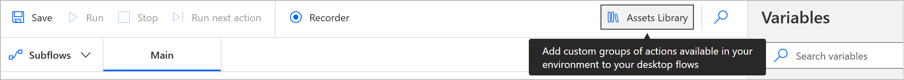

# Asset library

> [!NOTE]
> Power Automate for desktop v2.32 and newer is required

The Asset library is the way to include additional functionality in desktop flows. 

Custom actions(preview) developed by organizations and uploaded to the respective environments can be included/removde from desktop flows. 

To access the asset library either click on the dedicated button at the top right of the designer: 

You can include custom actions in desktop flows through the Asset library (link to asset library entry).

or through the entry under the Tools bar:

In the Custom actions tab, you will find the custom actions uploaded in the respective environment you are working in. 
> [!NOTE] 
> Makers are able to see custom actions shared with them.

 
 
