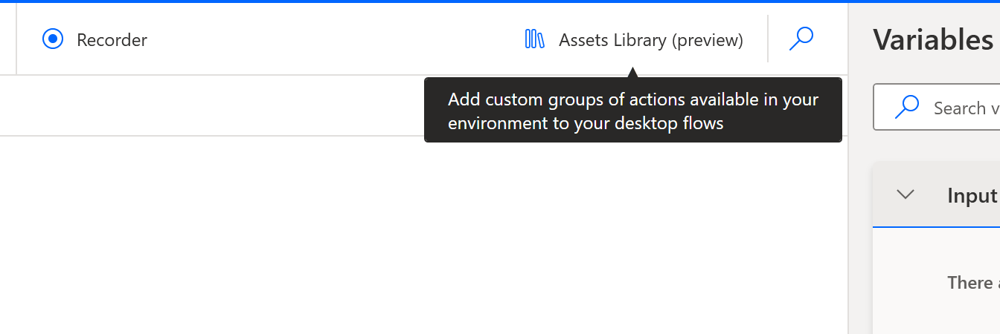
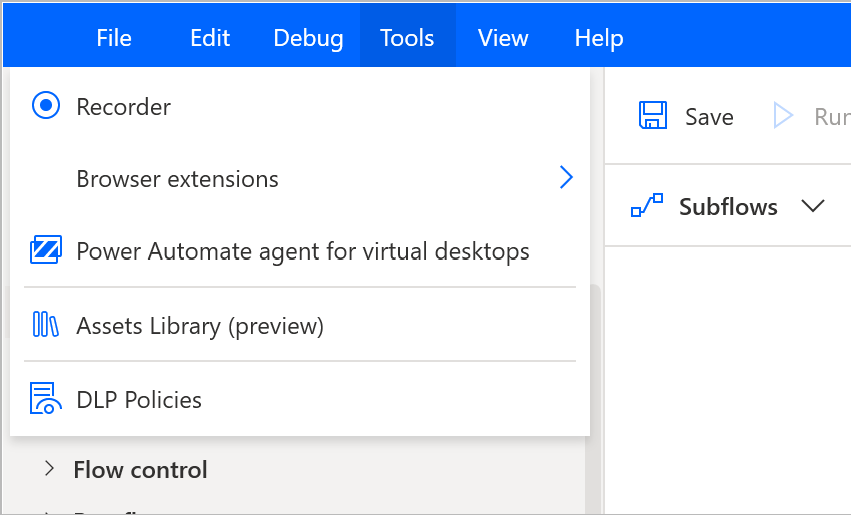
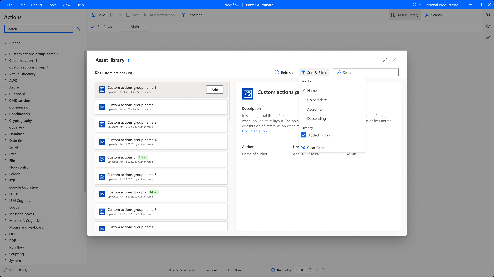

# Assets library

> [!IMPORTANT]
> Power Automate for desktop v2.32 and newer is required

The Assets library is the way to include additional functionality in desktop flows. 

Custom actions (preview) developed by organizations and uploaded to the respective environments can be included/removed from desktop flows. 

To access the Assets library either click on the dedicated button at the top right of the designer: 

or through the entry under the Tools bar:

## Custom actions (preview) tab

In the Custom actions (preview) tab, you will find the custom actions (preview) uploaded in the respective environment you are working in. 
> [!NOTE] 
> Makers are able to see custom actions (preview) shared with them.

 
 

[!INCLUDE[footer-include](../includes/footer-banner.md)]