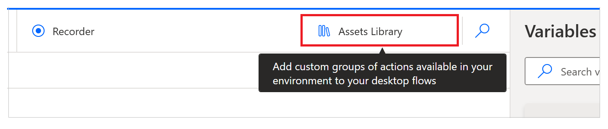
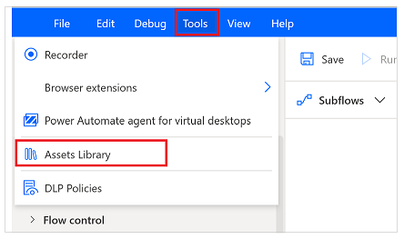

# Assets library (preview)

[!INCLUDE[cc-preview-features-top-note](../includes/cc-preview-features-top-note.md)]

> ! [!IMPORTANT]
> - [!INCLUDE[cc-preview-features-note](../includes/cc-preview-features-note.md)]
> - [!INCLUDE[cc-preview-features-definition-complete](../includes/cc-preview-features-definition-complete.md)]
> - This feature requires Power Automate for desktop v2.32 or later.

Assets library (preview) allows you to include more functionality in desktop flows. For example, you can upload Custom actions (preview) to the assets library when required.

To access the assets library, select the Assets library (preview) button at the top-right of the designer.

Alternatively, use the **Tools** bar.

## Custom actions (preview) tab

Custom actions (preview) tab shows you the custom actions uploaded in the environment you've selected.

> [!NOTE]
> You can only see Custom actions (preview) shared with you.

 
 
[!INCLUDE[footer-include](../includes/footer-banner.md)]
