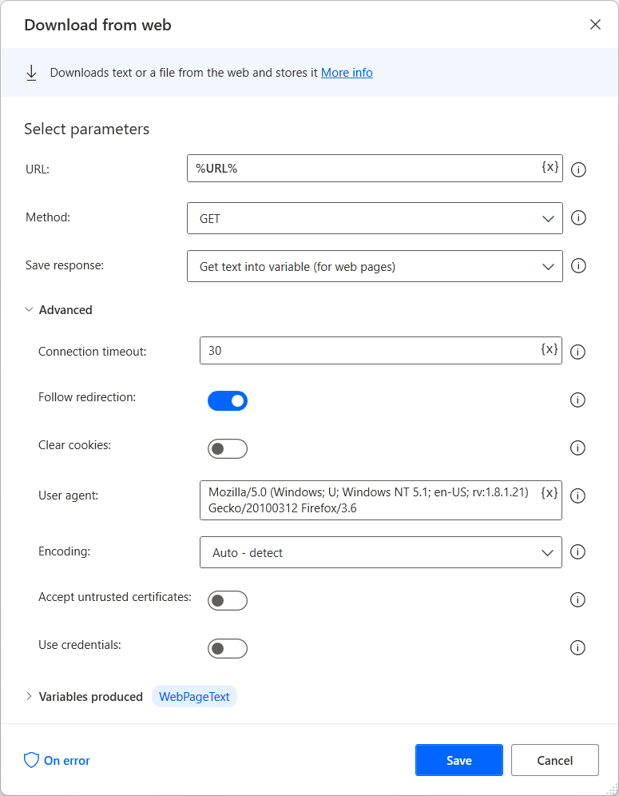
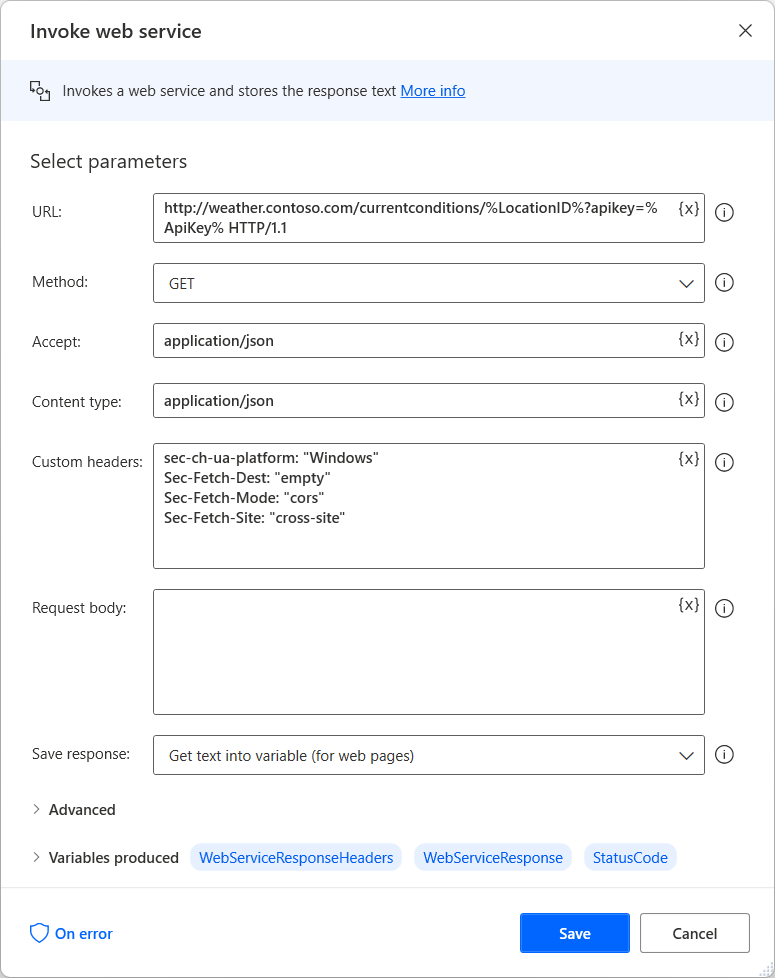

# Automate web flows

Power Automate offers several actions under the **Browser automation** group to enable users to interact with web browsers.

Four web browsers are currently supported:
- Microsoft Edge
- Microsoft Internet Explorer
- Google Chrome
- Mozilla Firefox

Browser automation is achieved by launching or attaching to one of the supported browsers and then deploying browser automation actions. Development may be performed manually or through the [use of the recorder](recording-flow.md).

## Building a browser automation flow

To begin a browser automation flow, use one of the browser-launching actions: **Launch new Microsoft Edge**, **Launch new Internet Explorer**, **Launch new Chrome**, or **Launch new Firefox**). You can start a new browser session or attach to an existing one.

> [!NOTE]
> To interact with browsers, you need to install the appropriate browser extension and configure the browser accordingly. You can find more information regarding the supported browsers and the required extension in [Use browsers and manage extensions](using-browsers.md).

After the browser instance is stored in a variable, you can deploy other browser automation actions to interact with the browser's content. The **Web form filling** actions focus on providing input to web pages, while **Web data extraction** actions draw data from web pages.

Most browser automation actions require you to specify a browser instance and a UI element to interact with. 

> [!NOTE]
> You can find a list with all the available browser automation actions in [Browser automation actions reference](actions-reference/webautomation.md).

Existing UI elements are displayed in the UI element pane, while new ones can be added directly through the action's properties or the pane. To find more information about UI elements, refer to [Automate using UI elements](ui-elements.md).

> [!NOTE]
> Browser automation actions accept exclusively UI elements captured from web pages. Therefore, existing UI elements captured from desktop applications aren't displayed in the browser automation actions.

To add a new UI element, highlight the appropriate web element and press **Ctrl & left-click**. After adding all the required elements, select **Done** to save them to the UI elements pane.

## Data population on the web

To provide input to a web page, select the appropriate **Web form filling** action depending on the nature of the element, and specify the browser instance.

## Web data extraction

To extract a piece of data from a web page, use the **Get details of web page** or the **Get details of element on web page** action, depending on whether the data in question concerns the entire web page or an element inside it.

To extract large amounts of structured data, use the **Extract data from web page** action. After deploying the action, right-click on the required data on the web page to view the available options.

Any lists or tables of data will be automatically identified after two of their elements are designated for extraction.

## Interacting with the web and web services

Power Automate provides various HTTP actions to allow users to communicate directly with web resources, such as web pages, files, and APIs, without the need of a web browser.

> [!NOTE]
> You can find a list with all the available HTTP actions in [HTTTP actions reference](actions-reference/web.md).

### Downloading web resources

Use the **Download from web** action to directly download web page content or files stored on the web.

Both the **GET** and **POST** methods can be used with this action. The files can be downloaded directly to the disk, while web page contents are saved into a variable.

### Accessing web APIs

Use the **Invoke web service** action to access web APIs. Various methods are compatible with this action, which is fully customizable in order to accommodate virtually any API.

Apart from the **Invoke web service** action, Power Automate provides the **Invoke SOAP web service** action to interact with SOAP web services.

[!INCLUDE[footer-include](../includes/footer-banner.md)]