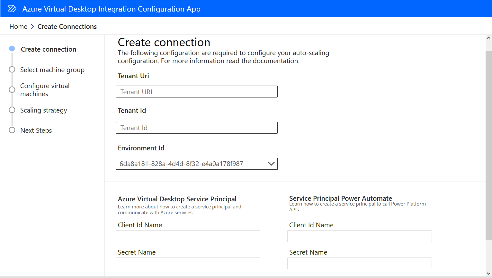
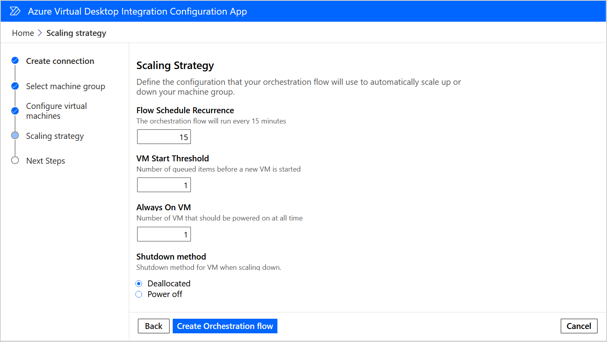

# Use the Azure Virtual Desktop Integration starter kit

The main entry point to the AVD integration starter kit is the AVD Integration
Configuration App. You can use this application to:

1.  List the Orchestration flows that have already been generated by the Starter
    Kit

2.  Create a new scale configuration.

To create a new scale configuration:

1.  Go to [Power Automate](https://flow.microsoft.com/).

2.  On the left pane, select **Solutions**.

3.  Select the starter kit solution, navigate to Apps then launch the **AVD
    Integration Configuration App**

4.  Select **New scaling configuration** in the home page.

    

5.  Enter the tenant domain name and tenant Id. Read the respective [documentation](/partner-center/find-ids-and-domain-names\#find-the-microsoft-azure-ad-tenant-id-and-primary-domain-name) to find more information 

6.  Select the Environment you want to create the orchestration Flow in.

7.  Provide the secret names for both App registrations (Power Platform and
    Azure Service Management).

8.  Select the machine group you want to automatically scale using AVD VMs.

9.  Select the host pool you want to use to scale your machine group.

10. Provide the Azure Automation specific information (Account Name and
    Automation Credential).

11. Enter the secret name for the selected machine group.

12. Configure your scaling strategy:

    

13. Select **Create Orchestration Flow**

A new cloud flow will be created with the configured the information and scaling
strategy. You can now navigate to the target environment and review, test or
edit the cloud flow if needed. Once you are happy with your configuration, you
can enable the cloud flow to automatically apply your scaling configuration to
the machine group.

