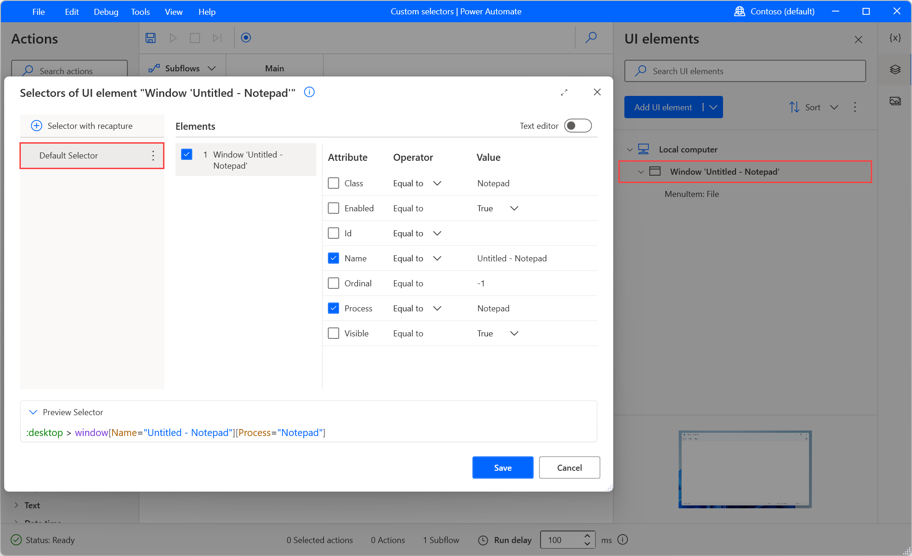
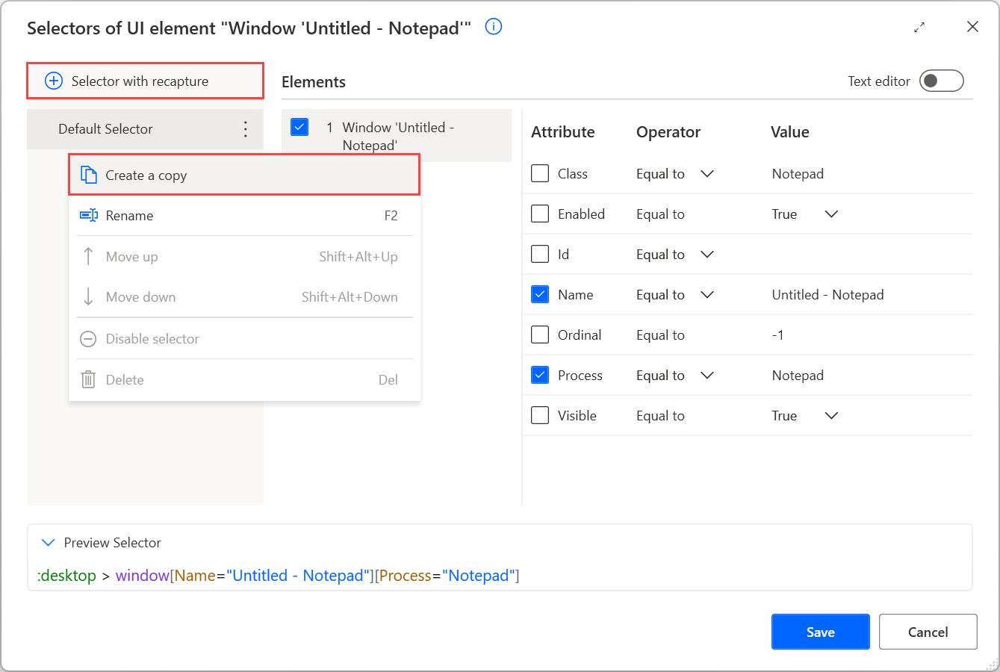
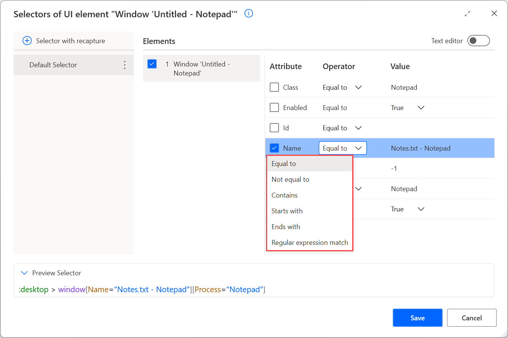
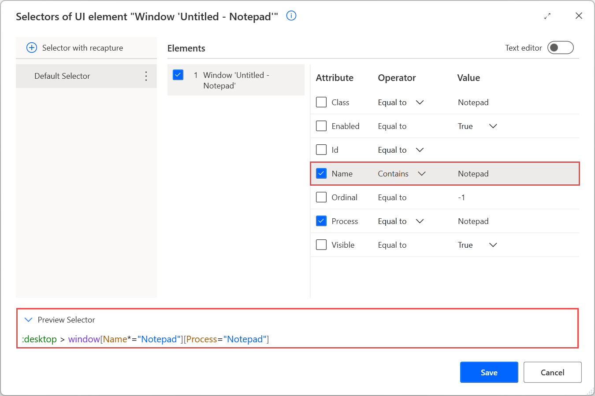
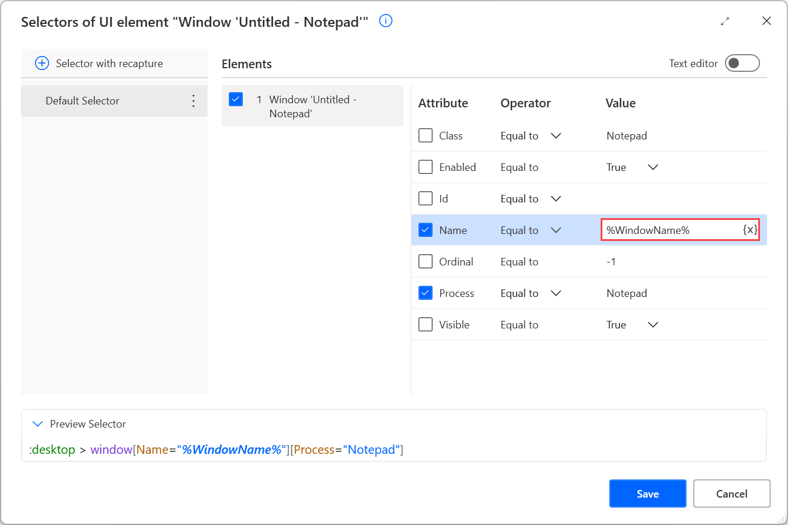

# Build a custom selector

Power Automate enables users to interact with web and desktop applications through UI elements. Consider UI elements as application components, such as buttons and text fields.

To specify a UI element, you have to create selectors that pinpoint the specific component you want to interact with.

> [!NOTE]
> Power Automate supports the creation of multiple selectors for a UI element. If a selector fails to access the element, the following selector is used.

Although Power Automate enables users to create selectors automatically, some particular scenarios need manually created selectors. A common scenario is the automation of applications that display dynamic content.

When a custom selector is needed, you can modify an existing selector or build one from scratch.

To edit an existing selector, select the appropriate UI element and choose the selector you want to edit. 

To create a new selector, select the appropriate UI element and then the **New** button.

Selectors use the **>** notation to indicate the hierarchical structure of the selected elements. Each element in the selector is contained within the element on its left and displayed in the following form: 

**element[Attribute1=”Attribute1Name”][Attribute2=”Attribute2Name”]...[Attributen=”AttributenName”]**

> [!NOTE]
> Web and desktop selectors have the same structure and functionality. The main differences between them are the available attributes. Web selectors use HTML attributes, while desktop selectors use different kinds of attributes based on the application design.

To specify an application component precisely, Power Automate utilizes multiple levels of selectors.

Selectors use a tree structure that describes the exact location of a component in the application or webpage. Each level is the child of the upper level and the parent of the lower level selector. The selector in the lower level describes the component you want to handle. 

This functionality enables Power Automate to distinguish a component from components with similar attributes in the same application.

Disabling or enabling levels of selectors allows you to change the location in which Power Automate will search for the component. In the case of dynamic applications, you can adapt the selectors accordingly.

For example, the following selector pinpoints the **File** menu option in an untitled Notepad window. The first level of the selector describes the menu bar of the window, while the second level describes the **File** option.

> [!NOTE]
> The menu option and the Notepad window are different UI elements, but they have a parent-child relationship. 

Assume that you want to edit the selector to work with a Notepad window named **Notes**. To achieve this functionality, change the **Name** attribute of the selector to **Notes - Notepad**. The new selector should be: **:desktop > window[Name="Notes - Notepad"][Process="notepad"]**.

## Use operators in a custom selector

In the previous example, the selector located a Notepad window with a specific title. To make the selector more dynamic, replace the **Equal to** operator with other operators or regular expressions.

The **Equal to** operator makes the selector search for a specific hard-coded value. Although this functionality is effective in static applications, hard-coded values can be a barrier in dynamic applications.

Use the **Contains** operator to locate elements that don't have fixed values but always contain a specific keyword. For example, apply the **Contains** operator in the Notepad selector to make it work with all Notepad windows.

Apart from the **Equal to** and **Contains** operators, Power Automate provides four more operators: 

- **Not equal to**: Checks if an attribute contains any value except a specific one.
- **Starts with**: Checks if an attribute contains a value that starts with a particular character, keyword, or phrase.
- **Ends with**: Checks if an attribute contains a value that ends with a particular character, keyword, or phrase
- **Regular expression match**: Checks if an attribute contains a value that matches a custom regular expression. 

  Power Automate's regular expression engine is .NET. You can find more information regarding regular expressions in [Regular Expression Language - Quick Reference](/dotnet/standard/base-types/regular-expression-language-quick-reference).

## Use variables in a custom selector

Apart from various operators, Power Automate enables you to create dynamic selectors using variables.

If the value of a selector's attribute depends on calculations and results of previous actions, replace the hard-coded value with a variable.

To use a variable in a selector, launch the **Custom selector builder** and populate the variable's name enclosed by percentage signs (**%**). You can find more information about the percentage notation in [Use variables and the % notation](variable-manipulation.md).

If you use a variable in the **Name** attribute of the Notepad example, the selector should be **:desktop > window[Name="%WindowName%"][Process="notepad"]**.

