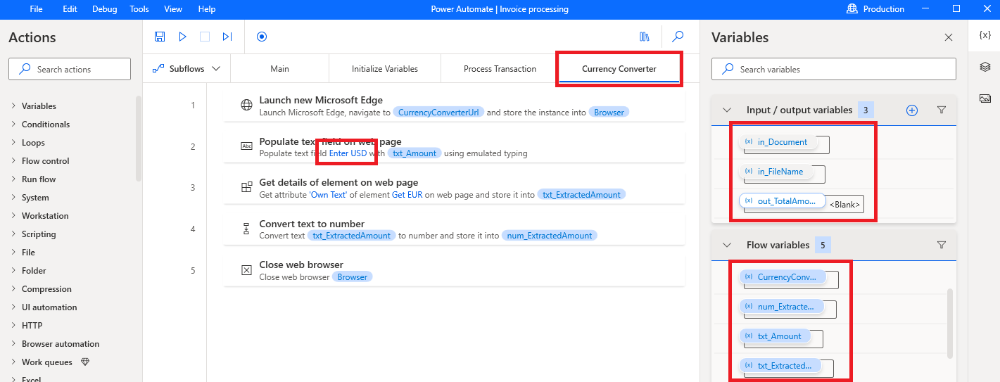
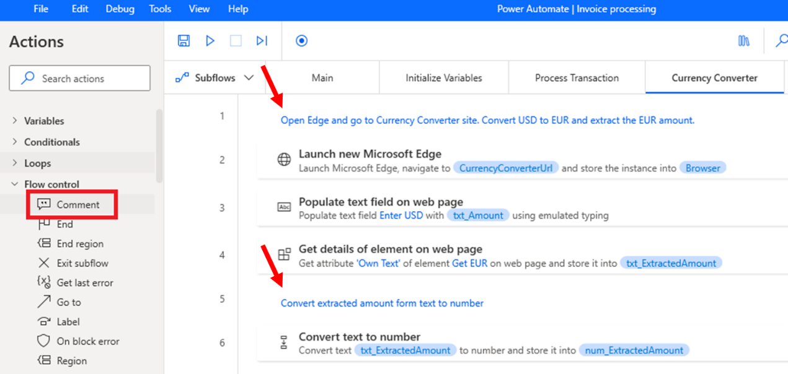
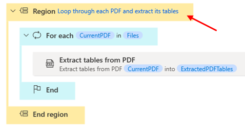
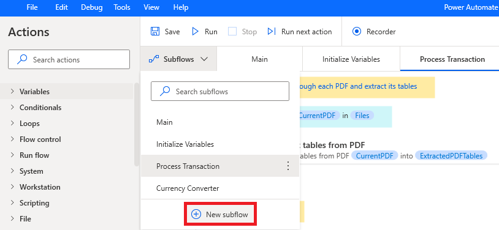
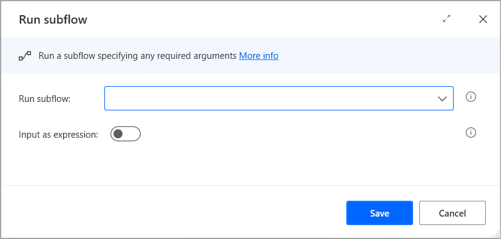
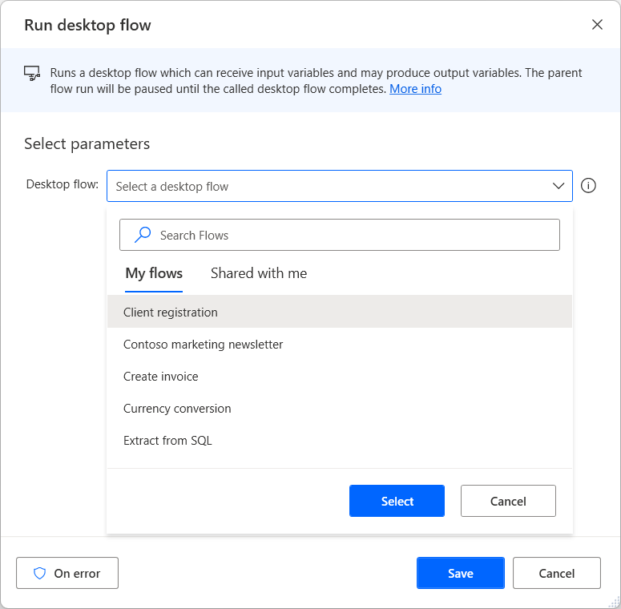

# Build clear and easy to manage flow scripts

Organize flow scripts in a clear and understandable manner to improve
development efficiency, facilitate teamwork, and ease troubleshooting.

## Use consistent naming conventions

Provide descriptive and meaningful names when naming subflows,
variables, UI elements or images.

For variables (Input/Output and Flow variables):

- Use camelCase, PascalCase or underscores to separate words.

<!-- -->

- Add a datatype prefix to variable names.​

- For Input/Output variables, add a prefix to both the variables’ name
  and external name, to distinguish them from flow variables, and other
  variables outside of the flow designer.

For cloud flows best practices, learn more about [using consistent
naming for flow
components](https://learn.microsoft.com/power-automate/guidance/coding-guidelines/use-consistent-naming-conventions).

## Add comments

Use the **Comment** action to add notes in the flow script.

- Add a comment at the beginning of the **Main** subflow to introduce
  the flow (a short description of the process, what the audience is,
  other flows involved etc.)​.

- Add comments when fixing bugs.​

- Add comments at the beginning of each subflow to explain its purpose.

Note:

Get help adding comments with the [Summarize actions
& subflows Copilot
skill](https://learn.microsoft.com/power-automate/desktop-flows/copilot-in-power-automate-for-desktop#use-copilot-to-summarize-actions-and-subflows-preview)

## Add regions

Use the **Region** and **End region** actions to organize actions within
a subflow into logical groups that can be expanded or collapsed.

 

## Modular design and reusable components

Break down your flow into logical modules or sections based on the
functionality or tasks being performed.

### Subflows

Create subflows to encapsulate related actions or to group a reusable
set of actions.

- Identify a set of actions that perform a certain task or actions that
  need to be repeated within the flow and put them in a subflow.

- Invoke the subflow with the **Run subflow** action.

Learn more about [setting up
subflows](https://learn.microsoft.com/power-automate/desktop-flows/designer-workspace#setting-up-subflows)

### Reusable flows

Create reusable flows to break down complex processes into manageable
chunks that can be easily plugged into different workflows.

- Identify flows that can be reused across other desktop flows and
  create a dedicated flow to be used as a reusable component.

- Share the reusable flow with other users within an Environment.

- To convert a subflow to a new (reusable) flow, copy/paste all the
  actions of the subflow to the workspace of that flow.

- Invoke it with the **Run desktop flow** action as a child desktop
  flow.

Learn more about [running a desktop flow from other desktop
flows](https://learn.microsoft.com/power-automate/desktop-flows/how-to/run-desktop-flow-action).

For cloud flows best practices, learn more about [creating reusable
code](https://learn.microsoft.com/power-automate/guidance/coding-guidelines/create-reusable-code).
