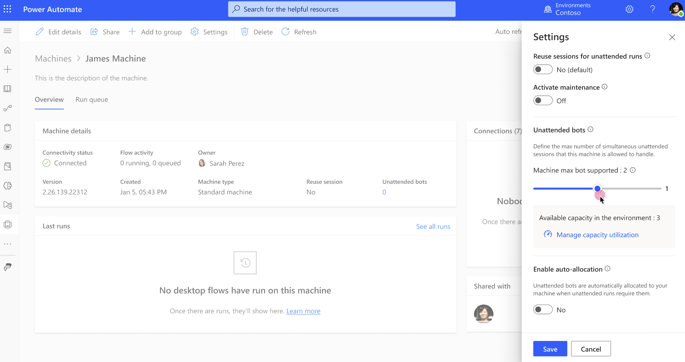
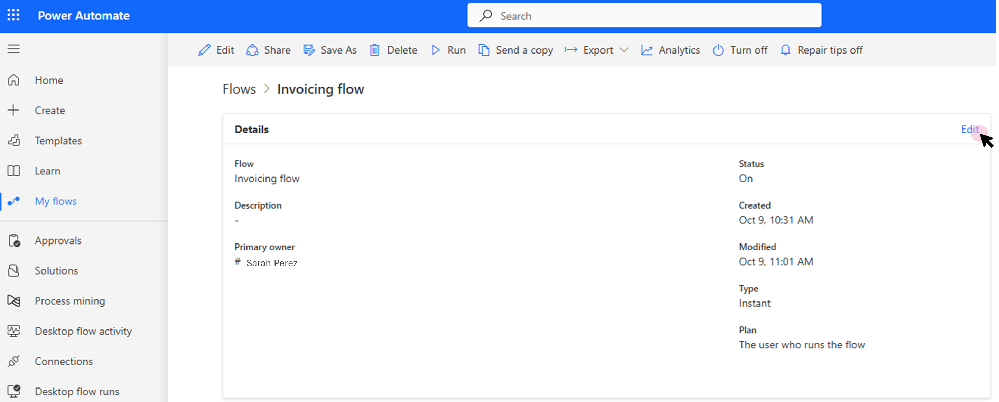
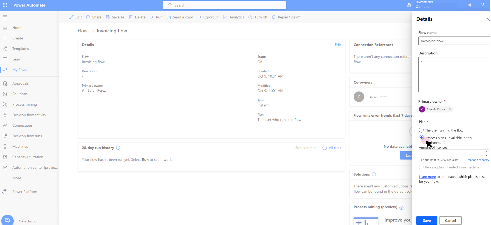
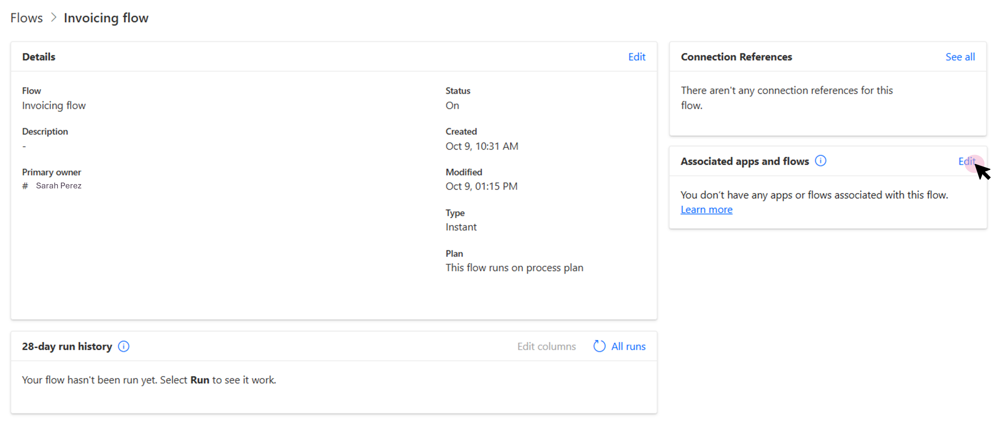
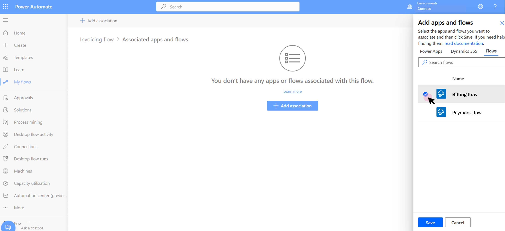

# How to use process capacity

> [!NOTE]
>
> Process capacity and unattended RPA capacity have been combined in a single capacity pool and can be used interchangeably within the Power Automate platform. They have exactly the same value and role.

Within the Power Automate portal:

- Process capacity is based on a purchased [process license](/power-platform/admin/power-automate-licensing/types).
- Legacy unattended RPA capacity is based on an [unattended RPA add-on](/power-platform/admin/power-automate-licensing/add-ons#unattended-rpa-add-on).

Process capacity or legacy unattended RPA capacity can be allocated to a machine or to a cloud flow.

## Allocate process capacity to a machine

When process capacity is allocated to a machine, it becomes an *unattended bot*. Each unattended bot on a machine can carry one unattended desktop flow run at a time. So if a machine needs to execute multiple unattended runs simultaneously, it needs as many unattended bots as it has simultaneous unattended runs to perform.

To allocate process capacity to a machine, go to the machine details page and select **Settings**.

Use the **Unattended bots** slider to allocate some process capacity to the machine and save.

You now have a machine that can perform unattended RPA.

> [!NOTE]
>
> - **Machine max bot bot supported** depends on your machine and its OS. The maximum value this parameter can reach is 10 (for some Windows Servers).
> - **Available capacity in the environment** shows how many unattended bots can still be created. Keep in mind that the process capacity is a shared resources between all users within an environment and so use only what you need.
> - **Enable auto-allocation** allows unattended bots to automatically be allocated to a machine when an unattended run requires it. Multiple unattended bots can be auto-allocated in case of simultaneous unattended runs.
> - For a global overview on how process capacity is used within the environment, use the **Manage capacity utilization** link. It also provides the option to request more capacity.

## Allocate process capacity to a cloud flow 

Allocated to a cloud flow, the Process plan enables use of premium cloud flow [capabilities] (/https://learn.microsoft.com/en-us/power-platform/admin/power-automate-licensing/types?tabs=power-automate-premium%2Cpower-automate-process%2Cconnector-types#capacity-licenses.) Each Process capacity allocated to a cloud flow entitles it to 250k daily [Power Platform Request](/power-platform/admin/api-request-limits-allocations#Request-limits-in-power-automate) (stackable limit).

To allocate a Process capacity to a cloud flow, go to the cloud flow details page and select **Edit**.

Change the plan used by the flow to **Process plan**, select the number of Process capacity you want to allocate to the flow and save.

The cloud flow is now independent from the user license, it has become a 'process flow.' Process flows have their plan switch to "Process plan" and a process-flow can be associated to other cloud flows. Please note process-flows cannot be associated to one another.  

 ## Associate a flow to a process flow

A cloud flow associated to a process-flow is covered by the Process license allocated to the process-flow. Its plan switches to "This flow is associated to run on process plan," its runs are counted against the Process license PPR capacity [PPR consumption](/power-platform/admin/api-request-limits-allocations#Request-limits-in-power-automate). A process-flow can be associated to a maximum of 25 cloud flows.

To associate a cloud flow to a process flow, go to the process flow details page and select **Edit** in the 'Associated apps and flows' card.

Select the cloud flows you wish to associate to your Process flow and save : 

> [!NOTE]
>
> - Process flows can't be associated together
> - A maximum of 25 flows can be associated to the same Process flow
> - De-association can only be done from the Process flow
> - An associated flow can't have its plan updated - it needs to be de-associated first

## Related information

[Process capacity utilization](capacity-utilization-process.md)
