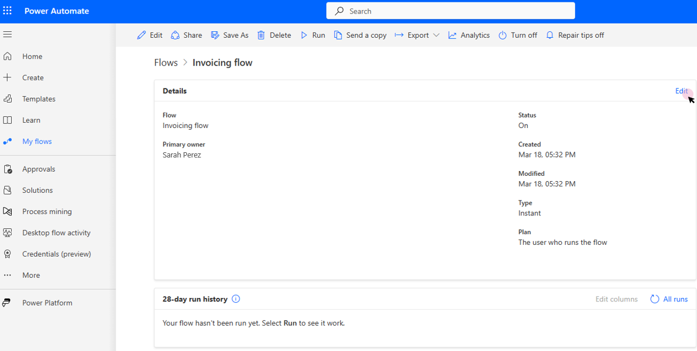

# How to use process capacity

> [!NOTE]
>
> Process capacity and unattended RPA capacity have been combined in a single capacity pool and can be used interchangeably within the Power Automate platform. They have exactly the same value and role.

Within the Power Automate portal:

- Process capacity is based on a purchased [process license](/power-platform/admin/power-automate-licensing/types).
- Legacy unattended RPA capacity is based on an [unattended RPA add-on](/power-platform/admin/power-automate-licensing/add-ons#unattended-rpa-add-on).

A Process capacity, or legacy Unattended RPA capacity, can be **allocated to a machine or to a cloud flow**. When allocated to a cloud flow, it becomes a **Process plan** based on which the cloud flow is licensed to run premium actions independently from the user license. 

## Allocate process capacity to a machine

When process capacity is allocated to a machine, it becomes an *unattended bot*. Each unattended bot on a machine can carry one unattended desktop flow run at a time. So if a machine needs to execute multiple unattended runs simultaneously, it needs as many unattended bots as it has simultaneous unattended runs to perform.

To allocate process capacity to a machine, follow these steps:

1. Sign in to [Power Automate](https://make.powerautomate.com/) by using your organizational account.
1. Select the correct environment.
1. Select **Machines**.
1. Go to the machine details page and select **Settings**:

Check how many bots your machine can support and if you have available Process capacity:

You now have a machine that can perform unattended RPA.

> [!NOTE]
>
> The "Machine max bot bot supported" parameter depends on your machine and its OS. The maximum value this parameter can reach is 10 (for some Windows Servers)
> The "Available capacity in the environment" inform you about how many unattended bots can still be created. Keep in mind that the Process capacity is a shared resources between all users within an environment and so use only what you need
> For a global overview on how the Process capacity is used within the environment, use the "Manage capacity utilization" link (it will also provide the option to request more capacity)
> The "Enable auto-allocation" parameter, when turned on, allows unattended bots to automatically be allocated to a machine when an unattended run requires it (multiple unattended bots can be auto-allocated in case on simulateneous unattended runs)

You now have a machine that can perform unattended RPA:

## Allocate process capacity to a cloud flow

When process capacity is allocated to a cloud flow, it becomes a *process plan* based on which the cloud flow is licensed to run premium actions independently from the user license.

To allocate a Process capacity to a cloud flow, go to the cloud flow details page, click on Edit:

The cloud flow is by default based the user plan:

Change the plan used by the flow to the **Per-flow/Process** and save.

The cloud flow is now independent from the user license:

> [!NOTE]
>
> The process capacity allocation to cloud flow will be updated in a future release.

## See also

[Process capacity utilization](capacity-utilization-process.md)
