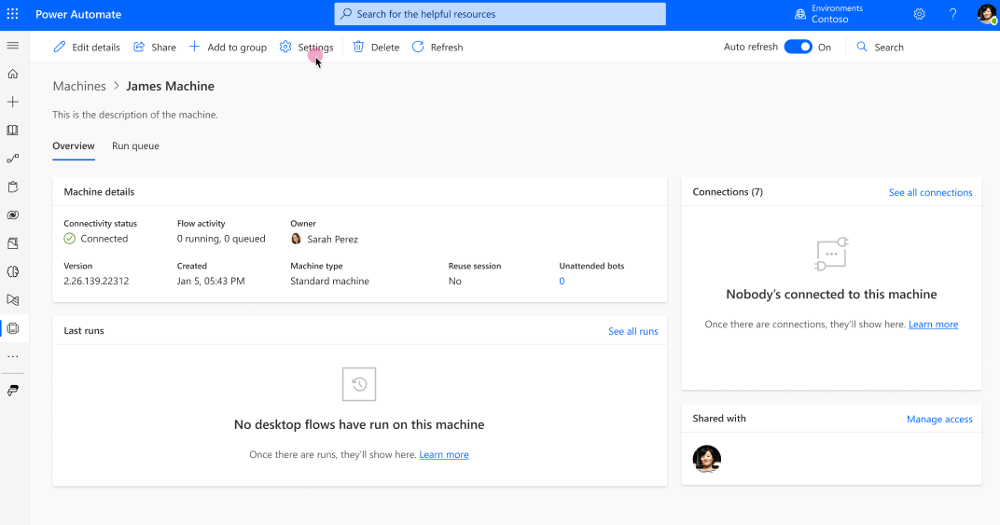
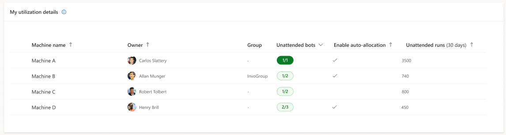
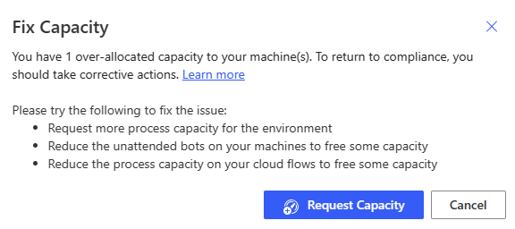
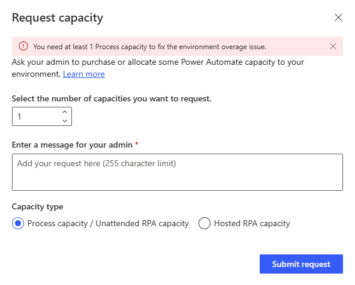

# How to use Process capacity

> [!NOTE]
>
> Process capacity and Unattended RPA capacity have been combined in a single capacity pool and can be used interchangeably within the Power Automate platform. They have exactly the same value and role.

As a reminder, within the Power Automate portal :
- each Process capacity is based on a purchased [Process license](/power-platform/admin/power-automate-licensing/types)
- each legacy Unattended RPA capacity is based on an [Unattended RPA add-on](/power-platform/admin/power-automate-licensing/add-ons#unattended-rpa-add-on).

A Process capacity, or legacy Unattended RPA capacity, can be **allocated to a machine or to a cloud flow**. When allocated to a cloud flow, it becomes a **Process plan** based on which the cloud flow is licensed to run premium actions independantly from the user license. 

## Allocating Process capacity to a machine

When a Process capacity is allocated to a machine, it becomes an **unattended bot**. Each unattended bot on a machine can carry one unattended desktop flow run at a time. So if a machine needs to execute multiple unattended runs simultaneously, it needs as many unattended bots as it has simultaneous unattended runs to perform. 

To allocated a Process capacity to a machine, go to the machine details page, click on Settings :

Check how many bots your machine can support and if you have available Process capacity :

> [!NOTE]
>
> The "Machine max bot bot supported" parameter depends on your machine and its OS. The maximum value this parameter can reach is 10 (for some Windows Servers)
> The "Available capacity in the environment" inform you about how many unattended bots can still be created. Keep in mind that the Process capacity is a shared resources between all users within an environment and so use only what you need
> For a global overview on how the Process capacity is used within the environment, use the "Manage capacity utilization" link (it will also provide the option to request more capacity)
> The "Enable auto-allocation" parameter, when turned on, allows unattended bots to automatically be allocated to a machine when an unattended run requires it (multiple unattended bots can be auto-allocated in case on simulateneous unattended runs)

You now have a machine that can perform unattended RPA :

## Allocating Process capacity to a cloud flow

When a Process capacity is allocated to a cloud flow, it becomes a **Process plan** based on which the cloud flow is licensed to run premium actions independantly from the user license. 

To allocated a Process capacity to a cloud flow, go to the cloud flow details page, click on Settings :

|Before allocation|Consuming object|After allocation|Description|Allocation mode|
|----|--------------------|----|----|----|
|Process capacity|[Machine](manage-machines.md)|Unattended bot|Every unattended bot on a machine allows it to carry out an additional unattended desktop flow run simultaneously.|Capacity is auto-allocated to the machine at unattended desktop flow runtime or can be manually allocated by the user.|
|Process capacity|Cloud flow|Process plan|Every Process plan allocated to a cloud flow allows it to run premium actions independantly from the user license.|Capacity is manually allocated to the cloud flow by the user.|

> [!NOTE]
>
> Process capacity and Unattended RPA capacity have been combined in a single capacity pool and can be used interchangeably within the Power Automate platform. They have exactly the same value and role.

## Process & Unattended RPA capacity overview

The **Process & Unattended RPA capacity overview** pie chart helps you understand the capacity consumption within the environment, lets you know if there's still capacity to scale-up in the future, and alerts you when the utilized capacity is exceeding environment capacity (= overage).

## Process and Unattended RPA capacity insights

The **Process and Unattended RPA capacity insights** card informs you of operation health and gives recommendations when there are compliance issues.

|Badge|Message|Insight|
|----|--------------------|----|
|**Sufficient capacity**|There's available capacity for new unattended machines or for new process plans on cloud flows.|Scale-up possible in the future.|
|**Fully utilized**|There's no more capacity for new unattended bots or for new process plans on cloud flows.|The capacity utilization rate is optimal at 100% but there's no room for scaling-up.|
|**Capacity overage**|User has over-allocated capacity to their machines or/and to their cloud flows.	|Uncompliant capacity usage exceeding environment capacity.|

## Process and Unattended RPA utilization details

In this section, you learn how to oversee and manage all machines you have access to (as owner or through sharing).

> [!NOTE]
>
> By clicking on a machine, you can edit its unattended bots setting and its auto-allocation setting.
> Machines can be, when necessary (in case of overage), prioritized based on their unattended runs.
> Cloud flow using process capacity will be added to the page in a future release

## Capacity overage

Capacity overage in an environment occurs when the capacity utilized by the unattended bots on machines and the process plans on cloud flows surpasses the assigned capacity of the environment. In such instances, specific machines and/or cloud flows might be identified as exceeding capacity. To return to compliance, it's important to promptly rectify the situation.

### Machine in overage

Machines identified in overage are not compliant :

> [!NOTE]
>
> A machine can have a subset of its unattended bots identified as in overage (= uncompliant)

### How to fix Process and Unattended RPA capacity overage?

When some unattended machines are in overage, the **Fix capacity button** appears in the **Process & Unattended RPA capacity insights** card.

|Fix capacity - Button|
|-------|
||

It provides corrective actions.

|Fix capacity - Corrective actions|
|-|
||

The **Request capacity** action submits a request to the tenant administrator for the consideration of assigning capacity to the environment.

|Fix capacity - Request capacity|
|-|
||

> [!NOTE]
> 
> The preset value in the request capacity modal dialog is equal to the total overage value in the environment (the user's overage and the other users' overage).
> This preset value ensures that when the additional capacity is assigned to the environment, the user who made the request have their machines or returned back to compliance.
> If the user submits a smaller request, when the additional requested capacity is provisioned to the environment, there’s no guarantee that their own machines will return to compliance. The extra capacity might be allocated to other in-overage machines owned by different users.

### What are the rules governing which objects are identified as in overage?

When the total Process capacity assigned to an environment is inferior to the combined capacity allocated to machines and cloud flows: the overage is identified, on machines and cloud flows indistinctively, starting from the most recently created allocation to the oldest.

## Permissions required to view and edit capacity allocation

To view and edit capacity allocation, you need a security role with privileges to the **Flow Capacity Assignment** table. For example, the Environment Maker role can view and edit allocation of hosted capacity.

## See also

[Capacity utilization within Power Automate (preview)](capacity-utilization.md)
