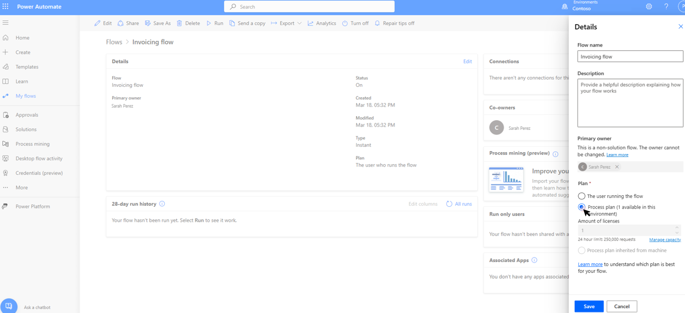

# How to use process capacity

> [!NOTE]
>
> Process capacity and unattended RPA capacity have been combined in a single capacity pool and can be used interchangeably within the Power Automate platform. They have exactly the same value and role.

Within the Power Automate portal:

- Process capacity is based on a purchased [process license](/power-platform/admin/power-automate-licensing/types).
- Legacy unattended RPA capacity is based on an [unattended RPA add-on](/power-platform/admin/power-automate-licensing/add-ons#unattended-rpa-add-on).

Process capacity or legacy unattended RPA capacity can be allocated to a machine or to a cloud flow.

## Allocate process capacity to a machine

When Process capacity is allocated to a machine, it becomes an *unattended bot*. Each unattended bot on a machine can carry one unattended desktop flow run at a time. So if a machine needs to execute multiple unattended runs simultaneously, it needs as many unattended bots as it has simultaneous unattended runs to perform.

To allocate process capacity to a machine, go to the machine details page and select **Settings**.

Use the **Unattended bots** slider to allocate some process capacity to the machine and save.

You now have a machine that can perform unattended RPA.

> [!NOTE]
>
> - **Machine max bot bot supported** depends on your machine and its OS. The maximum value this parameter can reach is 10 (for some Windows Servers).
> - **Available capacity in the environment** shows how many unattended bots can still be created. Keep in mind that the process capacity is a shared resources between all users within an environment and so use only what you need.
> - **Enable auto-allocation** allows unattended bots to automatically be allocated to a machine when an unattended run requires it. Multiple unattended bots can be auto-allocated in case of simultaneous unattended runs.
> - For a global overview on how process capacity is used within the environment, use the **Manage capacity utilization** link. It also provides the option to request more capacity.

## Allocate process capacity to a cloud flow 

When a process capacity is allocated to a cloud flow, it becomes a *Process plan*. This plan licenses the cloud flow to run premium actions independently from the user license, with a daily limit of 250,000 [Power Platform Request](/power-platform/admin/api-request-limits-allocations#Request-limits-in-power-automate).

To allocate a Process capacity to a cloud flow, go to the cloud flow details page and select **Edit**.

> [!NOTE]
>
> At creation, a cloud flow is by default based on the user plan.

Change the plan used by the flow to **Process plan** and save.

The cloud flow is now independent from the user license.

> [!NOTE]
>
> - Only solution flow (flow that are in a solution) can become process flows
> - Stacking multiple process capacities on a single cloud flow isn't enabled yet.

## Related information

[Process capacity utilization](capacity-utilization-process.md)
