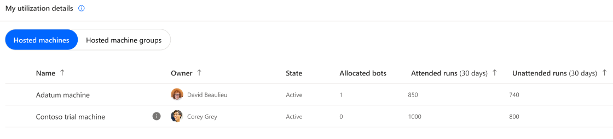
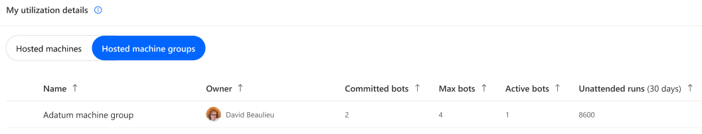

# Hosted RPA capacity utilization

> [!IMPORTANT]
> - The capacity utilization page is in preview.

 

## Reminder on Hosted RPA capacity 

Within the Power Automate platform, the '**Hosted RPA capacity**' is a purchased item (an [add-on](https://learn.microsoft.com/en-us/power-platform/admin/power-automate-licensing/add-ons#hosted-rpa-add-on)) assigned to the environment [(see how to assign capacity to environments)](https://learn.microsoft.com/power-platform/admin/capacity-add-on#allocate-or-change-capacity-in-an-environment) which allows to run desktop flows with zero infrastructure. It is allocated to hosted machines or committed to hosted machine groups :
  

|Consumming object|Description|Consumption mode|
|----|--------------------|----|
|[Hosted machine](hosted-machoines.md)|To be created, each hosted machine requires an hosted RPA capacity allocated.|Hosted RPA capacity is auto-allocated to hosted machine at its creation.|
|[Hosted machine group](hosted-machine-groups.md)|Every hosted RPA capacity committed to a hosted machine group guarantees the availability of a bot during auto-scaling (= committed bot). This ensures that the necessary resources will always be available for processing the desktop flows.|Manual commitment on hosted machine group.|

> [!NOTE]
> - A committed capacity to an hosted machine group is still part of the common pool available to all hosted machine group.
> - The hosted machine group with the committment has a priority of usage over all concurrent hosted machine groups.

 

## Hosted RPA capacity overview

The '**Hosted RPA capacity overview**' pie chart helps the user understand what's his share of hosted capacity consumption within the environment compared to the other makers, let him known if there is still capacity to scale-up in the future and alerts him when his objects are exceeding environment capacity (= overage): 

||Legend|Description|
|----|--------------------|----|
||Allocated to my hosted machines|Compliant capacity allocated to hosted machines that the user owns or which are shared with him.|
||Committed to my hosted machine groups|Compliant capacity committed to hosted machine groups that the user owns or which are shared with him.|
||Utilized by other makers|Compliant capacity allocated or committed to objects which the user does not own and which were not shared with him.|
||Available capacity|Available capacity for new hosted machines or new committed bots on hosted machine groups.|
||My overage utilization|Sum of capacities over-allocated to hosted machines and over-committed to hosted machine groups which the user owns or which are shared with him|
||Overage by other makers|Sum of capacities over-allocated and over-committed to objects which the user does not own and which were not shared with him.|

  

## Hosted RPA capacity insights 

The '**Hosted capacity insights**' card informs the user of operation health and provides him with recommendation in case of compliance issues:

|Badge|Message|Insight|
|----|--------------------|----|
||There is available capacity for new hosted machines or new committed bots on hosted machine groups.|Scale-up is possible in the future|
||There is no more capacity for new hosted machines or new committed bots on hosted machine groups.|The capacity utilization rate is optimal at 100% but there is no room for scaling-up.|
||User has some over-allocated capacity to his hosted machines or/and some over-committed bots to his hosted machine groups.|Uncompliant capacity usage exceeding environment capacity.|
||There is a non-empty pool of capacity shared by all hosted machine groups.|All hosted machine groups theoratically have access to at least 1 bot.|
||The capacity pool shared by all hosted machine groups is empty.|Hosted machine groups won’t be able to spin-up bots when needed. All automation based on them will fail.|

> [!NOTE]
> - All hosted machine groups share a pool of hosted capacity made of the available capacity and the compliant committed capacity within the environment (which value can be retrieved on the overview pie chart).
> - For example, 1 available capacity (non-allocated to a hosted machine and non-committed to an hosted machine group) is pooled between all the hosted machine groups with a first arrived first served behavior.
> - Having a non-empty pool is not always a guarantee of good health depending on the number of hosted machine groups relying on the pool, the intensity of runs they perform and their relative schedule.

  

## Hosted RPA utilization details

In this section the user can oversee and manage all hosted machines & hosted machine groups he has access to (as owner or through sharing) : 

### 1. Hosted Machines

> [!NOTE]
> - Every hosted machine gets auto-allocated 1 hosted capacity at creation except for hosted machine based on trial user licenses and hosted machine provisionned with an error
> - Hosted machines can be, when necessary (in case of overage), prioritized based on their attended and unattended runs.

### 2. Hosted Machine Groups

> [!NOTE]
> - The 'Active bots' column refers to machines currently spin-up and consumming hosted capacity from the shared pool.
> - Hosted machine groups can be, when necessary (in case of overage), prioritized based on their unattended runs.

  

## Hosted RPA capacity overage

Capacity overage in an environment occurs when **the capacity utilized by hosted machines and hosted machine groups surpasses the assigned capacity of the environment**. In such instances, specific hosted machines and/or hosted machine groups may be identified as exceeding capacity. To prevent any disruption, it is crucial to promptly rectify the situation:

  
### Hosted machine in overage:
Hosted machines identified in overage risk being turned-off after a grace period:  

  
### Hosted machine group in overage:
Hosted machine groups will not honour their over-committed bots expected behaviour:  

> [!NOTE]
> - An hosted machine group can have a sub-set of its committed bots identified as in overage (= over-committed), in that case, only the compliant committed bots will be honoured.

  

### How to fix hosted capacity overage?
When the user owns some hosted machines or hosted machine groups in overage, the **Fix capacity button** appears in the 'Hosted capacty insight' card, it provides a list of corrective actions: 

|Fix capacity - Corrective actions|
|-------|
||

  
The **Request capacity** action submits a request to the tenant administrator for assignation of capacity to the environment:
 

|Fix capacity - Request capacity|
|---------|
||

> [!NOTE]
> - The pre-set value in the request capacity modal is equal to the total overage value in the environment (the user's overage and the other users' overage).
> - This ensures that when the additional capacity is assigned to the environment, the user who made the request has its hosted machines or hosted machine groups returned back to compliance.
> - If the user submits a smaller request, when the additional requested capacity is provisioned to the environment, there’s no guarantee that their own hosted machines or hosted machine groups will return to compliance. The extra capacity might be allocated to other in-overage hosted machines / hosted machine groups owned by different users.

  

### What are the rules governing which objects are identified as in overage ?

When the total capacity assigned to an environment is inferior to the combined capacity allocated to hosted machines and committed to hosted machine groups:

- Firstly, the overage will be identified on the committed capacity of hosted machine groups, starting from the most recently created committed bot setting to the oldest. 
- Secondly, the overage will be identified on the allocated capacity of hosted machines, starting from the most recently created machine to the oldest.
