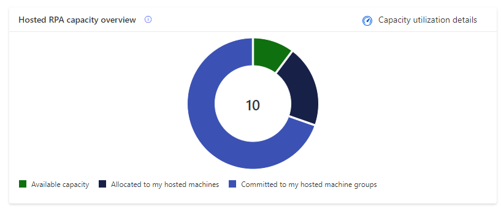
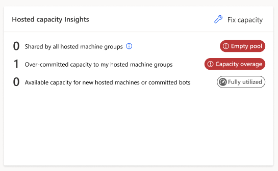

# Hosted Process capacity utilization

The Hosted Process capacity utilization page provides insight into how your Hosted Process (previously Power Automate Hosted RPA add-on) capacity is being used within your environment. As a reminder, within the Power Automate platform, each Hosted Process capacity is based on a purchased [Hosted Process license](/power-platform/admin/power-automate-licensing/add-ons#hosted-rpa-add-on). It's [assigned to the environment](/power-platform/admin/capacity-add-on#allocate-or-change-capacity-in-an-environment) and allows you to [run desktop flows with zero infrastructure](hosted-rpa-overview.md).

A Hosted Process capacity can be allocated to a hosted machine or committed to a hosted machine group.

|Consuming object|Description|Consumption mode|
|----|--------------------|----|
|[Hosted machine](hosted-machines.md)|To be created, each hosted machine requires a Hosted Process capacity allocated.|Hosted Process capacity is autoallocated to hosted machine at its creation.|
|[Hosted machine group](hosted-machine-groups.md)|Every Hosted Process capacity committed to a hosted machine group guarantees the availability of a bot during autoscaling (= committed bot). The commitment ensures that the necessary resources are always available for processing the desktop flows.|Manual allocation of committed bots on hosted machine group.|

> [!NOTE]
>
> A hosted machine group with a commitment has a priority of usage on its committed bots over all concurrent hosted machine groups. More information: [Load balance hosted machine groups](hosted-machine-groups.md#load-balance-hosted-machine-group).

## Hosted Process capacity overview

The **Hosted Process capacity overview** pie chart helps you understand what's your share of the hosted capacity consumption within the environment compared to other makers. It lets you know if there's still capacity to scale-up in the future and alerts you when your objects are exceeding environment capacity.

|-|Legend|Description|
|----|--------------------|----|
||Allocated to my hosted machines|Compliant capacity allocated to hosted machines, which the user owns or which are shared with them.|
||Committed to my hosted machine groups|Compliant capacity committed to hosted machine groups, which the user owns or which are shared with them.|
||Utilized by other makers|Compliant capacity allocated or committed to objects, which the user doesn't own and which weren't shared with them.|
||Available capacity|Available capacity for new hosted machines or new committed bots on hosted machine groups.|
||My overage utilization|Sum of capacities over-allocated to hosted machines and over-committed to hosted machine groups, which the user owns or which are shared with them.|
||Overage by other makers|Sum of capacities over-allocated and over-committed to objects, which the user doesn't own and which weren't shared with them.|

## Hosted Process capacity insights

The '**Hosted capacity insights**' card informs you of operation health and provides you with recommendations if there are compliance issues.

|Badge|Message|Insight|
|----|--------------------|----|
|**Sufficient capacity**|There's available capacity for new hosted machines or new committed bots on hosted machine groups.|Scale-up is possible in the future.|
|**Fully utilized**|There's no more capacity for new hosted machines or new committed bots on hosted machine groups.|The capacity utilization rate is optimal at 100% but there's no room for scaling-up.|
|**Capacity overage**|User has over-allocated capacity to their hosted machines or/and over-committed bots to their hosted machine groups.|Uncompliant capacity usage exceeding environment capacity.|
|**Sufficient pool**|There's a nonempty pool of capacity shared by all hosted machine groups.|All hosted machine groups theoretically have access to at least one bot.|
|**Empty pool**|The capacity pool shared by all hosted machine groups is empty.|Hosted machine groups can't spin-up bots when needed. All automations based on them are going to fail.|

> [!NOTE]
>
> - All hosted machine groups share a pool of hosted capacity made of the available capacity and the compliant committed capacity within the environment (which value can be retrieved on the overview pie chart).
> - For example, one available capacity (non-allocated to a hosted machine and non-committed to a hosted machine group) is pooled between all the hosted machine groups with a first arrived first served behavior.
> - Having a non-empty pool isn't always a guarantee of good health depending on the number of hosted machine groups relying on the pool, the intensity of runs they perform, and their relative schedule.

## Hosted Process utilization details

In this section, you learn how to oversee and manage all hosted machines and hosted machine groups you have access to (as owner or through sharing).

### Hosted machines

> [!NOTE]
>
> - Every hosted machine gets auto-allocated one hosted capacity at creation except for hosted machines based on trial user license and hosted machines provisioned with an error.
> - Hosted machines can be, when necessary (in case of overage), prioritized based on their attended and unattended runs.

### Hosted machine groups

> [!NOTE]
>
> - The **Active bots** column refers to machines currently spin-up and consuming hosted capacity from the shared pool.
> - Hosted machine groups can be, when necessary in case of overage, prioritized based on their unattended runs.

## Hosted Process capacity overage

Capacity overage in an environment occurs when the capacity utilized by hosted machines and hosted machine groups surpasses the assigned capacity of the environment. In such instances, specific hosted machines and/or hosted machine groups might be identified as exceeding capacity. To prevent disruption, it's crucial to promptly rectify the situation.

### Hosted machine in overage

Hosted machines identified in overage risk being turned-off after a grace period.

### Hosted machine group in overage

Hosted machine groups don't honor their over-committed bots expected behavior.

> [!NOTE]
> A hosted machine group can have a subset of its committed bots identified as in overage (= over-committed), in that case, only the compliant committed bots are honored.

### How to fix hosted capacity overage?

When you own some hosted machines or hosted machine groups in overage, or when the hosted pool is empty, the **Fix capacity** button appears in the **Hosted capacity insights** card:

|Fix capacity - Button|
|-------|
||

It provides a list of corrective actions:

|Fix capacity - Corrective actions|
|-------|
||

The **Request capacity** action submits a request to the tenant administrator for assignation of capacity to the environment:

|Fix capacity - Request capacity|
|---------|
||

> [!NOTE]
>
> - The preset value in the request capacity modal dialog is equal to the total overage value in the environment (the user's overage and the other users' overage).
> - This preset value ensures that when the additional capacity is assigned to the environment, the user who made the request have their hosted machines or hosted machine groups returned back to compliance.
> - If the user submits a smaller request, when the additional requested capacity is provisioned to the environment, there’s no guarantee that their own hosted machines or hosted machine groups will return to compliance. The extra capacity might be allocated to other in-overage hosted machines / hosted machine groups owned by different users.

### What are the rules governing which objects are identified as in overage?

When the total Hosted Process capacity assigned to an environment is inferior to the combined capacity allocated to hosted machines and committed to hosted machine groups:

- First, the overage is identified on the committed capacity of hosted machine groups, starting from the most recently created committed bot setting to the oldest.
- Second, the overage is identified on the allocated capacity of hosted machines, starting from the most recently created machine to the oldest.

## Permissions required to view and edit capacity allocation

To view and edit capacity allocation, you need a security role with privileges to the **Flow Capacity Assignment** table. For example, the Environment Maker role can view and edit allocation of hosted capacity.

## Using Hosted Process capacity as process capacity

The Hosted Process capacity can be used as process capacity to enable standard machines to run desktop flows in unattended mode. In an environment with Hosted Process capacity, this Hosted Process capability enables the creation of overage process capacity allocation to machines and/or cloud flows. These in-overage machine or cloud flows operate as efficiently as any other process, without any performance issues. This mechanism is temporary and will be replaced by a more explicit behavior.

## Related information

[Capacity utilization within Power Automate](capacity-utilization.md)
