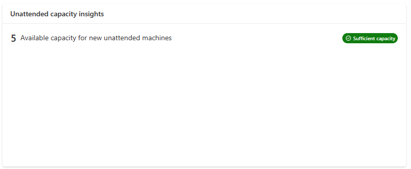
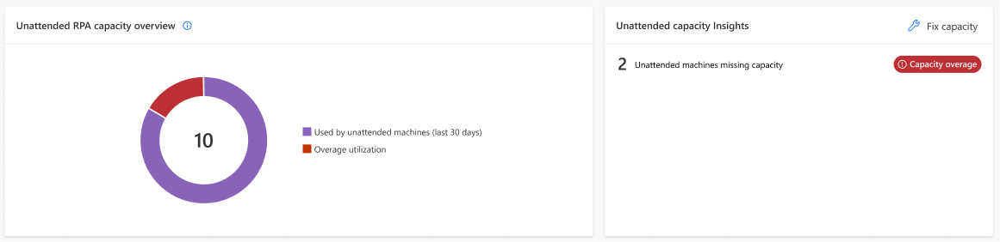
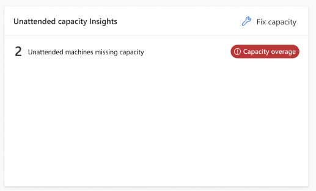
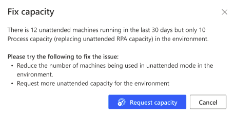
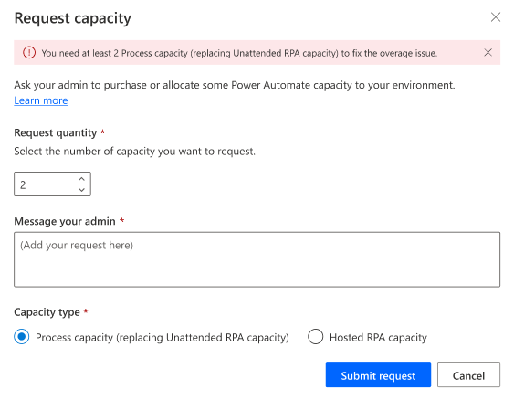

# Process and Unattended RPA capacity utilization (preview)

[!INCLUDE [cc-beta-prerelease-disclaimer](actions-reference/includes/cc-beta-prerelease-disclaimer.md)]

The **Process and Unattended RPA capacity utilization page** provides you with insights into how your process capacity (or legacy unattended RPA capacity) is being used within your environment. As a reminder, within the Power Automate platform each process capacity is based on a purchased [Process license](/power-platform/admin/power-automate-licensing/types) (and each legacy unattended RPA capacity is based on a [Unattended RPA add-on](/power-platform/admin/power-automate-licensing/add-ons#unattended-rpa-add-on)). It is [assigned to the environment](/power-platform/admin/capacity-add-on#allocate-or-change-capacity-in-an-environment) and allows your machines to run desktop flows autonomously without human interaction in unattended mode. Every capacity allocated to a machine allows it to carry out an additional unattended desktop flow run simultaneously.

[!INCLUDE [cc-preview-features-definition](../includes/cc-preview-features-definition.md)]

A process capacity (or legacy unattended RPA capacity) can be allocated to a machine.

|Consuming object|Description|Consumption mode|
|----|--------------------|----|
|[Machine](manage-machines.md)|Every capacity allocated to a machine allows it to carry out an additional unattended desktop flow run simultaneously.|Capacity is auto-allocated to the machine at unattended desktop flow run time.|

> [!NOTE]
>
> - Process capacity and Unattended RPA capacity have been combined in a single capacity pool and have exactly the same role within the Power Automate platform
> - Manual allocation of the process capacity (or legacy Unattended RPA capacity) to the machine will be released in Q2 2024

## Unattended RPA capacity overview

The '**Unattended RPA capacity overview**' pie chart helps the user understand what is the capacity consumption within the environment, let them know if there's still capacity to scale-up in the future and alerts them when the utilized capacity is exceeding environment capacity (= overage): 

|-|Legend|Description|
|----|--------------------|----|
||Used by unattended machines (last 30 days)|Compliant capacity allocated to machines within the environment.|
||Available capacity|Available capacity for new unattended machines.|
||My overage utilization|Capacity over-allocated to unattended machines within the environment.|

> [!NOTE]
> 
> - The current chart displays an environment-wide report over capacity consumption (it does not distinguish the user's machines consumption from others' machines consumption)
> - This distinction will be added with the manual allocation of capacity to the machine in Q2 2024

## Process and Unattended RPA capacity insights 

The '**Unattended capacity insights**' card informs the user of operation health and gives them recommendation in there are compliance issues:

|Badge|Message|Insight|
|----|--------------------|----|
|**Sufficient capacity**|There's available capacity for new unattended machines.|Scale-up possible in the future.|
|**Fully utilized**|There's no more capacity for new unattended machines.|The capacity utilization rate is optimal at 100% but there's no room for scaling-up.|
|**Capacity overage**|There's some over-allocated capacity to unattended machines in the environment.|Uncompliant capacity usage exceeding environment capacity.|

## Capacity overage

Capacity overage in an environment occurs when **the capacity utilized by unattended machines surpasses the assigned capacity of the environment**. To return to compliance, it's important to promptly rectify the situation:

### How to fix process and unattended RPA capacity overage?
When some unattended machines are in overage, the **Fix capacity button** appears in the 'Unattended capacity insights' card: 

|Fix capacity - Button|
|-------|
||

It provides corrective actions: 

|Fix capacity - Corrective actions|
|-|
||

The **Request capacity** action submits a request to the tenant administrator for the assignation of capacity to the environment:

|Fix capacity - Request capacity|
|-|
||

> [!NOTE]
> 
> - The pre-set value in the request capacity modal is equal to the total overage value in the environment 
