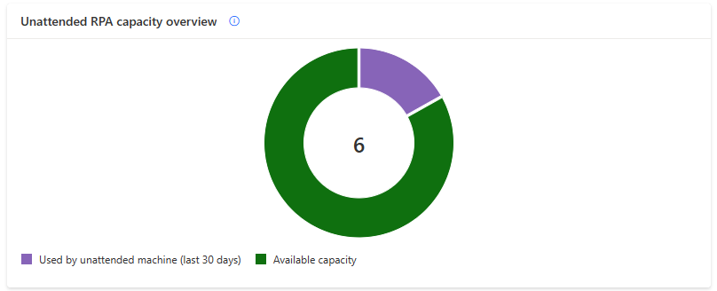

# Process and Unattended RPA capacity utilization (preview)

> [!IMPORTANT]
> - The capacity utilization page is in preview.
> - The Process capacity and the Unattended RPA capacity (legacy) have been combined in a single pool. They can seamlessly be utilized by machines (and coming in Q2 2024, by cloud flows).
> - The details allocation of those capacity (to machines and cloud flows) will be incorporated in the capacity utilization page in Q2 2024.

## Reminder on Process and Unattended RPA capacity 

Within the Power Automate platform, the **‘Process and Unattended RPA capacity'** are purchased items (a [license](https://go.microsoft.com/fwlink/?linkid=2258569) and an [add-on](https://go.microsoft.com/fwlink/?linkid=2258651)) assigned to the environment [(see how to assign capacity to environments)](https://go.microsoft.com/fwlink/?linkid=2258569) which allows to run desktop flows autonomously without human interaction. The Process (or Unattended RPA) capacity is needed to run desktop flows in unattended mode. Every capacity allocated to a machine allows it to carry out an additional unattended desktop flow run concurrently.
  

|Consumming object|Description|Consumption mode|
|----|--------------------|----|
|[Machine](manage-machines.md)|Every capacity allocated to a machine allows it to carry out an additional unattended desktop flow run concurrently.|Capacity is auto-allocated to the machine at unattended desktop flow run time.|

> [!NOTE]
> - Manual allocation of the Unattended RPA capacity (or Process capacity) to the machine will be released in Q2 2024

 

## Process and Unattended RPA capacity overview

The '**Process and Unattended RPA capacity overview**' pie chart helps the user understand what is the capacity consumption within the environment, let them known if there is still capacity to scale-up in the future and alerts them when the utilized capacity is exceeding environment capacity (= overage): 

||Legend|Description|
|----|--------------------|----|
||Used by unattended machines (last 30 days)|Compliant capacity allocated to machines within the environment.|
||Available capacity|Available capacity for new unattended machines.|
||My overage utilization|Capacity over-allocated to unattended machines within the environment.|

> [!NOTE]
> - The current chart displays an environment-wide report over capacity consumption (it does not distinguish the user's machines consumption from others' machines consumption)
> - This distinction will be added with the manual allocation of capacity to the machine in Q2 2024

  

## Process and Unattended RPA capacity insights 

The '**Process and unattended capacity insights**' card informs the user of operation health and gives them recommendation in case of compliance issues:

|Badge|Message|Insight|
|----|--------------------|----|
||There is available capacity for new unattended machines.|Scale-up possible in the future.|
||There is no more capacity for new unattended machines.|The capacity utilization rate is optimal at 100% but there is no room for scaling-up.|
||There is some over-allocated capacity to unattended machines in the environment.|Uncompliant capacity usage exceeding environment capacity.|

  

## Capacity overage

Capacity overage in an environment occurs when **the capacity utilized by unattended machines surpasses the assigned capacity of the environment**. To return to compliance, it is importanat to promptly rectify the situation:

  

### How to fix process and unattended RPA capacity overage?
When some unattended machines are in overage, the **Fix capacity button** appears in the 'Process and unattended capacty insights' card, it provides corrective actions: 

|Fix capacity - Corrective actions|
|-|
||

  
The **Request capacity** action submits a request to the tenant administrator for the assignation of capacity to the environment:
 
|Fix capacity - Request capacity|
|-|
||

> [!NOTE]
> - The pre-set value in the request capacity modal is equal to the total overage value in the environment 

  

