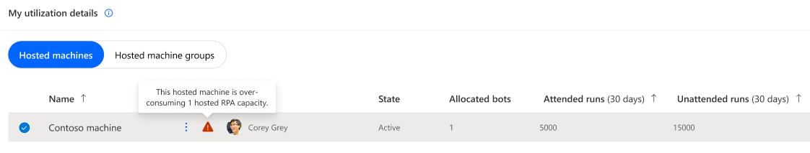
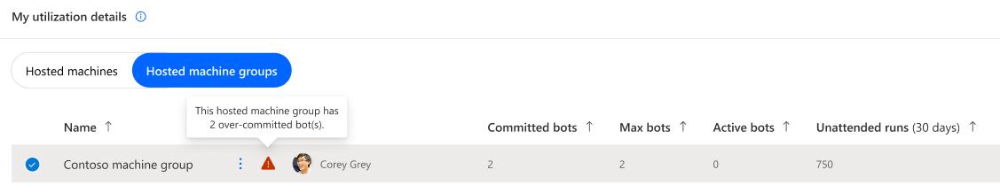

# Unattended RPA capacity utilization 

> [!IMPORTANT]
> - The capacity utilization page is in preview.
> - The Unattended RPA capacity (legacy) and the Process capacity have been combined in a single pool. They can seamlessly be utilized by machines (and coming in Q2 2024, by cloud flows).
> - The details allocation of those capacity (to machines and cloud flows) will be incorporated in the capacity utilization page in Q2 2024.

## Reminder on Unattended RPA capacity 

Within the Power Automate platform, the **‘Unattended RPA capacity’** is a purchased item (an [add-on](https://learn.microsoft.com/en-us/power-platform/admin/power-automate-licensing/add-ons#unattended-rpa-add-on)) assigned to the environment [(see how to assign capacity to environments)](https://learn.microsoft.com/power-platform/admin/capacity-add-on#allocate-or-change-capacity-in-an-environment) which allows to run desktop flows with zero infrastructure. The Unattended RPA capacity (or Process capacity) is needed to run desktop flows in unattended mode. Every capacity allocated to a machine allows it to carry out an additional unattended desktop flow run concurrently.
  

|Consumming object|Description|Consumption mode|
|----|--------------------|----|
|[Machine](manage-machines.md)|Every capacity allocated to a machine allows it to carry out an additional unattended desktop flow run concurrently.|Capacity is auto-allocated to the machine at unattended desktop flow run time.|

> [!NOTE]
> - Manual allocation of the Unattended RPA capacity (or Process capacity) to the machine will be released in Q2 2024

 

## Unattended RPA capacity overview

The '**Unattended RPA capacity overview**' pie chart helps the user understand what's the unattended RPA capacity consumption within the environment, let him known if there is still capacity to scale-up in the future and alerts him when the utilized capacity is exceeding environment capacity (= overage): 

||Legend|Description|
|----|--------------------|----|
||Used by unattended machines (last 30 days)|Compliant capacity allocated to machines within the environment.|
||Available capacity|Available capacity for new unattended machines.|
||My overage utilization|Capacity over-allocated to unattended machines within the environment.|

> [!NOTE]
> - The chart displays an environment-wide report over unattended capacity consumption. 

  

## Unattended RPA capacity insights 

The '**Unattended capacity insights**' card informs the user of operation health and gives him recommendation in case of compliance issues:

|Badge|Message|Insight|
|----|--------------------|----|
||There is available capacity for new unattended machines.|Scale-up possible in the future.|
||There is no more capacity for new unattended machines.|The capacity utilization rate is optimal at 100% but there is no room for scaling-up.|
||There is some over-allocated capacity to unattended machines in the environment.|Uncompliant capacity usage exceeding environment capacity.|

  

## Hosted RPA capacity overage

Capacity overage in an environment occurs when **the capacity utilized by hosted machines and hosted machine groups surpasses the assigned capacity of the environment**. In such instances, specific hosted machines and/or hosted machine groups may be identified as exceeding capacity. To prevent any disruption, it is crucial to promptly rectify the situation:

  
### Hosted machine in overage:
Hosted machines identified in overage risk being turned-off after a grace period:  

  
### Hosted machine group in overage:
Hosted machine groups will not honour their over-committed bots expected behaviour:  

> [!NOTE]
> - An hosted machine group can have a sub-set of its committed bots identified as in overage (= over-committed), in that case, only the compliant committed bots will be honoured.

  

### How to fix hosted capacity overage?
When the user owns (or has been shared) some hosted machines or hosted machine groups in overage, the **Fix capacity button** appears in the Hosted Capacty Insight card, it provides corrective actions: 

|Fix capacity - Corrective actions|
|-|
||

  
The **Request capacity** action submits a request to the tenant administrator for the assignation of capacity to the environment:
 
|Fix capacity - Request capacity|
|-|
||

> [!NOTE]
> - The pre-set value in the request capacity modal is equal to the total overage value in the environment (the user's overage and the other users' overage)
> - This ensures that when the additional capacity is assigned to the environment, the user who made the request has its hosted machines or hosted machine groups returned to compliance
> - If the user submits a smaller request, when the additional capacity is provisioned to the environment, there’s no guarantee that their own hosted machines or hosted machine groups will return to compliance. The extra capacity might be allocated to other overage objects owned by different users

  

### What are the rules governing which objects are identified as in overage ?

When the total capacity assigned to an environment is less than the combined capacity allocated to hosted machines and committed to hosted machine groups:

- Firstly, the overage will be identified in the committed capacity of hosted machine groups, starting from the most recently created committed bot setting to the oldest. 
- Secondly, the overage will be identified in the allocated capacity of hosted machines, starting from the most recently created machine to the oldest.
