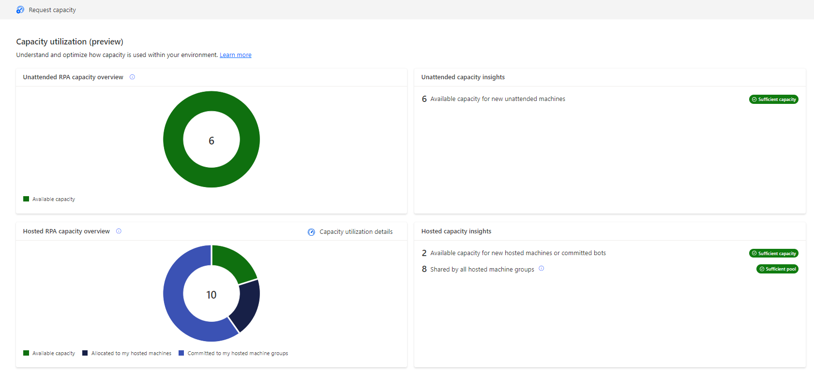

# Capacity utilization within Power Automate

> [!IMPORTANT]
> - The capacity utilization page is in preview.
> - In the January 2024 release, the capacity utilization page only details hosted RPA capacity utilization

 

## Reminder on capacity within Power Automate

Within the Power Automate platform, a **‘Capacity’** is a purchased item (that can be a license or an add-on) assigned to an the environment [(see how to assign capacity to environments)](https://learn.microsoft.com/power-platform/admin/capacity-add-on#allocate-or-change-capacity-in-an-environment) that can be utilized by a specific Power Automate object allowing it to carry out premium operation. 
  
Currently, there are 3 types of capacity that can be utilized by Power Automate objects : 
  

|Capacity|Power Automate object|Consumption mode|Premium operation enabled|
|----|--------------------|----|----|
|Hosted RPA capacity|Hosted machine|[Auto-allocation](# "Hosted RPA capacity is auto-allocated to hosted machine at its creation.")|To be created, each hosted machine requires an hosted RPA capacity allocated.|
|Hosted RPA capacity|Hosted machine group|Manual commitment|Every hosted RPA capacity committed to a hosted machine group guarantees the availability of a bot during auto-scaling.|
|Unattended RPA capacity (or Process capacity)|Machine|[Auto-allocation](# "Capacity is auto-allocated at unattended desktop flow run time.")|Every capacity allocated to a machine allows it to carry out an additional unattended desktop flow run concurrently.|
|Process capacity|Cloud flow|Manual allocation|Every capacity assigned to a cloud flow enables it, along with all its associated cloud flows, to use premium connectors and execute actions up to a daily limit of 250k Power Platform Requests (stackable limit).|

> [!NOTE]
> - The Unattended RPA capacity (legacy) and the Process capacity have been combined in a single pool. They can seamlessly be utilized by machines (and in Q2 2024 by cloud flow)
> - The Process capacity allocation to cloud flow is not yet incorporated in the capacity utilization page, it will be in Q2 2024
> - Although the Per Flow Plan is a capacity that can be allocated to a cloud flow, it is not incorporated into the capacity utilization page. It is indeed being phased out in favor of the Process capacity.

 

## Capacity utilization overview page

The capacity utilization page offers an overview of each environment capacity, detailing their usage and providing suggestions and insights for more efficient management of automations and the desktop infrastructure.

The overview page provides for 1) **Hosted RPA capacity** and 2) **Unattended RPA capacity** : 
- A breakdown of each capacity utilization (my consumption / others' consumption / capacity available / capacity in overage)
- Insights and recommendation over compliance issues

 

  

The 2 pie charts underscore the crucial point that, within a given environment, capacity is a <b>limited resource that users may compete for</b>, necessitating priorization of use cases.  

## Per-capacity details pages

### 1. [Hosted RPA capacity utilization](capacity-utilization-hosted.md)

The Hosted RPA capacity allows to run desktop flows with zero infrastructure. It is allocated to hosted machine or committed to hosted machine groups. 

### 2. [Unattended RPA capacity utilization](capacity-utilization-process.md)

The Unattended RPA capacity (or Process capacity) is needed to run desktop flows in unattended mode. Each machine performing unattended runs needs to be covered by one capacity.

  

