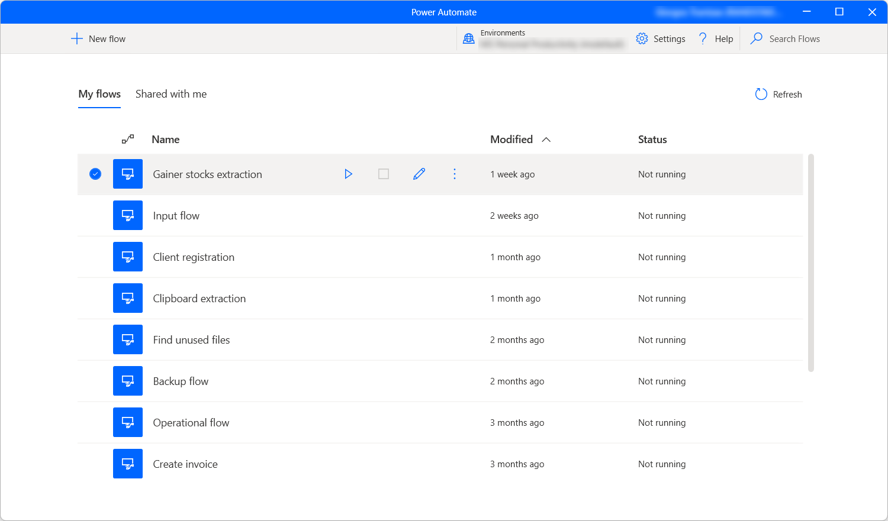
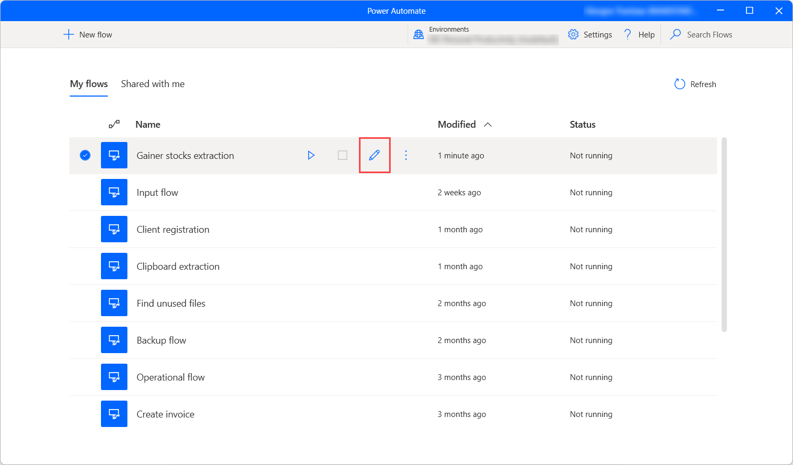

# Power Automate for desktop console

The flow console is the central interface of Power Automate.

After signing in, your username will be displayed in the top-right corner, while a list of flows occupies the central pane. At the top right-hand side, a dropdown list allows you to switch environments in order to access different flows; alongside the environments are also the Settings and Help buttons, and a search bar for easily locating flows.

## Starting a desktop flow

Power Automate users can run any available desktop flow through the console. To run a desktop flow as local attended, hover the cursor over it and select the **Start** button. You can find the current status of each flow in the **Status** column of the desktop flows list.

If the flow contains [input variables](manage-variables.md#input-and-output-variables), a dialog box prompts the user to provide values for each input variable.

## Editing a desktop flow

Through the console, users can create a new flow by pressing the **New flow** button, or edit an already existing one by double-clicking on it, or hovering the cursor over it and pressing the edit button:

In both scenarios, the flow designer will be launched; it's the component where flow creation and editing take place.

>[!NOTE]
> When more than one people make changes to a shared desktop flow, the last one that saves the flow overrides all previous actions.

## Console Settings

Press the **Settings** button to configure Power Automate for desktop to your liking:

Under the **Application** category, select whether Power Automate should launch automatically, and whether closing the console will close the application as well. You may also set a hotkey combination to instantly stop a running flow.

Using the **Monitoring/Notifications** drop-down menu, you can choose whether Power Automate will display integrated Windows notifications, a custom monitoring window, or no notifications at all. To find more information regarding Power Automate notifications, refer to [Runtime notifications](run-pad-flow.md#runtime-notifications).

By default, Power Automate always prompts you to confirm the triggering of a desktop flow via URL. The **Display confirmation dialog when invoking flows via URL** option allows you to disable this functionality. You can find more information about external links in [Run desktop flows via URL](run-pad-flow.md#run-desktop-flows-via-url).  

To decide whether Microsoft may collect diagnostic data to improve user experience, navigate to the **Data collection** settings tab. 

>[!NOTE]
>Only an admin may change Data collection settings.

## Desktop flow details

To review the details of a desktop flow, right-click on it and select **Details**. Through the **Details** dialog, you can edit the name and description of the flow, as well as see the owner, the creation and last modification dates, and the flow ID.

## Update Power Automate for desktop

Power Automate will frequently check for updates and display a notification dialog. In order not to disrupt your work, the update dialog offers you the option to delay the update and proceed with it at a later time. If you don't wish to receive any update notifications, you may uncheck the **Show update notifications** option in the general settings. To manually update, you may select the **Check for updates** button in the general settings.

## Switch organization

For cases that a user is member of more than one tenant, they can switch between them by selecting their alias at the top right of the console window and clicking on **Switch organization**.

[!INCLUDE[footer-include](../includes/footer-banner.md)]