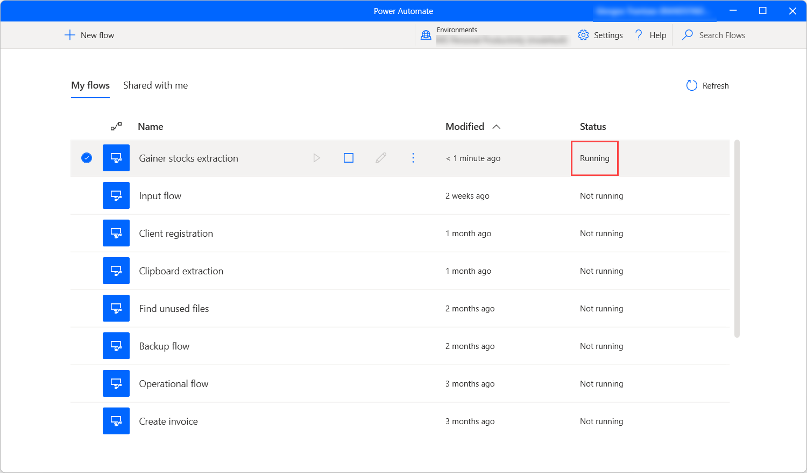

# Power Automate Desktop flow console

The flow console is the central interface of Power Automate Desktop.

After signing in, your username will be displayed in the top-right corner. A list of flows occupies the central pane, while a dropdown list at the top allows users to switch environments in order to access different flows.

## Starting a cloud flow

Users may run any Power Automate Desktop flows available to them through the console, by hovering the cursor over a cloud flow and pressing the "Start" button. The status of the flow is also displayed:

If the flow contains input variables, a dialog box prompts the user to provide values for each input variable.

## Editing a cloud flow

Through the console, users may also create a new flow by pressing the "New flow" button, or edit an already existing one by double-clicking on it, or hovering the cursor over it and pressing the edit button:

In both scenarios, the flow designer will be launched; this is where flow creation and editing takes place.

[!INCLUDE[footer-include](../includes/footer-banner.md)]