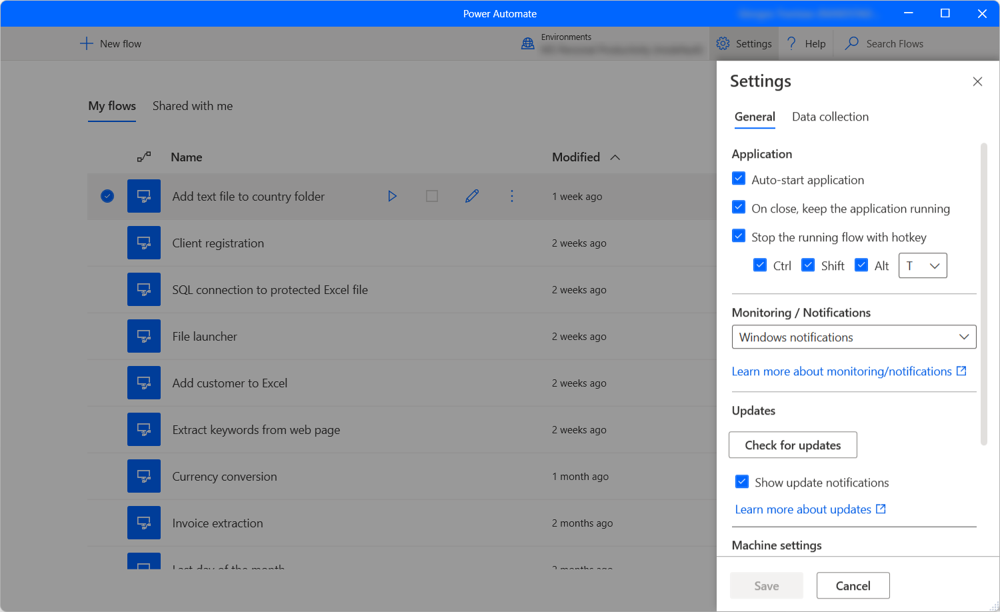

# Power Automate console

The console is the central interface of Power Automate for desktop.

The main area of the console contains three tabs that display different kind of desktop flows: your flows, [shared flows](manage.md#share-desktop-flows), and [built-in examples](create-flow.md#start-creating-desktop-flows-using-examples).

On the top of the window, you can see the current user, while on the command bar, you can see all the available bulk actions, a dropdown list to switch environments, the **Settings** and **Help** buttons, and a search bar.

## Starting a desktop flow

To run a desktop flow as local attended, use the **Start** button next to the selected flow or on the command bar. The **Status** column allows you to review the current status of each flow.

If a running flow contains [input variables](manage-variables.md#input-and-output-variables), a dialog box will prompt you to provide the appropriate values.

## Editing a desktop flow

Apart from [creating new desktop flows](create-flow.md), you can edit existing flows using the **Edit** button next to the selected flow or on the command bar.

The development of new flows and the editing of existing flows occur in the flow designer. To find more information regarding the flow designer and how to develop desktop flows, refer to [Desktop flow designer](flow-designer.md).

>[!IMPORTANT]
> When more than one person changes a shared desktop flow, the last person who saves the flow overrides all previous actions.

## Console Settings

To configure Power Automate for desktop to your liking, select the **Settings** button.

Under the **Application** category, select whether Power Automate should launch automatically and whether closing the console will also close the application. You may also set a hotkey combination to stop running flows instantly.

Using the **Monitoring/Notifications** dropdown menu, you can choose whether Power Automate will display integrated Windows notifications, a custom monitoring window, or no notifications at all. To find more information regarding Power Automate notifications, refer to [Runtime notifications](run-pad-flow.md#runtime-notifications).

By default, Power Automate always prompts you to confirm the triggering of a desktop flow via URL or desktop shortcut. The **Display confirmation dialog when invoking flows externally** option allows you to disable this functionality. You can find more information about external links in [Run desktop flows via URL or desktop shortcuts](run-pad-flow.md#run-desktop-flows-via-url-or-desktop-shortcuts).  

To decide whether Microsoft may collect diagnostic data to improve user experience, navigate to the **Data collection** settings tab.

>[!IMPORTANT]
>Only admins can change data collection settings.

## Desktop flow details

To review the details of a desktop flow, right-click on it and select **Details**. Through the **Details** pane, you can edit the name and description of the flow, as well as see the owner, the creation and last modification dates, and the flow ID.

Additionally, there's a **Run URL** that you can use to run the flow through many different sources, such as browsers, the Windows Run application, and the Command Prompt. You can find more information regarding this functionality in [Run desktop flows via URL or desktop shortcuts](run-pad-flow.md#run-desktop-flows-via-url-or-desktop-shortcuts).

## Update Power Automate for desktop

Power Automate frequently checks for updates and displays appropriate notifications.

Update notifications offer you the option to delay the update and proceed with it at a later time. If you don't wish to receive any update notifications, uncheck the **Show update notifications** option in the general settings.

To manually update, select **Check for updates** in the general settings.

## Switch organization

If you're a member of more than one tenant, you can switch between them by selecting their alias at the top right corner of the console and clicking on **Switch organization**.

[!INCLUDE[footer-include](../includes/footer-banner.md)]
