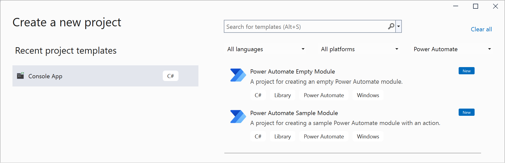

# Create Power Automate for desktop actions using the Actions SDK (preview)

> [!IMPORTANT]
> Power Automate for desktop v2.32 and newer is required

> [!NOTE] 
> The **Actions SDK (preview)** and **Power Automate Desktop - Visual Studio templates (preview)** are currently in preview. They are both available under the pre-release section through Visual Studio's NuGet package manager and at [www.nuget.org](https://www.nuget.org/)

Power Automate for desktop can be extended through the Actions SDK (preview). Through the SDK, **custom modules** can be created and then utilized through desktop flows. 
> [!NOTE]
> The term **modules** is equivalent to the term **custom actions group** (preview) and is used to describe custom actions groups (preview) from a pro-dev perspective in this article.


## Prerequisites

To create custom actions (preview) for Power Automate for desktop the following are required:
- An IDE (Integrated Development Environment - e.g. Visual Studio 2022) you can write C# on.
- Power Automate for desktop installed on your machine.
- The Actions SDK which you can download through Visual Studio's package manager or nuget.org. 

> [!NOTE] 
> In this guide, Visual Studio 2022 was utilized.


## Using Power Automate Desktop Actions - Visual Studio templates (preview)

> [!NOTE]
> Power Automate Desktop Actions - Visual Studio templates (preview) are supported for Visual Studio 2022 and newer


To install  the Power Automate Desktop Actions - Visual Studio templates (preview), you can either:

- Download the nuget package containing the templates, through [www.nuget.org](https://www.nuget.org/) and then execute the following command in Visual Studio's Package Manager by providing the appropriate path: 
```
dotnet new -i <path_to_Templates_nuget_package>
``` 
or
- by directly running this command in Visual Studio's Package Manager: 
```
dotnet new -i Microsoft.PowerPlatform.PowerAutomate.Desktop.Actions.Templates
``` 

The creation of custom actions (preview) for desktop flows is summarized in the following steps:
- Create a new project using Power Automate Desktop Actions - Visual Studio templates (preview).
- Build your project.
- Sign the generated .dll with a trusted certificate.
- Package the generated .dll along with all its dependencies in a .cab file.
- Sign the .cab file

> [!NOTE]
> The .dll representing the custom actions group (preview), its dependencies and the .cab which will contain all of them, must be properly signed with a valid certificate. The certifcate must also be present in the desktop on which the desktop flow containing the custom actions (preview) runs on.


Keep in mind the following analogy:
1. Every project (.dll) referencing the SDK is a module (custom actions group (preview)).
2. Actions of this module are represented by classes inside that project. 

After installing the Power Automate Desktop Actions templates for Visual Studio (preview), open Visual Studio and choose one of the following options:



| Project Template                      | Description |
| :------------------------------------ | :--------------------------------------------------------------------------------------- |
| Power Automate Empty Module           | Creates an empty project with the references required to create a custom Power Automate module. |
| Power Automate Sample Module          | Creates a sample project containing an action with the references required to create a custom Power Automate module. |

>[!NOTE]
> In these examples, the Power Automate Sample Module Project (a project including a simple action (Action1.cs)) is utilized.

This is how the Action1.cs looks like out of the box:

```csharp
using Microsoft.PowerPlatform.PowerAutomate.Desktop.Actions.SDK;
using Microsoft.PowerPlatform.PowerAutomate.Desktop.Actions.SDK.Attributes;
using System;

namespace Modules.CustomModule
{
    [Action(Id = "Action1", Order = 1)]
    [Throws("ActionError")] // TODO: change error name (or delete if not needed)
    public class Action1 : ActionBase
    {
        #region Properties

        // NOTE: You can find sample description and friendly name entries in Resources

        [InputArgument]
        public string InputArgument1 { get; set; }

        [OutputArgument]
        public string OutputArgument1 { get; set; }

        #endregion

        #region Methods Overrides

        public override void Execute(ActionContext context)
        {
            try
            {
                OutputArgument1 = $"Hello World ${InputArgument1}";
            }
            catch (Exception e)
            {
                if (e is ActionException) throw;

                throw new ActionException("ActionError", e.Message, e.InnerException);
            }
        }

        #endregion
    }
}
```

The majority of actions have parameters (Input or Output). 
Input and Output parameters are represented by classic C# properties. 

Each property should have an appropriate C# attribute, either [InputArgument] or [OutputArgument] to dictate its type and how they are presented in Power Automate for desktop.
Actions can also be organized in categories with the appropriate property in the Action attribute.

You can pre-populate the parameters by setting a default value C# attribute. 

For example, the default value of the InputArgument, is "Developer".
By applying this, and modifying the Execute method to return an Output, the custom action (preview) should look as follows:

```csharp
using Microsoft.PowerPlatform.PowerAutomate.Desktop.Actions.SDK;
using Microsoft.PowerPlatform.PowerAutomate.Desktop.Actions.SDK.Attributes;
using System;
using System.ComponentModel;

namespace Modules.CustomModule
{
    [Action(Id = "Action1", Order = 1, Category = "TestCategory")]
    [Throws("ActionError")] // TODO: change error name (or delete if not needed)
    public class Action1 : ActionBase
    {
        #region Properties

        // NOTE: You can find sample description and friendly name entries in Resources

        [InputArgument, DefaultValue("Developer")]
        public string InputArgument1 { get; set; }

        [OutputArgument]
        public string OutputArgument1 { get; set; }

        #endregion

        #region Methods Overrides

        public override void Execute(ActionContext context)
        {
            try
            {
                OutputArgument1 = $"Hello, {InputArgument1}";
            }
            catch (Exception e)
            {
                if (e is ActionException) throw;

                throw new ActionException("ActionError", e.Message, e.InnerException);
            }
        }

        #endregion
    }
}
```

## Custom module name conventions

For the custom modules to be readable through Power Automate for desktop, the AssemblyName must have a filename that follows the below pattern:

```
?*.Modules.?*
Modules.?*
```
For example, **Modules**.ContosoActions.dll


The AssemblyTitle in the project settings specifies the module ID. It can only have alphanumeric characters and underscores and must begin with a letter.


## Adding descriptions to custom actions (preview)

It is recommended to provide a description and a friendly name for the module and its respective actions so that Power Automate for desktop users will know how to best utilize them.

Friendly names and descriptions are displayed in the Power Automate for desktop's designer.


To add a description you have to modify the "Resources.resx" file under the Project "Properties".  

The format of the descriptions for modules and actions should be as follows: "Module_Description" or "Action_Description" and "Module_FriendlyName" or "Action_FriendlyName" respectively in the name field. The description in the value field.

It is also recommended to provide descriptions and friendly names for parameters. Their format should be as follows: "Action_Parameter_Description", "Action_Parameter_FriendlyName".

These can also be set with the FriendlyName and Description properties of the **[InputArgument]**, **[OutputArgument]** and **[Action]** attributes.


> It is recommended to denote what it is you are describing in the comment field (e.g. Module, Action etc.)

Another way to quickly add friendly names and descriptions to actions and parameters is with the FriendlyName and Description properties in the **[Action]**, **[InputArguement]** and **[OutputArguement]** attributes.

> [!NOTE] 
> The only way to add a friendly name and description to a module is by modifying the respective .resx file.


## Resources localization

The default language for modules in Power Automate for desktop is assumed to be English. 

The **Resources.resx** file should be in English. 

Any additional languages can be added with extra Resources.{locale}.resx files for localization. For example **Resources.fr.resx**.

## Creating actions without using the Power Automate Desktop Visual Studio templates (preview)

Begin by creating a new Class Library (.NET Framework) project. Select .NET framework version 4.7.2.
Add the Actions SDK (preview) to your project.


To form an action in the custom module just created:
- Delete the auto-generated Class1.cs file. 
- Create a new class inside your project to represent the custom action (preview) and give it a distinct name. 
- Include the Microsoft.PowerPlatform.PowerAutomate.Desktop.Actions.SDK and Microsoft.PowerPlatform.PowerAutomate.Desktop.Actions.SDK.Attributes namespaces.
- All classes representing actions should have an [Action] attribute above your class. 
- The class should have public access and inherit from ActionBase class.

```csharp
using System;
using Microsoft.PowerPlatform.PowerAutomate.Desktop.Actions.SDK;
using Microsoft.PowerPlatform.PowerAutomate.Desktop.Actions.SDK.Attributes;

namespace Modules.MyCustomModule
{
    [Action(Id = "CustomAction")]
    public class CustomAction : ActionBase
    {
        public override void Execute(ActionContext context)
        {
            throw new NotImplementedException();
        }
    }
}
```

The majority of actions have parameters (Input or Output). Input and Output parameters are represented by classic C# properties.
Each property should have an appropriate C# attribute, either [InputArgument] or [OutputArgument] to dictate its type and how they are presented in Power Automate for desktop.
Input arguments can also have default values.

```csharp
using System.ComponentModel;
using Microsoft.PowerPlatform.PowerAutomate.Desktop.Actions.SDK;
using Microsoft.PowerPlatform.PowerAutomate.Desktop.Actions.SDK.Attributes;

namespace Modules.MyCustomModule
{
    [Action(Id = "CustomAction")]
    public class CustomAction : ActionBase
    {
        [InputArgument, DefaultValue("Developer")]
        public string InputName { get; set; }

        [OutputArgument]
        public string DisplayedMessage { get; set; }

        public override void Execute(ActionContext context)
        {
            DisplayedMessage = $"Hello, {InputName}";
        }
    }
}
```

## Adding descriptions to custom actions (preview) created from scratch

It is recommended to provide a description and a friendly name for the modules and actions so that RPA developers will know how to best utilize them.

Friendly Names and Descriptions are displayed in the Power Automate for desktop's Designer.

The suggested approach is to create a "Resource.resx" file inside the Properties folder of the module project. The new ".resx" file should be named "Resources.resx".

The format of the descriptions for Modules and Actions should be as follows: "Module_Description" or "Action_Description" and "Module_FriendlyName" or "Action_FriendlyName" respectively in the name field. The description in the value field.

It is also recommended to provide descriptions and friendly names for parameters. Their format should be as follows: "Action_Parameter_Description", "Action_Parameter_FriendlyName".


>[!NOTE] 
> It is recommended to denote what it is you are describing in the comment field (e.g. Module, Action etc.)

## Custom module categories

Modules can include categories and subcategories for better action organization.

In order to separate custom actions(preview) in categories, subcategories etc. modify the **[Action]** attribute which precedes the class that represents the custom action (preview) in the following manner:

```csharp
[Action(Category = "category.subcategory")]
```

> [!NOTE] 
> A Module can have multiple categories. Similarly, categories can be comprised by subcategories. This structure can be indefinite.

The Order property dictates the order by which actions are previewed in the designer.

Action1 belongs in the category "TestCategory" and it will be the first action of the module (this way you explain Order and category with an example.

```csharp
[Action(Id = "Action1", Order = 1, Category = "TestCategory")]
```

## Conditional actions

Conditional actions are actions that return either "True" or "False". 'If file exists' Power Automate for desktop action of the standard library is a good example of a conditional action.

Conditional action example:

```csharp
using Microsoft.PowerPlatform.PowerAutomate.Desktop.Actions.SDK;
using Microsoft.PowerPlatform.PowerAutomate.Desktop.Actions.SDK.Attributes;
using System;
using System.ComponentModel;

namespace Modules.CustomModule
{
    [ConditionAction(Id = "ConditionalAction1", ResultPropertyName = nameof(Result))]
    [Throws("ActionError")] // TODO: change error name (or delete if not needed)
    public class ConditionalAction1 : ActionBase
    {
        #region Properties

        public bool Result { get; private set; }

        [InputArgument]
        public string InputArgument1 { get; set; }

        #endregion

        #region Methods Overrides

        public override void Execute(ActionContext context)
        {
            try
            {
                //TODO: add action execution code here
            }
            catch (Exception e)
            {
                if (e is ActionException) throw;

                throw new ActionException("ActionError", e.Message, e.InnerException);
            }
        }

        #endregion
    }
}
```

Notice the **Result** boolean variable. 

The **If file exists** action does not have an output argument. What it returns is either true or false, depending on what the boolean variable **Result** holds. 


## Custom action (preview) selectors

There are particular cases, in which a custom action (preview) might be required to have more than one variations. 

An example would be the "Launch Excel" action, from the standard library of actions. 

Using the "with a blank document" selector, the flow will launch a blank Excel document, whereas using the "and open the following document" selection will require the file path of the file to open.


The two actions mentioned above, are two selectors of the "Launch Excel" base action. 

When creating custom actions (preview) you don't have to re-write functionality.

 You can create a single "base" Action, setting its input and output parameters and then choose what would be visible in each flavor by utilizing action selectors. 

Through action selectors a level of abstraction can be added over a single action, allowing for the retrieval of specific functionality from the single "base" action without having to re-write code to form a new variation of the same action every time.

Think of selectors as choices, filtering a single action and presenting only the information required according to the respective selectors.


To form a new action selector, first create a base action to be utilized by the selectors. 

The central action requires either a boolean or an enum property as an input C# argument. 

The value of this property determines which selector is utilized.
- The most common way, is using an enum. Especially when more than two selectors are needed, enums is the only option.
- For two selector cases, booleans can be used.

This property, also known as a constraint argument, must have a default value.

The central action is declared as a classic action. 

Notice the first property (input argument) is an enum. Based on that property's value, the appropriate selector will become active.

>[!NOTE] 
> To have the arguments ordered in your desired manner, you set the Order value next to the InputArgument attribute.

```csharp
using System.ComponentModel;
using Microsoft.PowerPlatform.PowerAutomate.Desktop.Desktop.Actions.SDK;
using Microsoft.PowerPlatform.PowerAutomate.Desktop.Desktop.Actions.SDK.Attributes;

namespace Modules.CustomModule
{
    [Action(Id = "CentralCustomAction")]
    public  class CentralCustomAction : ActionBase
    {
        #region Properties

        [InputArgument, DefaultValue(SelectorChoice.Selector1)]
        public SelectorChoice Selector { get; set; }

        [InputArgument(Order = 1)]
        public string FirstName { get; set; }

        [InputArgument(Order = 2)]
        public string LastName { get; set; }

        [InputArgument(Order = 3)]
        public int Age { get; set; }

        [OutputArgument]
        public string DisplayedMessage { get; set; }

        #endregion

        #region Methods Overrides

        public override void Execute(ActionContext context)
        {
            if (Selector == SelectorChoice.Selector1)
            {
                DisplayedMessage = $"Hello, {FirstName}!";
            }
            else if (Selector == SelectorChoice.Selector2)
            {
                DisplayedMessage = $"Hello, {FirstName} {LastName}!";
            }
            else // The 3rd Selector was chosen {
                DisplayedMessage = $"Hello, {FirstName} {LastName}!\nYour age is: {Age}";
        }

        #endregion
    }
}
```

## Custom action (preview) selectors using enums

In this example you will create three selectors. A simple enum will dictate the appropriate selector each time:

```csharp
public enum SelectorChoice
{
    Selector1,
    Selector2,
    Selector3
}
```

Selectors are represented by classes. 

Those classes must inherit the ```ActionSelector<TBaseActionClass>``` class.
>[!NOTE] 
>TBaseActionClass is the base action class name.

In the UseName() method, the name of the action selector is declared. This is used as a name of the action to resolve the resources.

```csharp
public class Selector1 : ActionSelector<CentralCustomAction>
{
    public Selector1()
    {
        UseName("DisplayOnlyFirstName");
        Prop(p => p.Selector).ShouldBe(SelectorChoice.Selector1);
        ShowAll();
        Hide(p => p.LastName);
        Hide(p => p.Age);
        // or 
        // Show(p => p.FirstName); 
        // Show(p => p.DisplayedMessage);
    }
}
```

>[!NOTE]
>The Selector classes should not be declared as actions. The only action is the central one. Selectors act as filters.

In this specific example we want to display only one of the arguments, thus the others are filtered out. Similarly for Selector2:

```csharp
public class Selector2 : ActionSelector<CentralCustomAction>
{
    public Selector2()
    {
        UseName("DisplayFullName");
        Prop(p => p.Selector).ShouldBe(SelectorChoice.Selector2);
        ShowAll();
        Hide(p => p.Age);
    }
}
```

And Selector3 classes:

```csharp
public class Selector3 : ActionSelector<CentralCustomAction>
{
    public Selector3()
    {
        UseName("DisplayFullDetails");
        Prop(p => p.Selector).ShouldBe(SelectorChoice.Selector3);
        ShowAll();
    }
}
```

The final execution is achieved through the Execute(ActionContext context) method which resides in the central action. Based on the selector, the respective values filtered are displayed.

```csharp
public override void Execute(ActionContext context)
{
    if (Selector == SelectorChoice.Selector1)
    {
        DisplayedMessage = $"Hello, {FirstName}!";
    }
    else if (Selector == SelectorChoice.Selector2)
    {
        DisplayedMessage = $"Hello, {FirstName} {LastName}!";
    }
    else // The 3rd Selector was chosen {
        DisplayedMessage = $"Hello, {FirstName} {LastName}!\nYour age is: {Age}";
}
```

## Custom action (preview) selectors using boolean

An example utilizing Boolean instead of enums is demonstrated below.

```csharp
using System.ComponentModel;
using Microsoft.PowerPlatform.PowerAutomate.Desktop.Actions.SDK;
using Microsoft.PowerPlatform.PowerAutomate.Desktop.Actions.SDK.ActionSelectors;
using Microsoft.PowerPlatform.PowerAutomate.Desktop.Actions.SDK.Attributes;

namespace Modules.CustomModule
{
    [Action]
    public class CentralCustomActionWithBoolean : ActionBase
    {
        #region Properties

        [InputArgument, DefaultValue(true)]
        public bool TimeExpired { get; set; }

        [InputArgument]
        public string ElapsedTime { get; set; }

        [InputArgument]
        public string RemainingTime { get; set; }

        [OutputArgument]
        public string DisplayedMessage { get; set; }

        #endregion

        #region Methods Overrides

        public override void Execute(ActionContext context)
        {
            DisplayedMessage = TimeExpired ? $"The timer has expired. Elapsed time: {ElapsedTime}" : $"Remaining time: {RemainingTime}";
        }

        #endregion
    }

    public class NoTime : ActionSelector<CentralCustomActionWithBoolean>
    {
        public NoTime()
        {
            UseName("TimeHasExpired");
            Prop(p => p.TimeExpired).ShouldBe(true);
            ShowAll();
            Hide(p => p.RemainingTime);
        }
    }

    public class ThereIsTime : ActionSelector<CentralCustomActionWithBoolean>
    {
        public ThereIsTime()
        {
            UseName("TimeHasNotExpired");
            Prop(p => p.TimeExpired).ShouldBe(false);
            ShowAll();
            Hide(p => p.RemainingTime);
        }
    }
}
```

## Setting descriptions for custom action (preview) selectors

To create a description and a summary for selectors, use the following format in the .resx file of your custom module.

```
SelectorName_Description
SelectorName_Summary
```

This can also be done in the selector with the WithDescription and WithSummary methods.

## Creating and importing a self-signed certificate

To create a self-signed certificate with exportable private key and code sign capabilities:
- Open Windows PowerShell 
- Input the following commands by providing valid values where needed:
```PowerShell
$certname = "{Your cert name}"
$cert = New-SelfSignedCertificate -CertStoreLocation Cert:\CurrentUser\My -Type CodeSigningCert  -Subject "CN=$certname" -KeyExportPolicy Exportable -KeySpec Signature -KeyLength 2048 -KeyAlgorithm RSA -HashAlgorithm SHA256
$mypwd = ConvertTo-SecureString -String "{your password}" -Force -AsPlainText
Export-PfxCertificate -Cert $cert -FilePath "{enter full path of preferred exported 
location}\{preferred certificate name}.pfx" -Password $mypwd
```
- After the certificate has been created and exported, import it to your trust root
- Double click on the exported certificate
- Select Current user


- In the **Private key protection** screen, use the password provided during the creation of the certificate and also mark the key as exportable and include all extended properties
  

- Finally add the certificate to the Trusted Root Certification Authorities


## Signing a custom module

To finalize the creation of the custom module, the generated .dll file ([Assembly Name].dll) is required. The file can be found under the bin/release or bin/Debug folder of the project.

Sign the .dll file using a trusted certificate by running the following command in a Developer Command Prompt for Visual Studio:

```
Signtool sign /f {your certificate name}.pfx /p {your password for exporting the certificate} /fd 
SHA256 {path to the .dll you want to sign}.dll
```

> [!NOTE]
> The digital certificate must have an exportable private key and code sign capabilities

## Packaging everything in a cabinet file

The .dll containing the custom actions (preview) and all its dependencies (.dll files) must be packaged in a cabinet file (.cab). 

Create a Windows PowerShell Script (.ps1) containing the following lines: 
```PowerShell
param(

    [ValidateScript({Test-Path $_ -PathType Container})]
	[string]
	$sourceDir,
	
	[ValidateScript({Test-Path $_ -PathType Container})]
    [string]
    $cabOutputDir,

    [string]
    $cabFilename
)

$ddf = ".OPTION EXPLICIT
.Set CabinetName1=$cabFilename
.Set DiskDirectory1=$cabOutputDir
.Set CompressionType=LZX
.Set Cabinet=on
.Set Compress=on
.Set CabinetFileCountThreshold=0
.Set FolderFileCountThreshold=0
.Set FolderSizeThreshold=0
.Set MaxCabinetSize=0
.Set MaxDiskFileCount=0
.Set MaxDiskSize=0
"
$ddfpath = ($env:TEMP + "\customModule.ddf")
$sourceDirLength = $sourceDir.Length;
$ddf += (Get-ChildItem $sourceDir -Filter "*.dll" | Where-Object { (!$_.PSIsContainer) -and ($_.Name -ne "Microsoft.PowerPlatform.PowerAutomate.Desktop.Actions.SDK.dll") } | Select-Object -ExpandProperty FullName | ForEach-Object { '"' + $_ + '" "' + ($_.Substring($sourceDirLength)) + '"' }) -join "`r`n"
$ddf | Out-File -Encoding UTF8 $ddfpath
makecab.exe /F $ddfpath
Remove-Item $ddfpath
```
This Windows PowerShell Script can then be used for creating the .cab file by invoking it in Windows PowerShell and providing 
- the directory to the .dll files to be compressed
- the target directory to place the generated .cab file.

Example:
```PowerShell
.\makeCabFromDirectory.ps1 "{source dir to compress dlls}" "{target dir to save cab}" {cabName}.cab
```
> [!NOTE]
> The .cab file must also be signed. Unsigned .cab files and/or unsigned .dlls contained in them will not be usable in desktop flows and will result in error during inclusion.

[!INCLUDE[footer-include](../includes/footer-banner.md)]