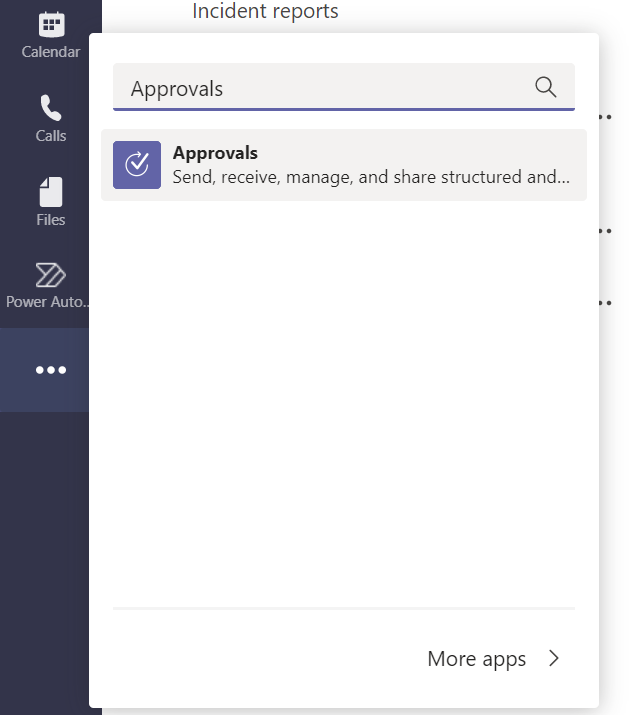
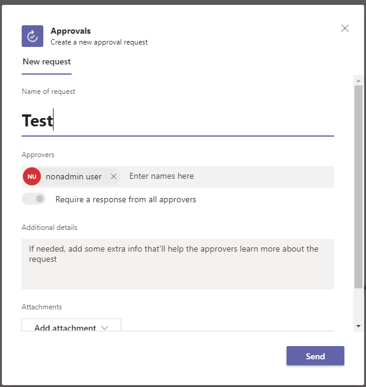
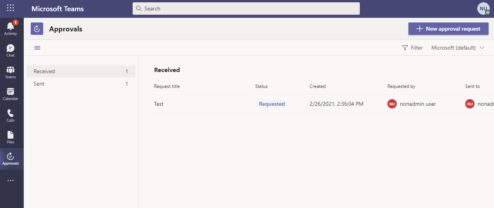
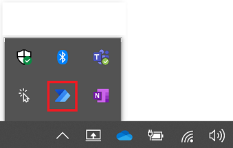

# Create a Microsoft Dataverse database

A Microsoft Dataverse database stores flows created in Power Automate Desktop.

>[!NOTE]
>For the preview release, you may need to create a Dataverse database before using Power Automate Desktop with your work or school account. This must be done only once in a tenant.

If you are an administrator or if you would like to provide information to the administrator to create a Dataverse database, see [Add a Microsoft Dataverse database](https://docs.microsoft.com/power-platform/admin/create-database).

## Add a Microsoft Dataverse database as a Microsoft Teams user

You can use the approvals experience in Teams to automatically add a Dataverse database that Power Automate Desktop can use to store flows. This only needs to be done once per tenant and non-admins can perform this task.

Follow these steps to create an approval from the Approvals app in Teams.

1. Sign into [Microsoft Teams](https://teams.microsoft.com/).

1. Select **More added apps (...)**.

   

1. Search for **approvals**, and then select the **Approvals** app.

1. Select **New approval request** on the top right of the app.

   

1. Provide a name for your request.
   For example, **My first request*.

1. Specify yourself in the **Approvers** list.

   

1. Select **Send**.

    This starts the process for adding a Dataverse database and may take a few minutes to complete. Once created, you will receive a notification in Teams with a request for approval.

    

    Your Dataverse database is now added to the default environment. 

1. Restart Power Automate Desktop (exit from the system tray icon)

    

You can now create desktop flows with Power Automate Desktop.

   

## Next Steps

- Learn how to [set up Power Automate Desktop](setup.md).
- Begin your journey in Power Automate Desktop by [creating a Power Automate Desktop flow](create-flow.md). 
- Get familiar with the [console](console.md) and the [flow designer](flow-designer.md), which are part of Power Automate Desktop. 
- You'll find the list of actions available in the [Actions reference](actions-reference.md).
