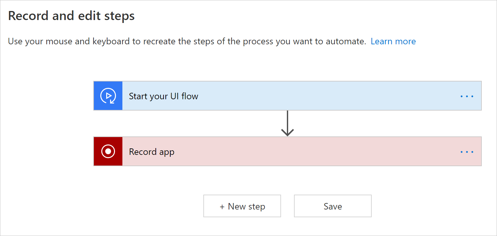
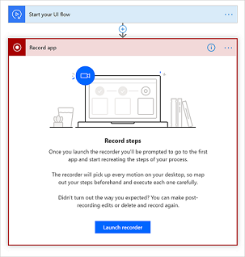
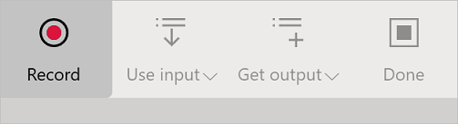
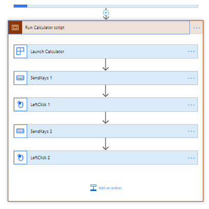

# Create and test Windows recorder (V1) flows

In the following steps, we'll demonstrate how to automate the calculator app to sum two numbers and then store the result for later use.

## Create a desktop Windows recorder (V1) flow

> [!TIP]
> You can automate other Windows desktop apps by following a similar pattern.

1. Ensure your [device is ready](setup.md#prerequisites) to create desktop flows.

1. Use [Microsoft Edge (Version 80 or later)](https://www.microsoftedgeinsider.com) or Google Chrome to open [Power Automate](https://flow.microsoft.com), and then sign in with the same work or school account as on your device.

1. Select **My flows** > **Desktop flows** > **New**.

    flow")

1. Click **Additional desktop flow options**.

    

1. Select Windows recorder (V1), and then click **Next**.

    

1. Enter a name for your Windows recoder (V1) flow into the **Flow name** field, and then select **Next**.

    

1. Select **Next** at the bottom to skip the optional **Set up inputs** screen since we aren't using inputs in this walkthrough.

1.	Select **Download package**.
1.	Open the **Setup.Microsoft.PowerAutomate.UIflow.exe** file. This file is likely in your **Downloads** folder after you downloaded it in the previous step.
1.	Follow the instructions in the Power Automate Desktop setup installer to complete the installation.
1. Once the Power Automate Desktop installer completes, go to Microsoft Edge store or Google Chrome store depending on the browser you are using and install **Microsoft Windows recorder (V1)** and **Selenium IDE** browser extensions and **Enable extensions**.

   Continue after you've installed the extension.

1. Select the **Record app** card to expand it.

   

1. Select **Launch recorder**.

   

   The recorder control displays at the top of your screen.

   

1. Start the calculator app.

     >[!TIP]
     >As your mouse hovers over controls in the app, you'll notice that a blue outline highlights each control. Always wait for the blue highlight before you select a control.
     >
     >If the blue highlight doesn't display around the element, it might not be recorded properly.

1. Select **Record** from the recorder control.
1. Select the first number, select **+**, select the second number, and then select **=**.

    

     > [!TIP]
     > You will improve automation reliability by:
     > - Opening and maximizing the apps you want to record before *before* you start recording
     > - Starting your recording with a click the app title bar to bring it in focus.

1. Select **Done** on the recorder control after you complete the actions you want to record.

1. Close the app that you recorded.

1. Select the card that starts with "Run <app name> script" to view screenshots of the recorded steps.

     >[!TIP]
     >Select **...** > **Delete** to remove any duplicate steps.

    

1. Select **Next**. 

1. Select **Next** to skip the optional **Set up outputs** step since we aren't using outputs in this walkthrough.

1. Test your desktop flow by selecting the **Test now** button, and then watch your desktop flow run.
    
 >[!IMPORTANT]
 >For best results, do not interact with your device for the duration of playback.

1. Select **Save and exit** to save your desktop flow.

## Known issues and solutions

- You may want to add a [**Close** action](edit-desktop.md#add-a-manual-action) at the end of your desktop flow because desktop flows launches a new instance of the applications with each test or run.

- Select **...** > **Delete** on the recorded actions card to remove any unnecessary/duplicate actions.

- Right clicks may not play back correctly. In such case, while recording, click left to focus desktop flows on the target user interface element, and then right click.

- If desktop flows no longer records or plays back Windows applications after installing a new version, confirm you have the [latest version](https://go.microsoft.com/fwlink/?linkid=2102613&clcid=0x409).

### Unsupported application types

- Interactions on Windows (File explorer, startup menu, task bar, etc.).

- Web browsers (Chrome, IE, Microsoft Edge, Firefox, Mozilla, etc.).
    Please instead refer to [Create a Selenium IDE flow](create-web.md) to
    automate websites.

- Java applications.

- Click once applications.

- Applications with a Web view such as Electron applications.

- Microsoft Office 2016 and earlier. 

- Microsoft Office online.

### Unsupported configurations

- Multi-screen.

- Recording through a virtual machine client (Remote Desktop, Citrix, etc.).

- Multiple instances of an application where the main window titles are identical.

- Application windows with identical titles, for example, Microsoft Outlook with multiple **Untitled – Message (HTML)** new mail windows active at the same time.

- Concurrent recording sessions on a given device.

- Concurrent playback sessions on a given device. In case of simultaneous desktop flow runs, the first one takes precedence and the subsequent ones fail until the first one completes.

- Playback on a device with a different keyboard layout than the device on which it was recorded.

- Recording on a device or Windows session while the browser with Power Automate is on a different device or Windows session.

### Unsupported action types and behaviors

The following actions will not be recorded:

- Double click.

- Mouse move.

- Mouse hover.

- Click and drag.

- Touch or pen input.

- Open app before recording.

## Unreliable behaviors and workarounds for Microsoft Office (desktop)

- Pin the ribbon before you begin playback to avoid issues that may occur if the ribbon is set to auto-hide during playback.
- Do not select items by clicking and dragging. For example, don't use shift-click to select cells in Microsoft Excel and don't select text in Microsoft Word or Microsoft PowerPoint by dragging the mouse.
- Some elements may not work correctly in desktop flows for Microsoft Word and Microsoft PowerPoint Desktop applications. For instance, options on the **File** menu such as starting from blank, or right clicking controls like adding a paragraph in Microsoft Word or changing the layout of slides in Microsoft PowerPoint may not work.

## Next steps

- Learn how to [trigger the desktop flow](run-desktop-flow.md) you just created.

- If you want to do more with desktop flows, you can also create desktop flows with [input and output](inputs-outputs-web.md) parameters.

[!INCLUDE[footer-include](../includes/footer-banner.md)]