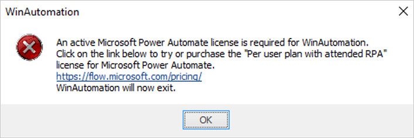
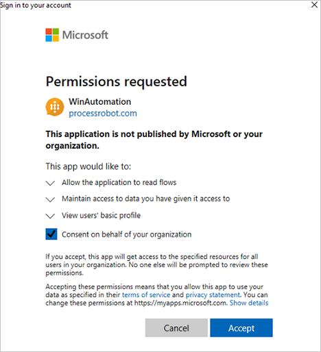
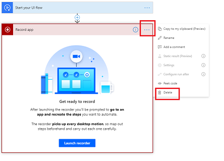
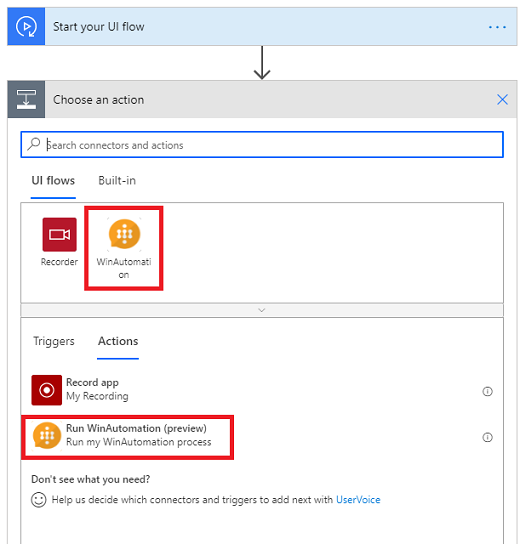
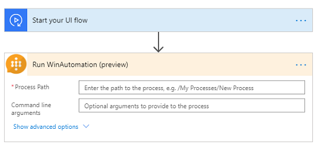
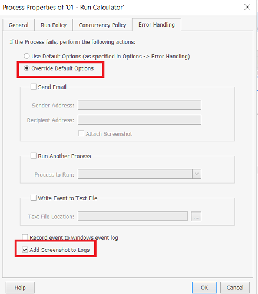
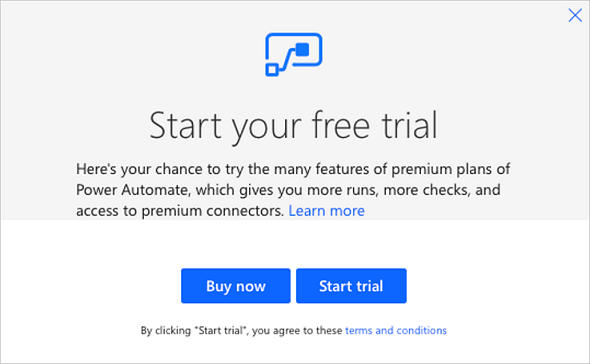
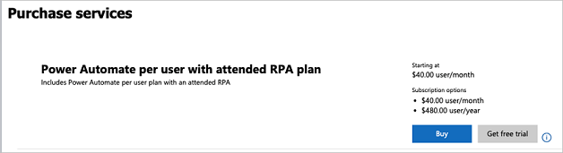

# Use Softomotive's WinAutomation with desktop flows

> [!IMPORTANT]
> From January 1st 2022, WinAutomation and ProcessRobot will no longer be supported. Learn more about the Softomotive products deprecation [here](https://aka.ms/Softomotive-Instructions). You may [migrate](softomotive-migrator.md) your flows to Power Automate. See the [Power Automate Desktop](introduction.md) documentation to learn about the evolution of WinAutomation.  

You may migrate your flows to Power Automate. See the Power Automate Desktop documentation to learn about the evolution of WinAutomation.

Here are some tips before you start using WinAutomation with desktop flows.

1.  Your Power Automate Attended RPA license (paid or trial) gives you full access to [WinAutomation](https://www.winautomation.com/). This document will guide you through getting WinAutomation Processes running with Power Automate.

1.  Automation scripts in WinAutomation are called **Processes**. In Power Automate, automation scripts are called *cloud* or *desktop* flows*.

1.  Before you create a WinAutomation Process, check the [list of connectors](https://flow.microsoft.com/connectors/) to see if the application you want to automate already has a connector. If it does, consider creating a cloud flow instead of a desktop flow. You might also [build your own connector](/connectors/custom-connectors/). In general, API-based connectors provide a better experience than UI automation in terms of scalability, reliability, and lower cost.

## Prerequisites

To run WinAutomation as part of Power Automate, you will need to:

1.  Ensure your machine meets the [requirements for desktop flows](./setup.md#prerequisites).

2.  Install the [desktop flows](./setup.md) app, and then install and configure the on-premises data gateway.

>[!IMPORTANT]
>You must have the latest version of WinAutomation and Power Automate Desktop to record, test, or run UI automation.

## Licensing

You need to have a Power Automate *Per user plan with attended RPA* to use Power Automate Desktop and WinAutomation. If you don't have a paid plan, you can start a trial by going to Power Automate.

 
## Install WinAutomation

1.  Download the [WinAutomation installer](https://go.microsoft.com/fwlink/?linkid=2133567).

1.  Run the **WinAutomationSetup.exe** file. This file is likely in your **Downloads** folder.

1.  Follow the instructions in the WinAutomation installer to complete the installation. During installation, ensure the **License Type** is set to **Microsoft Power Automate**.

## Sign in to WinAutomation

1.  After the installation completes, start the WinAutomation Console from the Windows start menu.

1.  The application will start and prompt you to login. Enter the user
    credentials you use for [Power Automate](https://flow.microsoft.com/). If
    you don’t have a valid license, you will see this error message. You can
    also visit the [pricing page](https://flow.microsoft.com/pricing/) to learn
    more about this license or to get a trial license.

      

      >[!IMPORTANT]
      > You will need your tenant administrator to grant consent to use
    your Power Automate Work or School account with WinAutomation. For that,
    your admin needs to install WinAutomation, sign in with their tenant
    administrator account, and then grant consent.

      

1.  When you are asked to create a Master key during sign in, create one.

1.  Once signed in, you will see the WinAutomation console with a few example
    Processes. To get started, go to **Options** \> **Help** \> **Getting Started**, and then go through a few
    examples of creating simple Processes or check out information from [WinAutomation docs: Building a Simple Process](https://docs.microsoft.com/previous-versions/troubleshoot/winautomation/process-development-tips/building-a-simple-process/how-to-create-a-simple-process). You can learn more from [WinAutomation getting started tutorials](https://www.winautomation.com/support/tutorials/).

You can now create your own WinAutomation Processes and test them locally.

## Run WinAutomation Processes from Power Automate

1.  Once you have created your automation Process in WinAutomation, you can run
    it from a cloud flow in Power Automate in attended or
    unattended mode. 
    
    >[!TIP]
    >Learn more about [creating and running desktop flows](./create-desktop.md).

1.  Create a new desktop flow. Delete the default first step of “Record app”.

      

1.  Select **New step**, select **WinAutomation**, and then select the **Run WinAutomation ** action.

      

1.  In the **Run WinAutomation** card, fill in the Process Path and any optional command line arguments for the WinAutomation Process that you want to run.

      

   >[!NOTE]
   >You must create and store WinAutomation Processes locally. *Process Path* is a case-sensitive path in the WinAutomation Console for the Process, from a base directory of My Processes in the Folders Pane on the left side. If you have put the Process in a subfolder, you will need to include that information in the ProcessPath. Don’t put quotes around the Process Path.

   >[!TIP]
   >You can use desktop flows inputs and Dynamic content in the target WinAutomation Process path and arguments from Power Automate flow.

1.  You can now save and test your Windows recorder (V1) flow to see how it launches the WinAutomation Process.

1.  You can then add the Windows recorder (V1) flow into a cloud flow. You can even connect to other Power Automate connectors and triggers.

1.  You can then select *attended* or *unattended* as the run type.

    >[!TIP]
    >In your WinAutomation Process, you can use the *Get Command Line Arguments* action to retrieve the command line arguments. The arguments are in an array. Use their index to reference each argument.

    >[!IMPORTANT]
    >Do not pass sensitive text such as passwords through the command line arguments.

    >[!IMPORTANT]
    >If you’re running desktop flows on an unattended cluster, ensure that WinAutomation is installed on all machines on which the target Process is copied. For more information on attended and unattended desktop flows, click [here](./run-desktop-flow.md).

1.  You can save and then run the flow and see it launch the WinAutomation Process. The Windows recorder (V1) flow will return after the WinAutomation Process run completes. You can view the run results from Power Automate. If the Process fails, you can see the error messages as well.

    >[!TIP]
    >If you get exceptions, you may not have the latest Power Automate Desktop installed. Install the [latest Power Automate Desktop](./upgrade.md).

1.  If you want WinAutomation to capture a screenshot when a Process fails, do the following:

1.  From the WinAutomation Console, right click on a Process, select "Edit Process's Properties". Go to the "Error Handling" tab and choose "Override Default Options". Click "Add screenshot to logs" and save. Now if a Process fails, you can view the screenshot captured at runtime from the Windows recorder (V1) flow run details. For more information on Process properties, see [WinAutomation docs: Process Properties](https://docs.microsoft.com/previous-versions/troubleshoot/winautomation/product-documentation/winautomation-console/winautomation-process-properties).

    

Currently you have to use certain WinAutomation steps to write results and outputs from the process into a file in the cloud share or email the results out. Then you can use connectors from Power Automate to access and use those
results.

## How to obtain an RPA trial license

Log in to [Power Automate](https://flow.microsoft.com/) then select the **Desktop flows** tab under **My flows**. You'll see the trial dialog from which you can start the trial.

If you already have a paid plan or you used a trial previously, you cannot start a new trial. In this case, you will need to ask your administrator to buy or start a trial of the Power Automate *Per user plan with attended RPA*. They can make the purchase by going to **Billing** \> **Purchase services** in the Microsoft 365 admin center, and then searching for the right plan.

Finally, once they have purchased a plan or gotten the free trial, they need to
assign that plan to a user.

>[!IMPORTANT]
>When you assign a plan to a user, it may take few minutes before the assignment
becomes effective.

## Troubleshooting

### Troubleshooting WinAutomation licensing issues

If you are receiving licensing errors during the launch of WinAutomation, ensure
the user you’re logging in as has a valid Power Automate RPA license. To confirm this:

1.  Go to [Power Automate](https://flow.microsoft.com/) and sign in.

1.  Select **My flows** on the left navigation bar.

1.  Select desktop flows on the page on the right. You should see you can create new
    desktop flows there if you have the correct license.

1.  You may need to start a trial or ask your administrator to do it.

    >[!NOTE]
    >The license is cached when users launch WinAutomation while connected to the Internet.

To reset the license information stored by WinAutomation, you can delete the following file: %localappdata%\\Softomotive\\WinAutomation\\msalcache.bin3.

### Troubleshooting other issues

Follow the links in this section to troubleshooting issues you may experience.

WinAutomation
- [Installation errors](https://docs.microsoft.com/previous-versions/troubleshoot/winautomation/support-tips/winautomation-installation-errors/how-to-uninstall-winautomation)
- [Console](https://docs.microsoft.com/previous-versions/troubleshoot/winautomation/support-tips/winautomation-console/backup-winautomation-processes-database)
- [Process errors](https://docs.microsoft.com/previous-versions/troubleshoot/winautomation/support-tips/winautomation-process-errors/additional-autologin-settings)
- [Web automation](https://docs.microsoft.com/previous-versions/troubleshoot/winautomation/support-tips/web-automation/browser-unavailable)
- [UI automation](https://docs.microsoft.com/previous-versions/troubleshoot/winautomation/support-tips/ui-automation/cannot-add-control-of-java-elements)
- [Excel automation](https://docs.microsoft.com/previous-versions/troubleshoot/winautomation/support-tips/excel-automation/excel-launch-error-800700c1-is-not-valid-win32-application)
- [Image Processing](https://docs.microsoft.com/previous-versions/troubleshoot/winautomation/support-tips/image-processing/capturefast-failed-to-upload-document)
- [Email automation](https://docs.microsoft.com/previous-versions/troubleshoot/winautomation/support-tips/email-automation/connect-to-exchange-server-using-exchange-server-address)
- [Databases](https://docs.microsoft.com/previous-versions/troubleshoot/winautomation/support-tips/databases/ace-oledb-12-0-provider-not-registered-on-local-machine)

ProcessRobot
- [Control Desk](https://docs.microsoft.com/previous-versions/troubleshoot/winautomation/support-tips/processrobot-control-desk/avconv-exe-has-stopped-working)
- [Process Studio](https://docs.microsoft.com/previous-versions/troubleshoot/winautomation/support-tips/processrobot-process-studio/cannot-edit-import-export-compare-versions-of-process)
- [ProcessRobot database](https://docs.microsoft.com/previous-versions/troubleshoot/winautomation/support-tips/processrobot-database/connect-processrobot-server-to-sql-database-with-windows-authentication)
- [Robot errors](https://docs.microsoft.com/previous-versions/troubleshoot/winautomation/support-tips/processrobot-robot-errors/cjjc01-janitor-error)
- [Process errors](https://docs.microsoft.com/previous-versions/troubleshoot/winautomation/support-tips/processrobot-process-errors/botstack-high-density-tips-and-problems)
- [Web automation](https://docs.microsoft.com/previous-versions/troubleshoot/winautomation/support-tips/web-automation/browser-unavailable)
- [UI automation](https://docs.microsoft.com/previous-versions/troubleshoot/winautomation/support-tips/ui-automation/cannot-add-control-of-java-elements)
- [Excel automation](https://docs.microsoft.com/previous-versions/troubleshoot/winautomation/support-tips/excel-automation/excel-launch-error-800700c1-is-not-valid-win32-application)
- [Image Processing](https://docs.microsoft.com/previous-versions/troubleshoot/winautomation/support-tips/image-processing/capturefast-failed-to-upload-document)
- [Email automation](https://docs.microsoft.com/previous-versions/troubleshoot/winautomation/support-tips/email-automation/connect-to-exchange-server-using-exchange-server-address)
- [Databases](https://docs.microsoft.com/previous-versions/troubleshoot/winautomation/support-tips/databases/ace-oledb-12-0-provider-not-registered-on-local-machine)

## Best practices for creating processes

Here are some tips for you to consider when you create processes.

WinAutomation

- [Triggers](https://docs.microsoft.com/previous-versions/troubleshoot/winautomation/product-documentation/winautomation-console/winautomation-triggers)
- [Web Automation](https://docs.microsoft.com/previous-versions/troubleshoot/winautomation/process-development-tips/web-automation/alternative-way-to-extract-data-from-web)
- [UI Automation](https://docs.microsoft.com/previous-versions/troubleshoot/winautomation/process-development-tips/ui-automation/active-directory-actions-and-dsquery-command)
- [Excel Automation](https://docs.microsoft.com/previous-versions/troubleshoot/winautomation/process-development-tips/excel-automation/autofit-excel-columns-using-vbscript)
- [Text Manipulation](https://docs.microsoft.com/previous-versions/troubleshoot/winautomation/process-development-tips/text-manipulation/convert-datetime-to-text-custom-date-formats)
- [Image Processing](https://docs.microsoft.com/previous-versions/troubleshoot/winautomation/process-development-tips/image-processing/how-to-print-images)
- [Email Automation](https://docs.microsoft.com/previous-versions/troubleshoot/winautomation/process-development-tips/email-automation/how-to-embed-images-to-email-body)
- [Databases](https://docs.microsoft.com/previous-versions/troubleshoot/winautomation/process-development-tips/databases/connection-strings-and-drivers)
- [Mathematical Operations](https://docs.microsoft.com/previous-versions/troubleshoot/winautomation/process-development-tips/mathematical-operations/basic-calculations)
- [Variables](https://docs.microsoft.com/previous-versions/troubleshoot/winautomation/process-development-tips/variables/check-if-a-variable-is-null)

ProcessRobot

- [Control Desk](https://docs.microsoft.com/previous-versions/troubleshoot/winautomation/support-tips/processrobot-control-desk/avconv-exe-has-stopped-working)
- [Dashboards](https://docs.microsoft.com/previous-versions/troubleshoot/winautomation/support-tips/processrobot-dashboards/dashboard-designer-tips)
- [Triggers](https://docs.microsoft.com/previous-versions/troubleshoot/winautomation/product-documentation/winautomation-console/winautomation-triggers)
- [Web Automation](https://docs.microsoft.com/previous-versions/troubleshoot/winautomation/process-development-tips/web-automation/alternative-way-to-extract-data-from-web)
- [UI Automation](https://docs.microsoft.com/previous-versions/troubleshoot/winautomation/process-development-tips/ui-automation/active-directory-actions-and-dsquery-command)
- [Excel Automation](https://docs.microsoft.com/previous-versions/troubleshoot/winautomation/process-development-tips/excel-automation/autofit-excel-columns-using-vbscript)
- [Text Manipulation](https://docs.microsoft.com/previous-versions/troubleshoot/winautomation/process-development-tips/text-manipulation/convert-datetime-to-text-custom-date-formats)
- [Image Processing](https://docs.microsoft.com/previous-versions/troubleshoot/winautomation/process-development-tips/image-processing/how-to-print-images)
- [Email Automation](https://docs.microsoft.com/previous-versions/troubleshoot/winautomation/process-development-tips/email-automation/how-to-embed-images-to-email-body)
- [Databases](https://docs.microsoft.com/previous-versions/troubleshoot/winautomation/process-development-tips/databases/connection-strings-and-drivers)
- [Mathematical Operations](https://docs.microsoft.com/previous-versions/troubleshoot/winautomation/process-development-tips/mathematical-operations/basic-calculations)
- [Variables](https://docs.microsoft.com/previous-versions/troubleshoot/winautomation/process-development-tips/variables/check-if-a-variable-is-null)

## Learn more

-   Read about the [WinAutomation acquisition](https://flow.microsoft.com/blog/microsoft-acquires-softomotive-to-expand-low-code-robotic-process-automation-capabilities-in-microsoft-power-automate/).
-   Read more at [WinAutomation docs](https://docs.microsoft.com/previous-versions/troubleshoot/winautomation/).
-   Learn more at [WinAutomation Academy](https://docs.microsoft.com/learn/browse/?terms=WinAutomation).
-   Get a head start with [WinAutomation tutorials](https://www.winautomation.com/support/tutorials/).
-   Learn to [create Windows recorder (V1) flows](./create-desktop.md).
-   Learn how to [run desktop flows](./run-desktop-flow.md).
-   Learn to [manage desktop flows](./manage.md).
-   Learn more about the [on-premises gateway](../gateway-reference.md#use-a-gateway).

[!INCLUDE[footer-include](../includes/footer-banner.md)]